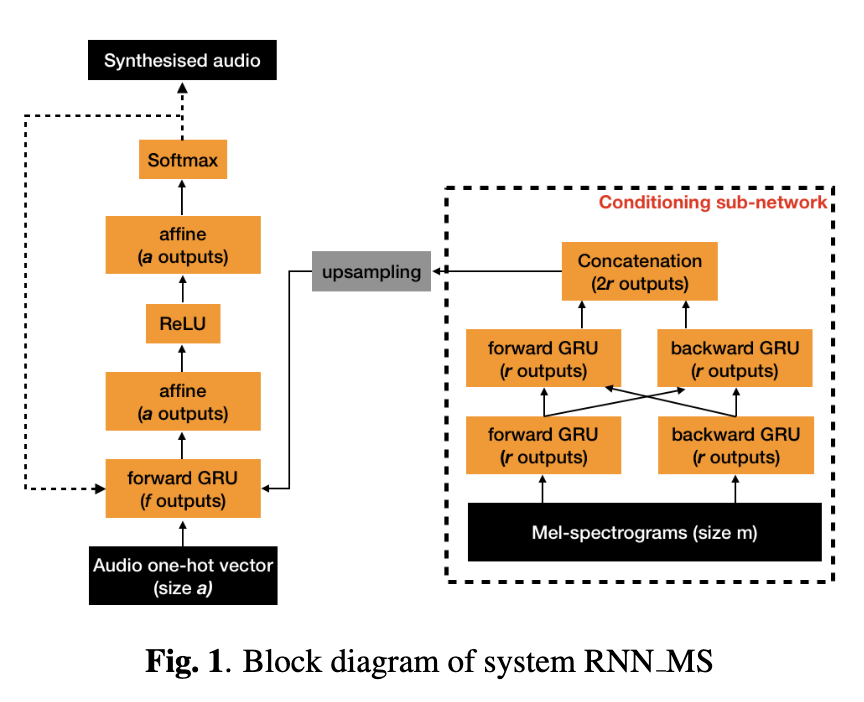
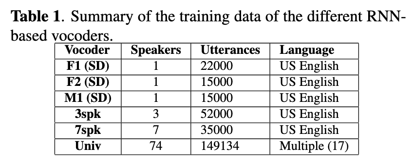
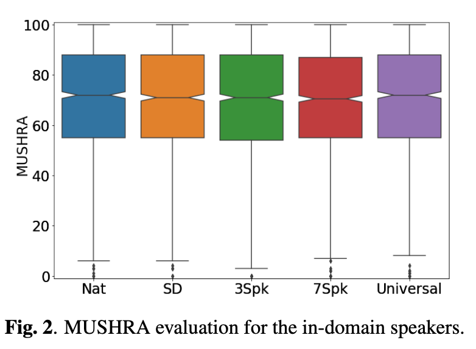
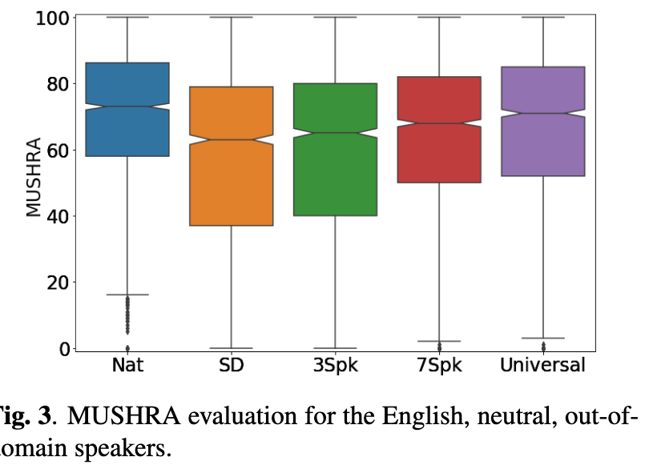
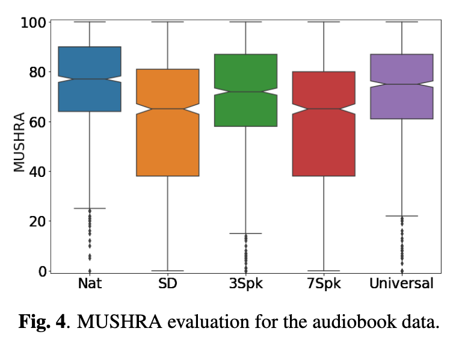
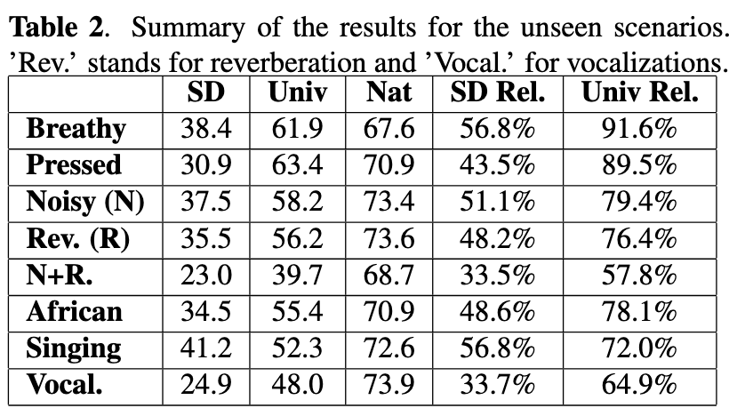

# Towards achieving robust universal neural vocoding

[Link to the paper](https://arxiv.org/abs/1811.06292)

**Jaime Lorenzo-Trueba, Thomas Drugman, Javier Latorre, Thomas Merritt, Bartosz Putrycz, Roberto Barra-Chicote, Alexis Moinet, Vatsal Aggarwal**

*Interspeech 2019*

Year: **2019**

The present work describes how the authors came up with a near-universal neural vocoder.

A vocoder is a model the produces speech given an input. More specifically, a neural networks based vocoder is a system that learns to reconstruct an audio waveform from accoustic features

The authors start raising awareness about the difficulty that this problem entails, leading a lot of times to overfitting to speaker characteristics problems. That is the reason why much effort has been previously done on training speaker-dependent vocoders.

The contributions to the SOTA of this papers, in summary, are:
- A proposal of a speaker independent WaveRNN-based architecture
- The ability of the proposal to generalize to unseen out of domain utterances
- The robustness and partial universality achieved

The architecture is described in the figure below

As it can be noticed in the picture, the current model has a RNN based architecture. The authors point to a reference claiming that the CNNs show instabilities. The structure used is inspired in the waveRNN and has two modules: the conditioning module and the auto-regressive module (think of an encoder-decoder architecture). The auto-regressive module uses GRUs, affine transformations and has a softmax output with 1024 units (10-bit output). It also receives the upsampled output from the conditioning module. The conditioning module uses two parallel GRUs in order to summarize the info in the mel-spectrogram input.

6 different vocoders have been trained:
- F1 (speaker dependent): Using one female voice
- F2 (speaker dependent): Using other female voice
- M1 (speaker dependent): Using a male voice
- 3spk: using the 3 previous speakers voice
- 7spk: using 7 speakers (the previous three ones + 2 females + 1 male + 1 child)
- Univ: using data from 74 speakers

The table below summarizes the details of these vocoders

The vocoders have been trained with mel spectrograms extracted from the original audio to reconstruct it. Several test sets have been built, all the vocoders have been measured against them:
- in-domain
- out-of-domain
- audiobook data (high prosodics)
- unseen scenarios

MUSHRA has been used to test the quality of the generations, using real people to score the recordings.

The results are shown below for all the vocoders and test sets,

The conclusions of this work are the following
- The more the speakers, the more the universality
- Covariance shift between train and test hurts performance
- The model showed difficulties on noisy environments
- The model is capable to sing! But not in noisy and distorted environments like rock
- In studio quality recordings, the vocoder achieved 98% MUSHRA!