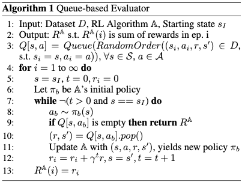
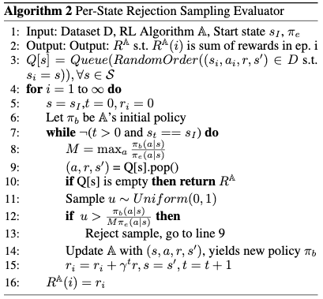
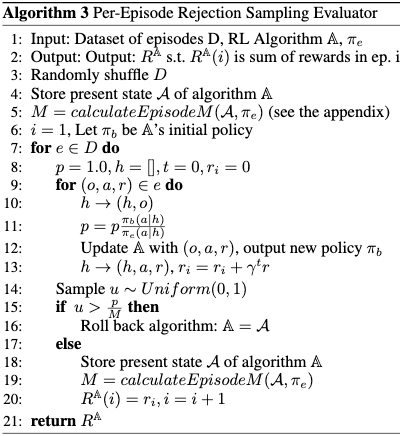

# Offline Evaluation of Online Reinforcement Learning Algorithms

[Link to the paper](http://grail.cs.washington.edu/projects/nonstationaryeval/nonstationaryevalExtended.pdf)

**Travis Mandel, Yun-En Liu, Emma Brunskill, Zoran Popovic**

*Proceedings of the 30th AAAI Conference on Artificial Intelligence*

Year: **2016**

- The objective of the paper is to provide a method to offline evaluate a policy, taking
  into account that it will continue learning in the real environment once it is
  deployed. For the latter topic, the we must understand how the agent would have
  gathered experience if it were run online.
- The offline evaluation consists of using pre-collected experiences to evaluate a new
  RL policy.
- Prior efforts differ in a couple of topics (i) they focus on evaluating fixed policies
  while the current assesses also the learning gain, and (ii) most of them rely on the
  assumption that the behavior policy that generated the experiences is known. Other
  efforts have been focused on trying to learn to predict the feedback of the
  environment (r and s'), which has been demonstrated to have a quadratic error with the
  evaluation length.
- This paper presents 3 alternative methods to deal with this problem (in increasing
  complexity order): Queue-based, Per-State Rejection Sampling (PSRS) and Per-Episode
  Rejection Sampling (PERS). All of them can leverage data collected using an unknown
  sample distribution.
- In general, the idea of PSRS and PERS is to penalize those samples/episodes which  probability of happening under the policy under evaluation is small as compared with the sampling probability (empirical probabilities in the data). These methods have mechanisms for often rejecting the samples difficult to achieve under the policy under evaluation, hence, we will evaluate more often over those cases more often visited by our policy.

## Queue

- This method assumes that the state-action space is known. It may not be applicable
  for continuous/large state-action spaces.
- The algorithm consists of building a mapping of a state-action to a queue of the
  rewards and next-states: (s, a) -> [(r, s'), (r, s'), (r, s')]. Then choose a state,
  get the action from the agent, look for that state-action pair in the mapping and
  pop an element from the queue. The estimation finishes when a queue is emptied.

## PSRS

- PSRS leverages the policy action probabilities (unlike queue does) so that when the sampling and policy probability distributions are the same, more data can be leveraged. Intuitively, if an agent chooses actions similarly to the sample distribution, the collected data is going to be more relevant to the evaluation estimation. This advantage over queue is usually known as leveraging *revealed randomness*.
- The algorithm consists of building a mapping of state to queue of action-reward-next_state triplets. The goal is to sample a tuple (a, r, s') such that a is sampled from the agent and (r, s') is sampled from the true environment. Getting the sample of a resembling the policy is the challenge here. The authors recommend sampling a using a technique known as "rejection sampling".
- Rejection sampling consists of (1) calculating the ratio of probabilities policy/real using as real the empirical one given the data (assumption! the authors do not specify that), (2) computing M as the max ratio over the possible actions, and (3) sampling a randomly uniform number $u$ from 0 to M and accepting only those (s,a,r,s') samples for which the ratio is greater than $u$. If the condition is not met, the sample is rejected and not used anymore.
- Even if the policy and the data have the same sampling distribution, we do not always consume all the samples in the evaluation. This is known as the fact that this method is (as well as queue), not *self.idempotent*.
- It is important to keep in mind that the current method assumes that the state space is known and finite (and hence discrete). The `max` computation can be intractable as the state space size grows

## PERS

- This method attempts to solve the state-size computational dependence, while introducing a computational dependence on the size of the episodes.
- It assumes POMDP or, in other words, it is *representation-agnostic*.
- Other important assumption is that, as it is a per-episode approach, the episodes must be reconstructed from the logs.
- The algorithm is very similar to PSRS but with the difference that the rejection sampling is done at episode level; for which the ratios of probabilities has to be computed at episode level through the product of each sample probability. In this case, computing M as the maximum probability ratio over all possible actions in each step of the episode becomes quickly intractable as the action space-size and the size of the episode grows. The authors give some ways of approximating it and a method to calculate it exactly using dynamic programming.
- This algorithm is *self-idempotent* given that if the policy and real distribution are the same, the ratio is 1, and $M=1$ so $ratio > M$ always.

________
The ratios of probabilities showed in PSRS and PERS algorithms is the same as in importance sampling. Intuitively, it measures how many times will I sample more a|s in my new policy than in the behavior policy. We want to "correct" the distribution of data collected by the behavior policy using that importance-sampling-ratio distribution. In other words, we will accept more often those samples which are more likely in the policy distribution and reject more often those which are less likely. In the other way, we penalize the samples often sampled by the behavior policy, just because they happen more often and we don't want that bias at the time of evaluating our policy.

The authors show success of this algorithm as compared with the model-based approach consisting on trying to learn the feedback of the system using a model.

The first two algorithms presented here are not applicable to the continuous state cases. PERS is the only scalable one.