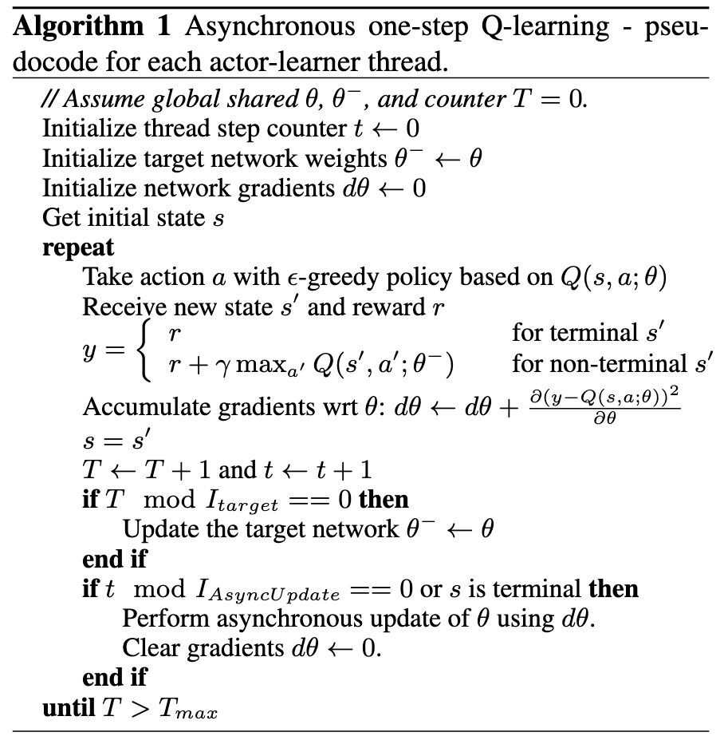
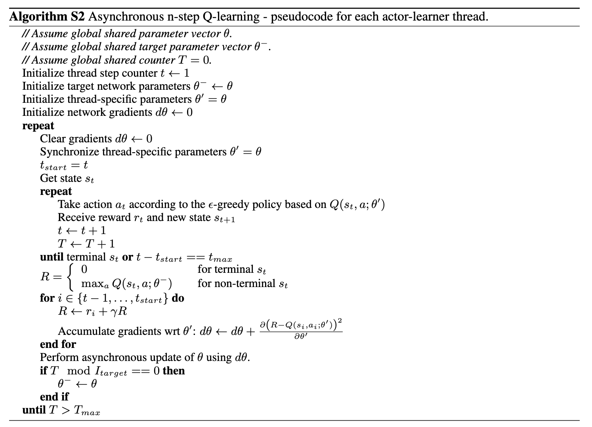
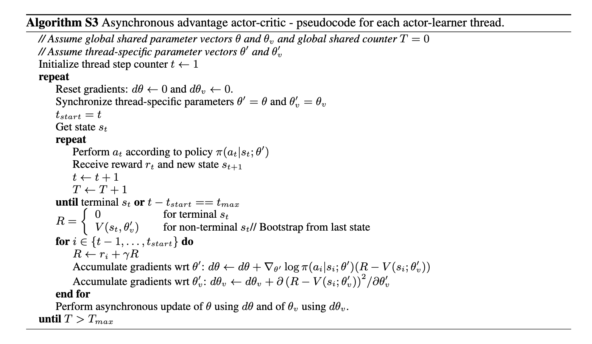
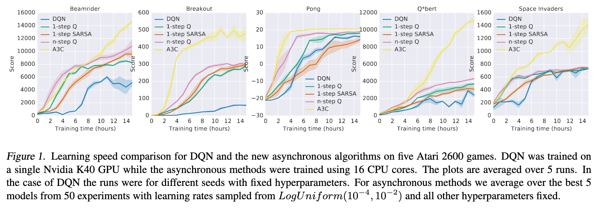
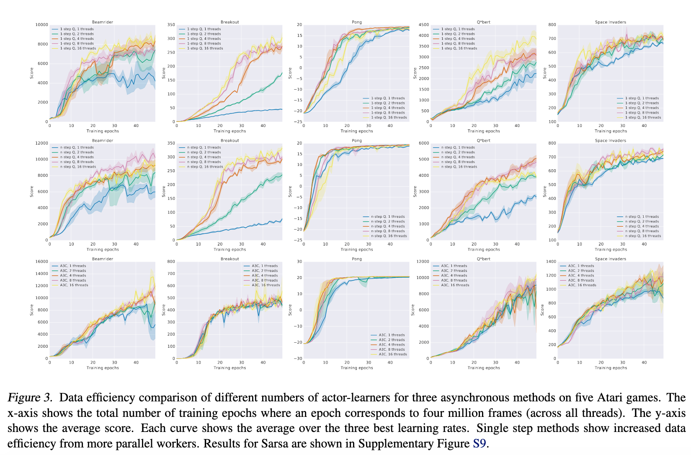
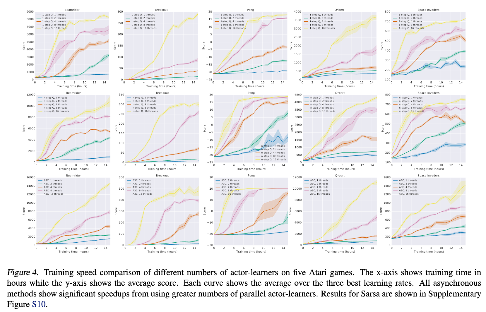

# Asynchronous Methods for Deep Reinforcement Learning

[Link to the paper](https://arxiv.org/abs/1602.01783)

**Volodymyr Mnih, Adrià Puigdomènech Badia, Mehdi Mirza, Alex Graves, Timothy P. Lillicrap, Tim Harley, David Silver, Koray Kavukcuoglu**

*Proceedings of The 33rd International Conference on Machine Learning*

Year: **2016**

This paper describes a framework for training RL algorithms in parallel. The authors test the framework across 4 different algorithms and the highest performance is achieved by the A3C (Async Advantage Actor Critic) algorithm.

Several efforts have been performed before this work on trying to stabilize the RL algorithms to work with deep learning function approximators; all of these approaches give solutions to the following problem: "the sequence of observed data encountered by an online RL agent is non-stationary, and online RL updates are strongly correlated". The data collection and the updates needs to be decorrelated for a successful training.

This work proposes using data collected from asynchronous agents running at the same time over multiple instances of the environment instead of implementing experience replay.

## RL background
- Q-Learning loss: $L_i(\theta_i) = \mathbb{E}\left(r + \gamma \max_a' Q(s', a';\theta_{i-1}) - Q(s, a;\theta_i)\right)^2$
- Policy-based methods loss: $L_i(\theta_i) = \mathbb{E}\left(\log\pi_\theta(a_t|s_t;\theta)(R_t-b_t(s_t)))\right)$ where $R_t$ is the return at time $t$ (got after acting with $a_t$ over $s_t$) and $b_t(s_t)$ is known as a baseline, typically represented as a learned value function of state $s_t$. $R_t$ is an estimate of $Q^\pi(a_t, s_t)$ (e.g. a n-step return; i.e. a sum of the rewards until time step $n$ + botstrap). The second term is known as the advantage function $A(a_t, s_t)=Q(a_t, s_t)-V(s_t)$.

## Asyncronous framework
Four algorithms are parallelised using the proposed framework:
- one-step SARSA
- one-step Q-Learning
- n-step Q-Learning
- Advantage Actor Critic

All the implementations share the following characteristics:
- Multiple actor learners run in parallel with different exploration methods
- The actors learn in their own copies of the environment

Async one-step Q-learning
- Each thread interacts with its own copy of the environment, computing the gradient of the Q-learning loss at each step
- A target network is used
- The gradients are accumulated over multiple timesteps and then applied to the network

Async SARSA
- The algorithm is in this case identical as the Q-learning, with the only difference that it uses the following loss function:
$L_i(\theta_i) = \mathbb{E}\left(r + \gamma Q(s', a';\theta^-) - Q(s, a;\theta)\right)^2$

Async n-step Q-learning
- The implementation that the authors suggest relies on the forward view formulation from Sutton&Barto.
- The algorithm selects actions using the policy up to $t_max$ steps, or until termination.
- The algorithm computes the gradients for n-step Q-learning updates for each of the state-action pairs encountered since the last update
- At each step the longest possible n-step return is used to compute the return.
- The gradients for all n-step cases are accumulated and applied in a single gradient step.

Async A3C
- A global policy $\pi$ and an estimate of the value function $V$ are maintained.
- It operates also using the forward-view formulation for n-step returns (for $\pi$ and $V$).
- The update is performed using the following formula $\nabla_\theta\log\pi(a_t, s_t;\theta')A(s_t,a_t;\theta,\theta_v)$ where the advantage function is fefined as $\sum_{i=0}^{k-1}\gamma^i r_{t+1} + \gamma^kV(s_{t+1};\theta_v)-V(s_t;\theta_v)$
- The proposed implementation relies on parallel actor learners and accumulated gradients.
- Parameters between the network that estimates the value and the one estimating the policy are shared, in practice.
- An extra term is added to the loss function to control the entropy of the policy and hence handle exploration.

## Results
The algorithms proposed are tested over Atari environments, TORCS 3D, MuJoCo and Labyrinth. They agents are trained in a system with 16 CPUs.

A comparison of the training time across all the algorithms is summarized below

The data efficiency and training speed is also an important success in this work, as shown in the figures below.

# Conclusion
- The authors demonstrated how it is possible to run stable DeepRL algorithms for (1) value and policy based methods, (2) on-policy and off-policy methods and (3) discrete and continuous action spaces.
- The schema of a parallel actor learners updating a central model has stabilizing effects on the learning process
- There are a lot of potential improvements which apply to the core algorithms (Q-learning, SARSA and A2C) which may apply in this setting and must be explored.