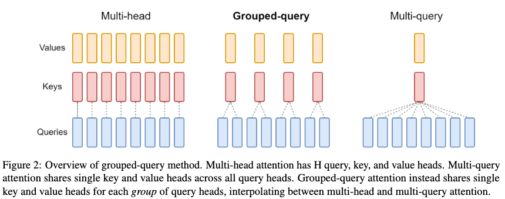
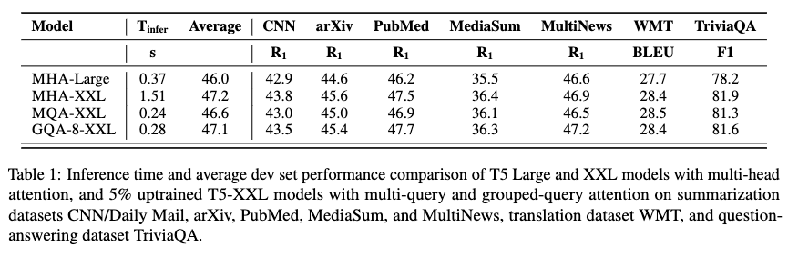
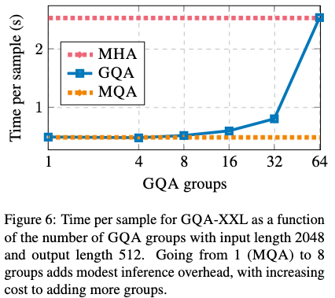
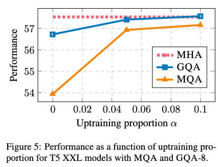

# GQA: Training Generalized Multi-Query Transformer Models from Multi-Head Checkpoints

[Link to the paper](https://arxiv.org/abs/2305.13245)

**Joshua Ainslie, James Lee-Thorp, Michiel de Jong, Yury Zemlyanskiy, Federico Lebrón, Sumit Sanghai**

*Google Research report*

Year: **2023**

Opensource implementation: https://github.com/kyegomez/MGQA

At a high level, this paper presents a technique to speed-up Multi Head Attention (MHA) by reducing the amount of key-value heads, and name it Grouped Query Attention (GQA). There's a drastic method in the literature at the time of publishing this paper, named Multi-Query Attention (MQA) that goes to the limit (single key-value head). This paper tries the middleground (>1 and <Query heads). This method is relevant because it attachs the memory bandwith overhead. At inference time, all the key-value heads need to be loaded in memory, hence reducing them reduces latency. The authors highlight that this technique is more effective for auto-regressive inference. Hence, in encoder-decoder architectures this is only applied on the decoder side (the authors test this rechnique using the T5 architecture).

Converting a MHA model to MQA (the drastic approach) can be performed in two steps (1) convert the checkpoint of the model removing the unneeded extra heads and (2) train for a few steps.

To convert a MHA model to GQA, the authors suggest grouping key-values heads and aggregating them using mean-pooling to get a single key-value head per group. GQA-G refers to the grouped query-attention method with $G$ heads. GQA-1 is equivalent to MQA and GQA-H is equivalent to MHA ($H$ being the number of query heads).

The authors define uptraining proportion as the proportion of training steps to run after checkpoint conversion, and refer to it as $alpha$.

Results show up to x5 speedups at no performance cost.

