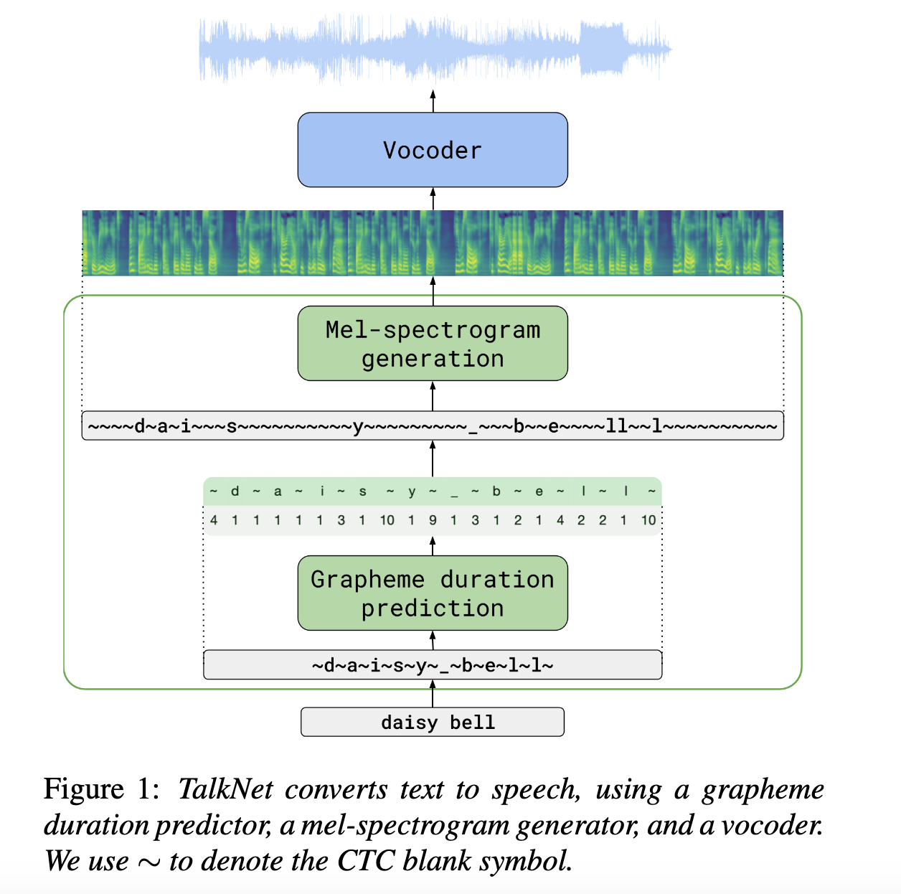
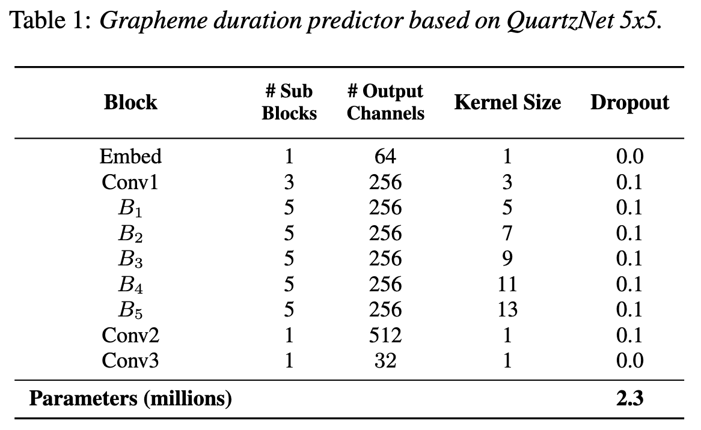
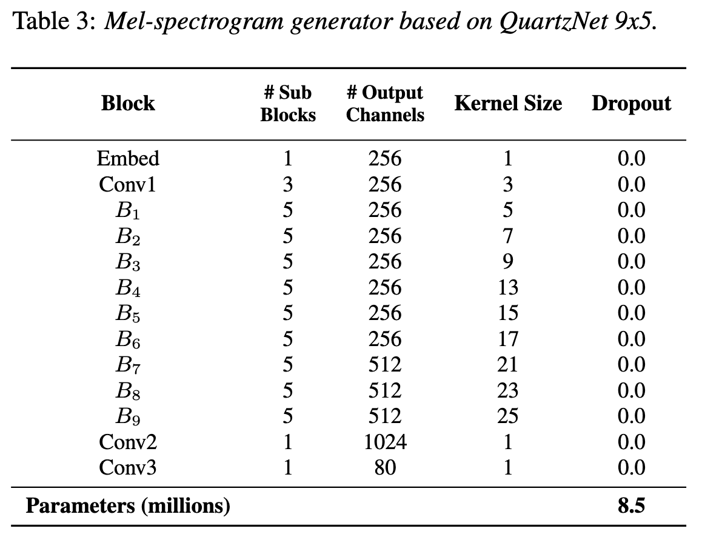
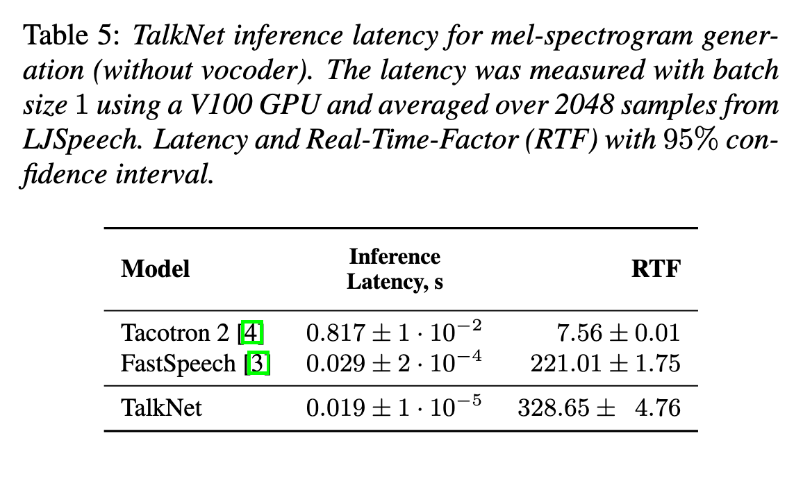

# TalkNet: Fully-Convolutional Non-Autoregressive Speech Synthesis Model

[Link to the paper](https://arxiv.org/abs/2005.05514)

**Stanislav Beliaev, Yurii Rebryk, Boris Ginsburg**

*INTERSPEECH 2020*

Year: **2020**

This paper presents an end-to-end solution to the Text to Speech problem which doesn't make use of RNNs and attention.

The neural TTS systems typically have two stages: text-to-spectrogram and spectrogram-to-speech. In this case, the contribution belongs to the first stage. The authors claim that there are some common problems arising when using RNNs and attention mechanisms:

1. Tendency to skip/repeat words. Need for monotonic attention.
2. Slow inference
3. Not a clear way to control prosody or voice speed, as the decoder automatically determines these aspects.

For tackling these two problems, the authors suggest to divide the text-to-spectrogram into two modules: the grapheme duration predictor and the mel-spectrogram generator.

The idea at high level is the following: the grapheme duration model takes as input the different letters with interleaving blank symbols (~). It predicts the duration of each of the symbols and then the authors manually repeat the symbols based on their durations. The ground truth for this model is generated using an Automatic Speech Recognition model. The mel-spectrogram generator takes the sequence with repetitions as input and produces an spectrogram as output. The authors insist that using this approach almost removes all the skip-word problems.

The architectures used for the two modules are described in the tables 1 and 3.

An important detail is that the blank characters in the Mel spec. generator don't have a proper embedding assigned. Instead, the authors used a linear interpolation between the previous character and the next character.

The resuts show a Mean Opinion Score (MOS) close to the competitor (Tacotron 2), as shown in the table below. Talknet is much (x43) faster than Tacotron 2, as shown below.

Comments:
- Why not MOS in fastspeech?
- Not all prosody can be controlled by this approach, only the duration. If f0 included, intonation would be also controlled.
- QuartzNet architecture is wrong, when it says "Depthwise Separable Convolution" it means "Depthwise Convolution".