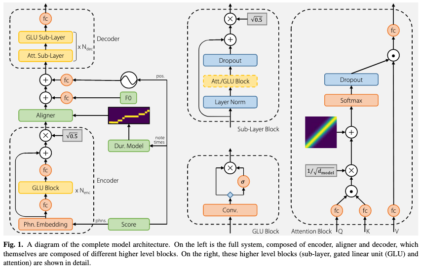
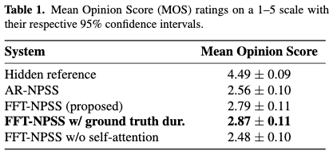

# Sequence to sequence singing synthesis using the feed forward transformer

[Link to the paper](https://arxiv.org/abs/1910.09989)

**Merlijn Blaauw, Jordi Bonada**

*ICASSP 2020*

Year: **2020**

Samples:  https://mtg.github.io/singing-synthesis-demos/transformer/

This work presents a new solution for singing synthesis using a transformer architecture in the decoder side.

The use of a feed forward decoder allows for faster synthesis and exposure bias problem elimination.

The inputs of the model are the sequence of musical notes (onset, duration, pitch and associated phonemes) and the F0 signal.

The output of the model is a sequence of vocoder features which, in this case it consists of the WORLD vocoder.

## Architecture

- Encoder: CNN + Gated Linear Units + Residual connections
- Decoder: Self-Atention + convolutions + Gated Linear Units. Attention matrix provided with a bias term along the diagonal.
- Duration model: average look-up table with average phoneme durations
- F0 model: the ground truth F0 is provided, the model is asked to predict timbre, but not intonation.

## Results
