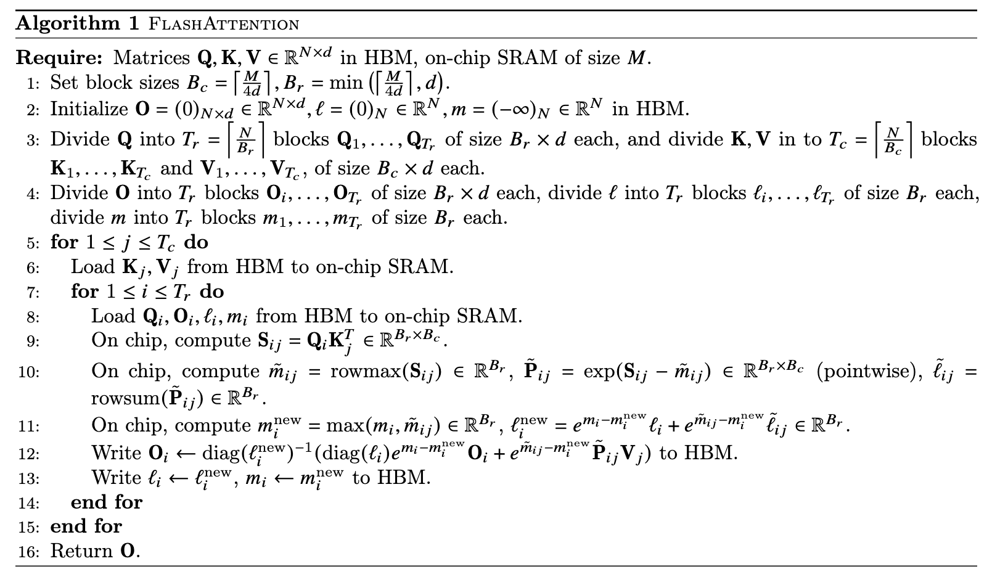

# FlashAttention: Fast and Memory-Efficient Exact Attention with IO-Awareness

[Link to the paper](https://arxiv.org/abs/2205.14135)

**Tri Dao, Daniel Y. Fu, Stefano Ermon, Atri Rudra, Christopher Ré**

*arXiv Preprint*

Year: **2022**

This paper analyzes the speed of attention implementations. Attention is the basis of transformer architectures, and it's well know that this architecture does not scale well with the length of the sequences. However, the authors of this paper increase the upper bound of affordable sequence lengths by optimizing how GPUs perform the attention operations. They achieve up to 7.6x improvement in GPT-2. The proposed algorithms implement exact attention, and focus on the read/write operations from GPU SRAM (fast cache) to high bandwith HBM (slow cache)

What they do to improve the efficiency is to compute attention by blocks (tiling). The algorithm is described below.

THe paper goes a lot into detail on the GPU memory management, which is not my field, so I stopped reading.