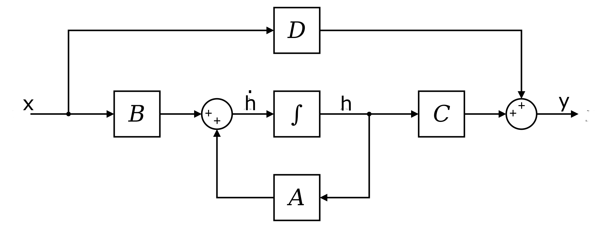

# Efficiently Modeling Long Sequences with Structured State Spaces

[Link to the paper](https://arxiv.org/abs/2111.00396)

**Albert Gu, Karan Goel, Christopher Ré**

*arXiv Preprint*

Year: **2021**

_**Note 1**: I have changed the bizarre notation used in the paper to the one used in Mamba. More specifically, the authors use u and x to denote input and state hidden vectors, respectively. Naturally, they have been changed in these notes by x and h, respectively._

_**Note 2**: these notes cover an intro to State Models only, not the S4 model. The goal of this review was to get in context to understand Mamba paper._

___

The authors of this paper introduce a new state-space model called Structured State Space (S4). This model is an evolution of previous L-SSM (Linear State-Space Models) that solves the prohibitive memory and computational cost of its computation.

## State models
### Intro
State space models are defined as follows

$$
h'(t) = \mathbf{A}h(t) + \mathbf{B}x(t)\\
y(t) = \mathbf{C}h(t) + \mathbf{D}x(t)
$$

In the above formulas...
- $\mathbf{h}(\cdot)$ is called the "state vector", and it represents the hidden state of the system $\mathbf{h}(t) \in \mathbb{R}^n$.
- $\mathbf{y}(\cdot)$ is called the "output vector", and it is defined as $\mathbf{y}(t) \in \mathbb{R}^q$.
- $\mathbf{x}$ is called the "input vector", with $\mathbf{x}(t) \in \mathbb{R}^p$.
- $\mathbf{A}$ is the "state matrix", with $\dim[\mathbf{A}] = n \times n$.
- $\mathbf{B}$ is the "input matrix", with $\dim[\mathbf{B}] = n \times p$.
- $\mathbf{C}$ is the "output matrix", with $\dim[\mathbf{C}] = q \times n$.
- $\mathbf{D}$ is the "feedthrough matrix". 

$\mathbf{D}$ can be seen as a skip connection, and it is often ignored for simplification purposes (i.e. assume $\mathbf{D}=0$, hereafter).

### The HiPPO trick
SSMs are unstable due to the fact that they entail a recurrent computation, where the state vector is recurrently multiplied by $\mathbf{A}$.That recurrent multiplication causes instabilities when $\mathbf{A}$ is not carefully chosen. Previous work showed that a wise choice for $\mathbf{A}$ is the _HiPPO_ matrix, defined below.

$$
  (\text{\textbf{HiPPO Matrix}})
  \qquad
  \bm{A}_{nk}
  =
  -
  \begin{cases}
    (2n+1)^{1/2}(2k+1)^{1/2} & \text{if } n > k \\
    n+1 & \text{if } n = k \\
    0 & \text{if } n < k
  \end{cases}
  .
$$

This matrix employs _Legendre_ polynomials in order to compress the input history of the input series $\mathbf{u}(t)$. This allows the SSM perform tasks that require long-term-dependencies. The $A$ matrix is hence fixed, and not trained. However the authors tried to finetune it and it seems thet the results improve a bit more.

### Discretization
SSMs are defined for continuous domains. In neural networks, one is usually interested in discrete domains. This can be easily done through different methods such as Euler method, or as the authors of the paper show, with the bilinear method. The discrete approximation of the matrices stated below are denoted as $\bar{\mathbf{A}}$, $\bar{\mathbf{B}}$, $\bar{\mathbf{C}}$, $\bar{\mathbf{D}}$.

$$
\begin{aligned}
  h_{k} &= \bm{\overline{A}} h_{k-1} + \bm{\overline{B}} x_k &
  \bm{\overline{A}} &= (\bm{I} - \Delta/2 \cdot \bm{A})^{-1}(\bm{I} + \Delta/2 \cdot \bm{A}) &
  \\
  y_k &= \bm{\overline{C}} h_k &
  \bm{\overline{B}} &= (\bm{I} - \Delta/2 \cdot \bm{A})^{-1} \Delta \bm{B} \\
   && \bm{\overline{C}} &= \bm{C}

\end{aligned}
$$

### Convolutional representation
Due to the linear nature of SSMs, the state vectors can be computed in parallel convolving carefully crafted kernel with the input $x_k$. The kernel can be derived by arranging the terms so that the states $h_k$ and output $y_k$ vectors are solely dependent on the inputs $x_k$.

For the first time step ($k=0$), following the discrete formulas above, we assume that the $x_{-1} = 0$

$$\begin{aligned}

h_0 = \bar{\mathbf{B}}x_0
\quad&\rightarrow&\quad 
y_0=\bar{\mathbf{C}}x_0 = \bar{\mathbf{C}}\bar{\mathbf{B}}x_0 \\

h_1 = \bar{\mathbf{A}} h_0 + \bar{\mathbf{B}}x_1 = \bar{\mathbf{A}} \bar{\mathbf{B}}x_0 + \bar{\mathbf{B}}x_1
\quad&\rightarrow&\quad 
y_1 =  \bar{\mathbf{C}}h_1 = \bar{\mathbf{C}}\bar{\mathbf{A}} \bar{\mathbf{B}}x_0 + \bar{\mathbf{C}}\bar{\mathbf{B}}x_1 \\

h_2 = \bar{\mathbf{A}} h_1 + \bar{\mathbf{B}}x_2 = \bar{\mathbf{A}}^2 \bar{\mathbf{B}}x_0 + \bar{\mathbf{A}} \bar{\mathbf{B}}x_1 + \bar{\mathbf{B}}x_2
\quad&\rightarrow&\quad 
y=\bar{\mathbf{C}}h_2 = \bar{\mathbf{C}}\bar{\mathbf{A}}^2 \bar{\mathbf{B}}x_0 +\bar{\mathbf{C}}\bar{\mathbf{A}} \bar{\mathbf{B}}x_1 + \bar{\mathbf{C}}\bar{\mathbf{B}}x_2\\
&...& 
\end{aligned}
$$

Generalizing the pattern above, we get the following expression.

$$ \begin{aligned}
h_k =  \sum_{i=0}^k\bar{\mathbf{A}}^{k-i} \bar{\mathbf{B}}x_i 
\quad&\rightarrow&\quad 
y_k = \bar{\mathbf{C}}h_k

\end{aligned}
$$

This can be seen as a convolution operation where $y=\bar{\mathbf{K}}x$, with $\bar{\mathbf{K}}$ being the SSM convolution filter.

$$
\bar{\mathbf{K}} = \left(\bar{\mathbf{C}}\bar{\mathbf{A^i}}\bar{\mathbf{B}}\right)_{i\in 0..L-1} =
(\bar{\mathbf{C}}\bar{\mathbf{B}}, 
\bar{\mathbf{C}}\bar{\mathbf{A}}\bar{\mathbf{B}},
\bar{\mathbf{C}}\bar{\mathbf{A}}^2\bar{\mathbf{B}},
\bar{\mathbf{C}}\bar{\mathbf{A}}^3\bar{\mathbf{B}},
...,
\bar{\mathbf{C}}\bar{\mathbf{A}}^{L-1}\bar{\mathbf{B}})
$$

## Important takeaways
1. State Models are algorithms for sequential modelling that allow RNN-like computation (for inference) as well as CNN-like computation (for teacher-forcing training).
1. State Models work by building a mapping $x(t)\in\mathbb{R}\rightarrow y(t)\in\mathbb{R}$ through an implicit hidden state $h(t)\in\mathbb{R}$.
1. State Models are linear in time-dimension. They do not have any non-linearity, which allows them to be run in parallel (convolutional mode).
1. The state-transition matrix $A$ (and the input $B$ and output $C$  ones) is fixed, and does not depend on the input, the hidden state or the time step. It's commonly said that the model dynamics of SM are linear-time invariant (LTI). In other words, the same computation is repeated over and over for each time step.
1. The SMs are applied independently to each channel, hence some mechanism to merge channels is required beyond SMs.

## Resources
- Umar Jamil's video on "Mamba and S4 Explained"
https://www.youtube.com/watch?v=8Q_tqwpTpVU
- Albert Gu's presentation (main author): 
https://www.youtube.com/watch?v=luCBXCErkCs
- Sasha Rush's blog on "The annotated S4" 
https://srush.github.io/annotated-s4