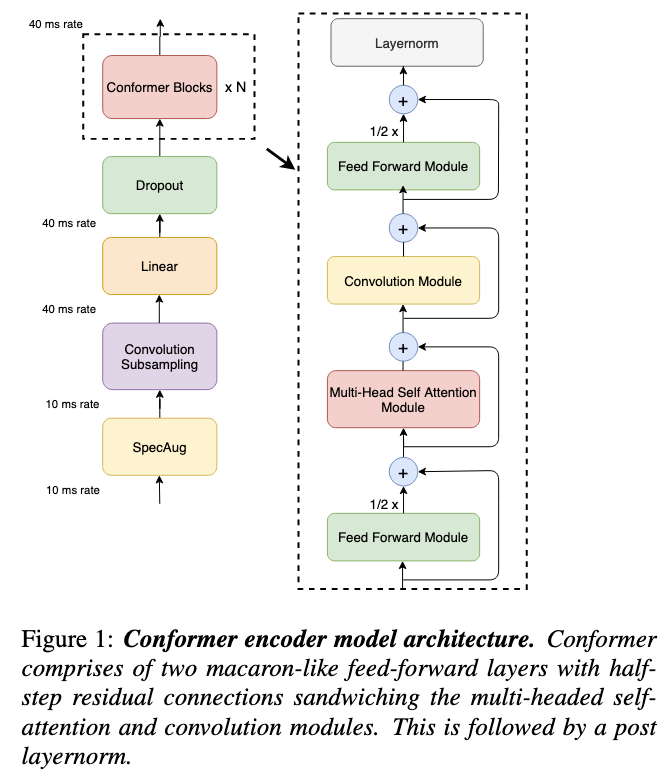
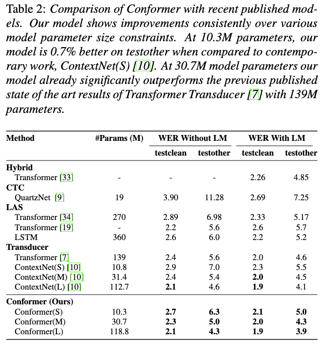
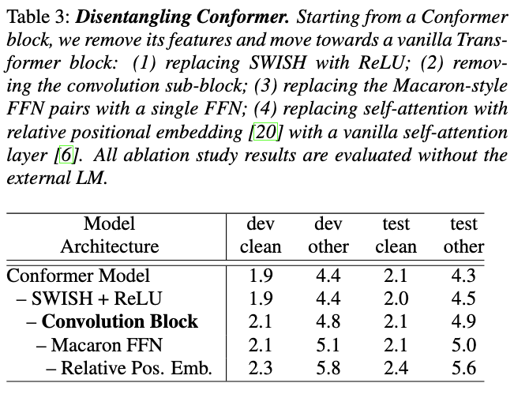

# Conformer: Convolution-augmented Transformer for Speech Recognition

[Link to the paper](https://arxiv.org/abs/2005.08100)

**Anmol Gulati, James Qin, Chung-Cheng Chiu, Niki Parmar, Yu Zhang, Jiahui Yu, Wei Han, Shibo Wang, Zhengdong Zhang, Yonghui Wu, Ruoming Pang**

*Interspeech 2020*

Year: **2020**

This paper proposes a variation to the original transformer architecture consisting of adding convolutional layers after the transformer multihead attention. This proposal is designed for ASR applications, more specifically to ASR encoders. The following figure shows a diagram depicting the architecture of a Conformer block.  Don't be confused by the modules previous to the conformer blocks, as they are just an ASR pre-net that serve the purpose of bringing the input acoustic features to the desired latent space.

As it can be seen in the diagram, the conformer architecture also adds an extra feed-forward module before the multi-head attention. There are many potentially unimportant details on all the modules that are described in the paper, like where do the authors use LayerNorm, where do they add a Swish or a GLU activation, or the fact that they use something similar to a depthwise separable convolution. I am not covering that in these notes.

The proposed model seems to work better than the transformer encoder, consistently. The authors argue that the motivation for interleaving a convolution module is to help the transformar architecture catching local fine-grain dependencies better than the standalone self-attention. The results are summarized in the follwing table.

Finally, the authors do an interesting ablation study where they conclude that what seems to bring performance is, in decreasing contribution order, the convolution module and the double feed-forward layer. Seems that the results express WER, but no stats tests seem to be performed :<.

