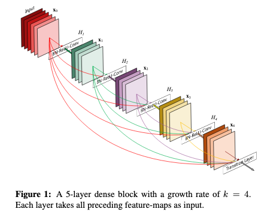
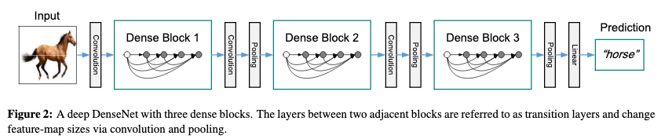
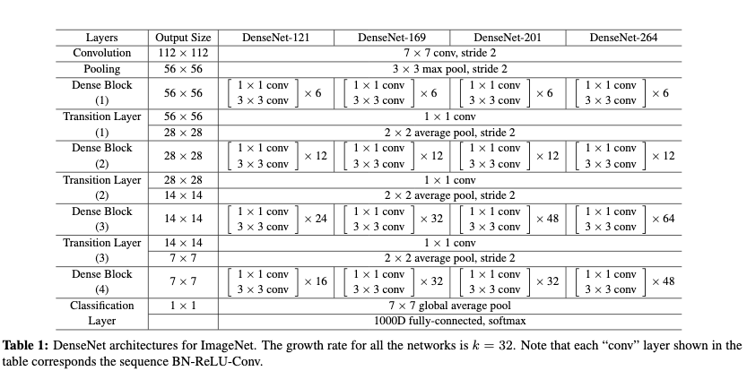
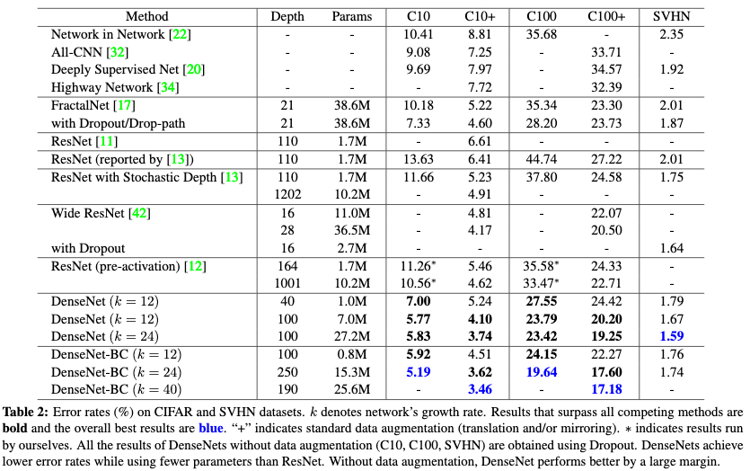
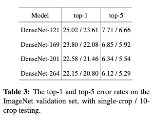

# Densely Connected Convolutional Networks

[Link to the paper](https://arxiv.org/abs/1608.06993)

**Gao Huang, Zhuang Liu, Laurens van der Maaten, Kilian Q. Weinberger**

*CVPR 2017*

Year: **2017**

This paper introduces DenseNet, a new CNN architecture built with the ideas of highway networks and resnet, that achieves better performance at a higher efficiency.

The architecture consists on a simple idea: connect every layer to all the following layers. The figure below summarizes it perfectly.

The idea is motivated by the recent success of ResNet and its ability to (1) help with vanishing gradients and (2) reuse weights of previous layers.

Some details:
- The network is organised in densenet blocks, each followed by a transition block, which is responsible for the pooling, and consists of a 1x1 conv followed by a 2x2 avg pooling.
  
- In the densenet blocks, the features of previous layers are **concatenated** to the outputs of the layer, and not added as in ResNet.
- The number of output channels $k$ in the convolutions of each block is small to prevent the outputs to grow too much over time (about $k=12$). $k$ is also known as the growth rate.
- To further reduce the number of parameters, a compositional convolution is used where a 1x1 conv is used before the usual 3x3 convolutions (predecessor of depthwise-separable convolutions).
- Batch norm is used before each ReLU activation.

Further architecture details

The network has been tested over multiple datasets (CIFAR-10/100, SVHN and ImageNet) showing superior performance almost in all the cases. The results are attached in the table below.

