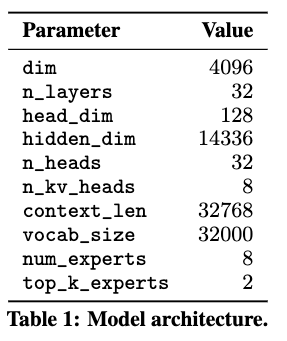
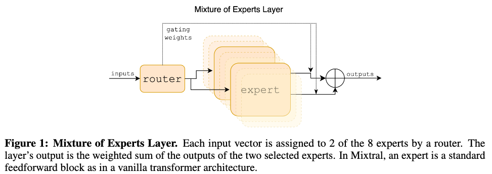
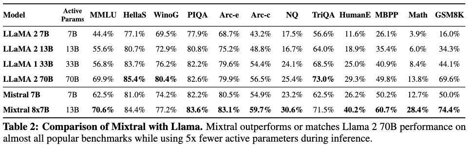
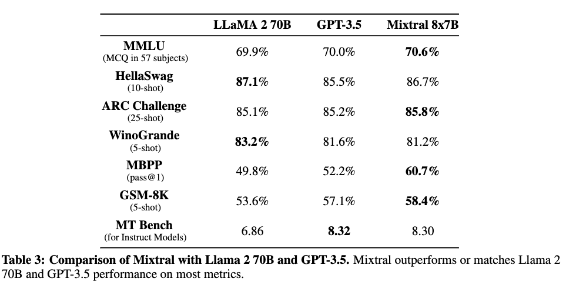

# Mixtral of Experts

[Link to the paper](https://arxiv.org/abs/2401.04088)

**Albert Q. Jiang, Alexandre Sablayrolles, Antoine Roux, Arthur Mensch, Blanche Savary, Chris Bamford, Devendra Singh Chaplot, Diego de las Casas, Emma Bou Hanna, Florian Bressand, Gianna Lengyel, Guillaume Bour, Guillaume Lample, Lélio Renard Lavaud, Lucile Saulnier, Marie-Anne Lachaux, Pierre Stock, Sandeep Subramanian, Sophia Yang, Szymon Antoniak, Teven Le Scao, Théophile Gervet, Thibaut Lavril, Thomas Wang, Timothée Lacroix, William El Sayed**

*Mistral.AI report*

Year: **2024**

Open Source Code: https://github.com/mistralai/mistral-src

This report introduces Mixtral 8x7B, a Sparse Mixture of Experts (SMoE) with open weights that surpasses Llama and GPT 3.5 in several benchmarks. The manuscript talks about model architecture, but the training details are very limited.

The mixture of experts contans 8 experts. One expert is defined as a feedforward block with unique weights. For inference, a "router" network picks 2 experts at each timestep. This is an effective way of increasing the size of the model without affecting inference speed, at the cost of a memory increase.

An additional Mixtral model is provided which is able to perform better on chat tasks. This version is called Instruct and is a fine-tuned version of the first using DPO. The models are trained with a context length of 32K tokens. The architecture details of the transformer are described below, and additional details are given in the Mistral 7B paper.

The **mixture of experts** layer is depicted in the figure below. The following equations describe how the gating network $G$ works and how the $N$ experts $E_i(x)$ are combined together.

$$\sum_{i=1}^{N} G(x)_i \cdot E_i(x)$$

The gating vector $G(x)$ is made sparse to avoid having to compute all $N$ expert outputs. The authors choose to implement this using a top-k operation before the softmax, as follows.

$$G(x) = \text{Softmax}(\text{TopK}(x\cdot W_g))$$

TopK masks out the logits below the K top ones, by setting them to $-\infty$. The full computation involving gating and expert networks is shown in the equation below.

$$y=\sum_{i=1}^{N}\text{Softmax}(\text{TopK}(x\cdot W_g))_i \cdot \text{SwiGLU}_i(x)

where SwiGLU represents the expert network.

Results are sumarized in the table below.

Further analysis don't conclude clear patterns of usage of the different experts in the network

