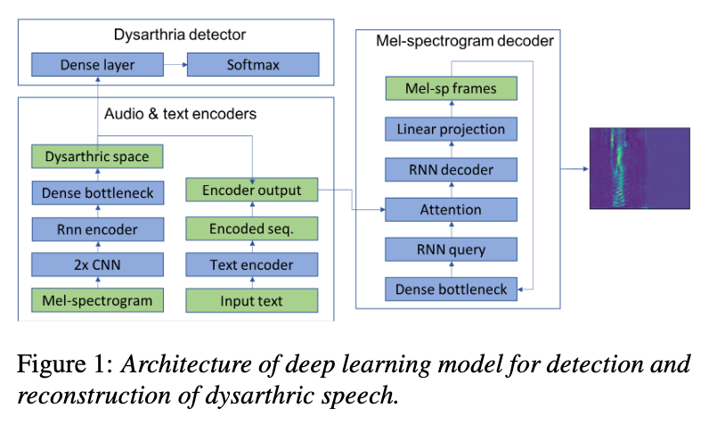
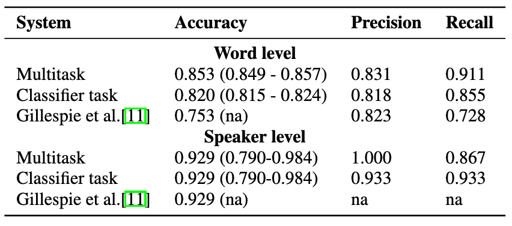
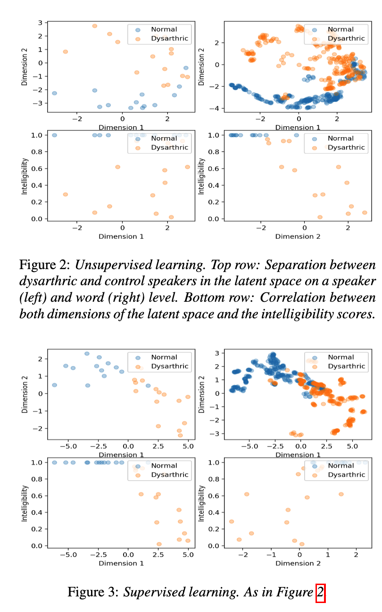

# Interpretable Deep Learning Model for the Detection and Reconstruction of Dysarthric Speech

[Link to the paper](https://arxiv.org/abs/1907.04743)

**Daniel Korzekwa, Roberto Barra-Chicote, Bozena Kostek, Thomas Drugman, Mateusz Lajszczak**

*Interspeech 2019*

Year: **2019**

Dysarthria is a type of brain/nervous system damage that causes speech problems (abnormal prosodic patterns). The current paper attempts to detect Dysarthria from recordings, provides some interpretable insights, and reconstructs the signal.

The architecture of the model proposed by the authors is summarized in the figure below.

The proposed model has two input modules: one for audio (mel spectrograms) and other for text. The audio module embeds the features into a low (2) dimensional space, which is used with a dense layer and a softmax to predict the probability of Dysarthria. This low-dimensional space feeds the text encoder output, that is passed to the decoder for speech reconstruction.

The spectrogram encoder uses RCNN. The text encoder uses several CNNs and a GRU layer. The input of the decoder is generated by concatenating (broadcasting) the output of both encoders.

The decoder uses RNN with attention (using as query a transformed mel frame from previously decoded samples). After the attention and RNN layer, a dense layer projects the output to the desired number of mel-coefficients.

The UA Speech dataset from the Uni. of Illinois, containing recordings of speakers with dysarthria and healthy ones, has been used for this task. A Leave On Speaker Out method has been used for cross validation.

The results show that the proposed model works well for dysarthria detection, when compared with a benchmark.

Two variants of latent space for observing the different dysarthria features have been used: one unsupervised and one supervised

For the reconstruction part, the first trials failed due to, potentially, high variability in the recordings. Later manipulations of the latent space improved the predictions. The authors also found difficulties on disentangling timbre of voice and speech fluency