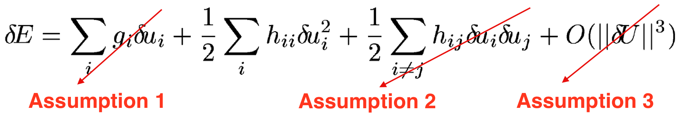
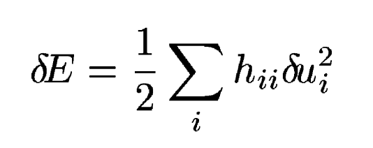
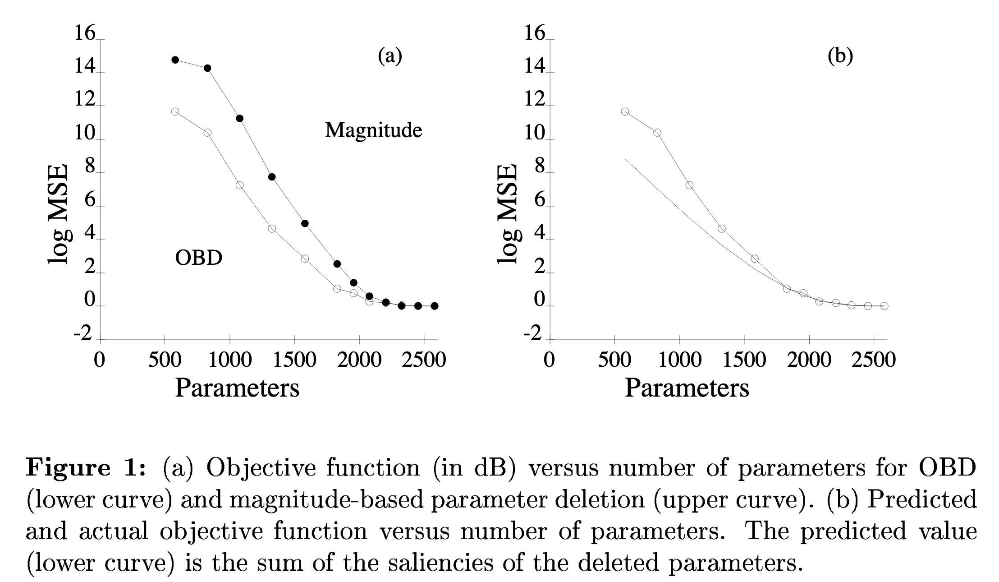
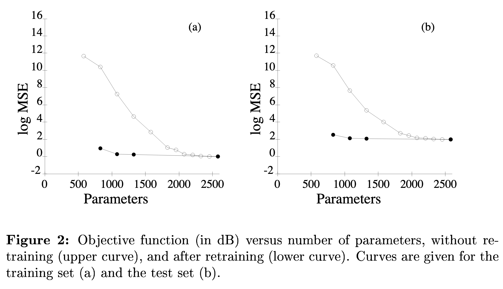

# Optimal brain damage

[Link to the paper](http://papers.nips.cc/paper/250-optimal-brain-damage)

**Yann LeCun**

*Neural Information Processing Systems (NIPS 1989)*

Year: **1989**

The current work introduces a pruning strategy that can be optimized using backpropagation.

The author starts by introducing the objective of the study: delete as many network connections as possible while keeping the performance of the network at the same level, or better. He defines the goal as pruning the weights with smallest "saliency", i.e. those weights whose deletion will have the least effect on the training error.

Estimating the saliency of each parameter using an iterative approach is unfeasible due to the combinatorial nature of the problem. Previous works have approximated saliency as the magnitude of the weights of the networks, so weights with smallest magnitudes are pruned first. This work moves beyond that approximation, proposing a second derivative of the error term wrt the parameters as another approximation for the saliency. The handwritten digit recognition data has been used to test the method.

The approach consists of constructing a local model of the error function that approximates the effect of a parameter perturbation in the error. LeCun uses a Taylor series to approximate the error function, and then he simplifies the expression through 3 assumptions.

where G is the gradient of the error E with respect to the parameters U, and the lowercase letters refer to the individual components of these matrices.

- Assumption 1 (aka extremal approximation): we assume that the network has already converged to a local optimum.
- Assumption 2 (aka diagonal approximation): the cross-effects of deleting several parameters are neglected. That is: the total change in the error can be decomposed as a sum of contributions of deleting each parameter individually.
- Assumption 3 (aka quadratic approximation): The error is locally quadratic. That allows approximating the error with a second order Taylor series.

The final approximation looks as follows.

The algorithm proposed is described in the following steps.

1. Define an architecture.
2. Train until convergence.
3. Compute 2nd order derivatives for each parameter $h_{kk}$.
4. Compute the saliencies for each parameter $s_k = h_{kk}u_k^2/2$.
5. Set to zero and freeze a fraction of the parameters with lower saliency.
6. Repeat from 3 until desired level of pruning.

Possible variants:
- Do not freeze the pruned parameters.
- Decrease the value of the pruned parameters instead of freezing.

The following figures show the results. The first one shows how the proposed method improves the magnitude approximation, and how the proposed local model fits the real behavior until some extent. The second figure shows how the picture improves when the network is retrained, for training and test sets.

The author also suggests interactively applying the pruning algorithm to gain insights about architecture design (e.g. drop a layer where the weights have low saliency).

Conclusions:
- We can do better than pruning with magnitude based method
- Neural networks pruned generalize better
