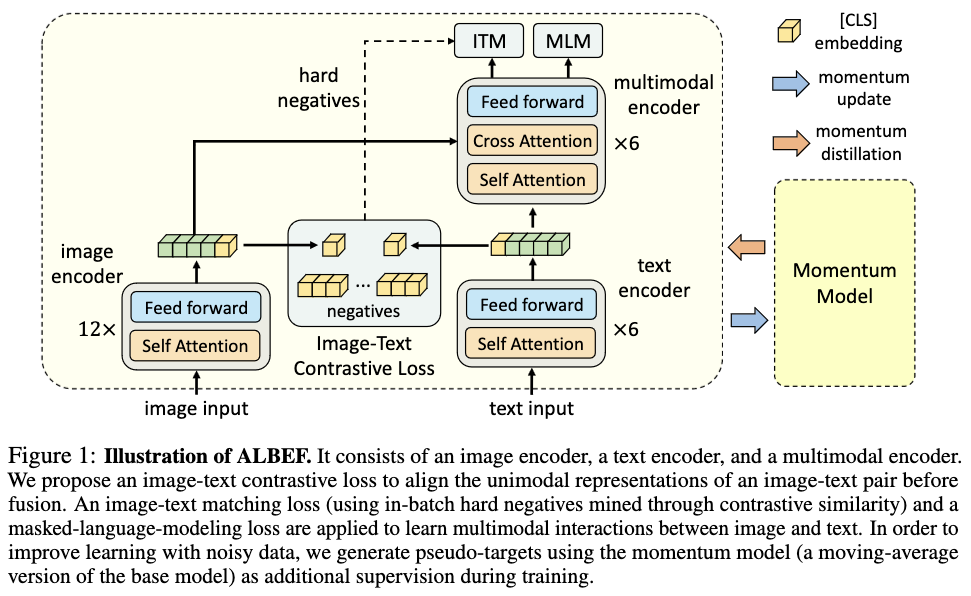
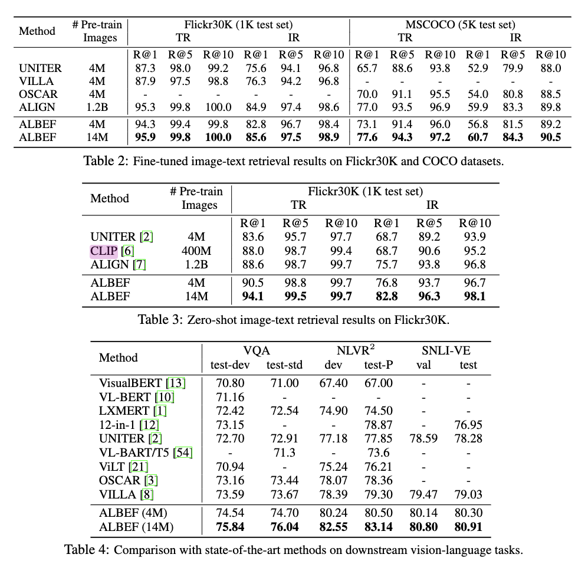

# ALign BEfore Fuse (ALBEF): Vision and Language Representation Learning with Momentum Distillation

[Link to the paper](https://arxiv.org/abs/2107.07651)

**Junnan Li, Ramprasaath R. Selvaraju, Akhilesh Deepak Gotmare, Shafiq Joty, Caiming Xiong, Steven Hoi**

*NEURIPS 2021*

Year: **2021**

The authors of this paper discuss the common limitations of Vision-and-Language Pre-training (VLP) models such as CLIP.
1. In many cases, image and features don't share a common hidden space.
2. Many approaches require object detection, i.e. bounding boxes annotation, which is both expensive to annotate and computationally heavy.
3. The datasets used commonly are very noisy because they are collected from the internet.

To address all those limitations, the authors propose a new framework that can be viewed as an extension of CLIP. The extension consists of a multimodal encoder that learns to combine ("fuse") the image and text features using attention ("alignment"). ALBEF still makes use of the CLIP loss (referred as Image-Text Contrastive, ITC), and adds a couple extra tasks/losses: a discriminative task after the multimodal module, and a masked language modeling task.

To address the misanotations, the authors propose a technique called Momentum Distillation (MoD), which is similar to the target-network idea of Deep Q-Learning algorithm. It consists of keeping an old version of the model (target network) to generate pseudo-targets. These are used to motivate the model to predict reasonable targets and learn from them, instead of solely relying on the noisy data labels. The parameters of the target network are alwawys kept close to the latest model through a moving average.

The architecture of ALBEF is summarized in the following figure.

Multimodal decoder (wrongly called encoder in the paper, while it is a transformer decoder): it consists of 6 layer transformer decoder that receives the text latents as input, and attends to the image latents (fusion). 

## Pretrained Tasks

ALBEF is first pretrained in three concurrent tasks, all of them using Cross-Entropy losses.

1. Image to text contrastive learning (ITC): same as CLIP loss, using CLS tokens and extracting the output of the CLS.
2. Masked Language Model (MLM): Similar to Wav2Vec, its objective is inferring masked text tokens from context tokens and from fused features. 
3. Image-Text Matching (ITM): Using the distributions of the similarity matrix of (1), the authors sample challenging images for given texts, and challenging texts for given images, and use them as negative examples. The idea is to choose in-batch challenging examples to avoid increasing the computation of the algorithm.

## Fine-tuning

After pre-training, ALBEF is fine-tuned on downstream tasks.

- Image-Text retrieval(IR/TR): Only ITC and ITM losses are backpropagated.
- Visual entailment (SNLI-VE): task consists of predicting entailment/neutral or contradictory given image/text pairs. For that the authors attach an MLP on top of the CLS class of the Multimodal decoder.
- Visual QA (VQA): Infer an answer given an image and a question by attaching a decoder on top of the multimodal decoder.
- Natural Language for Visual Reasoning (NLVR): consists of predicting whether a text is a good description for 2 images. The authors modify the multimodal decoder to get two images as input.
- Visual Grounding: aims to localize a region in the image given a description, and predict a heatmap.

## Results

