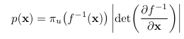
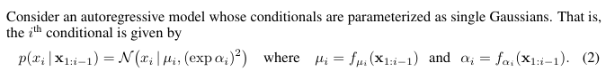
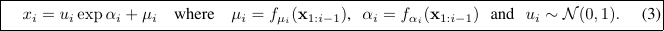
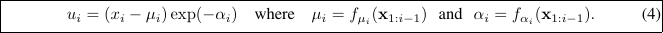
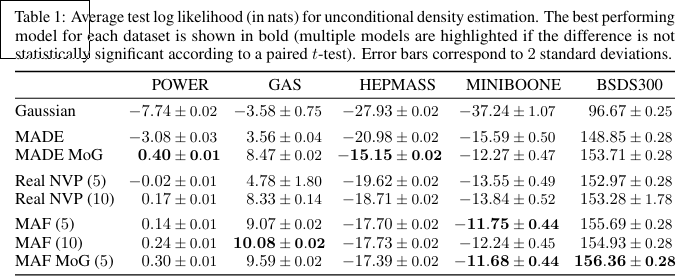

# Masked Autoregressive Flow for Density Estimation

[Link to the paper](https://arxiv.org/abs/1705.07057)

**George Papamakarios, Theo Pavlakou, Iain Murray**

*Neurips 2017*

Year: **2017**

This paper builds upon the MADE and RealNVP papers, and introduces a new generative model for density estimation.

The model architecture is based on the MADE idea. It consists of a set of MADE layers stacked, and trained as a Flow (MADE was originally not thought as a normalizing flow). The authors describe a mechanism to avoid using the autoregressive property of MADE layers, consisting of masking fully connected layers so that they depend only on previous inputs. That way, the Jacobian of the transformation becomes tractable by construction (TRIL/TRIU).

The notation of the paper goes as follows:
- $x$: input (e.g. image)
- $p(x)$: probability density of $x$
- $u$: random variable $u \sim $\pi_u(u)$
- $\pi_u(u)$: base density of the normalized code $u$. Typically a Gaussian, but can be any distribution with a closed form density.
- $f$: a function that maps a random variable $u$ to $x$. $x = f(u)$. This function must be invertible.

Once the transformation is learned, $p(x)$ can be calculated using the change of variables formula.

## Masked Autoregressive Flow (MAF)

Sampling (U -> X) (Slow)

Prob. Density estimation (X -> U) (Fast)

In MAF, autoregressive models are reinterpreted as a flow, so that given AR models M_1, ..., M_K we can:
- Model the random numbers $u_1$ of $M_1$ with $M_2$
- Model the random numbers $u_2$ of $M_2$ with $M_3$
- ...
- Model the random numbers $u_K$ of $M_K$ with a Gaussian distribution.

Functions $(f_\mu, f_\alpha)$ are implemented as a feedforward neural network with masking (MADE) that takes x as input and outputs mu and alpha. The masks are simply a binary matrix that is multiplied with the weights so that each layer depends only on previous inputs. MAF, in summary, is just a stack of MADE layers into a flow.

## Relationship with IAF

Sampling (U -> X) (FAST)

The only difference with MAF is that the functions $(f_\mu, f_\alpha)$ are computed taking the random numbers $u_1, ... , u_{i-1}$ as input instead of $x_1, ... , x_{i-1}$. This makes sampling fast and density estimation slow, as the first can be computed in parallel and the second should be computed sequentially.

## Relationship with RealNVP

RealNVP models use coupling layers instead of MADE layers. This has the disadvantage of being less flexible than MAF/MADE, but alows for parallel computation of transformations and inverses.

## Results over several datasets

