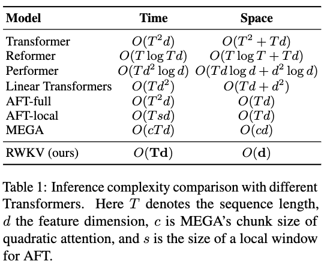
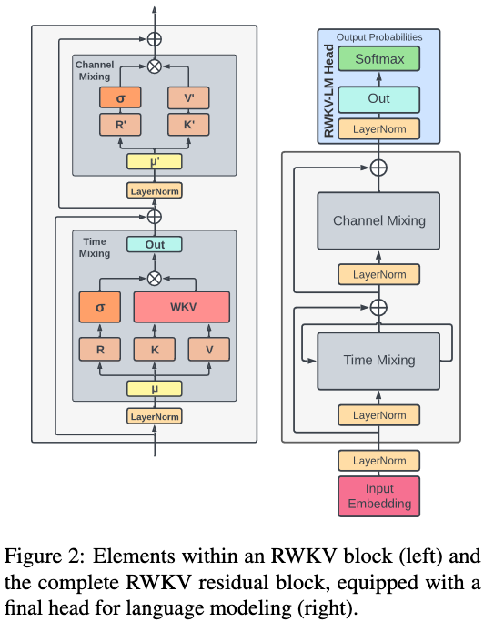
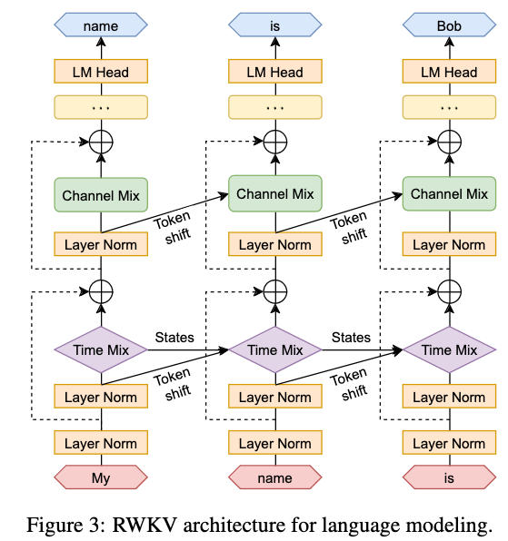

# RWKV: Reinventing RNNs for the Transformer Era

[Link to the paper](https://arxiv.org/abs/2305.13048)

**Bo Peng, Eric Alcaide, Quentin Anthony, Alon Albalak, Samuel Arcadinho, Stella Biderman, Huanqi Cao, Xin Cheng, Michael Chung, Matteo Grella, Kranthi Kiran GV, Xuzheng He, Haowen Hou, Jiaju Lin, Przemyslaw Kazienko, Jan Kocon, Jiaming Kong, Bartlomiej Koptyra, Hayden Lau, Krishna Sri Ipsit Mantri, Ferdinand Mom, Atsushi Saito, Guangyu Song, Xiangru Tang, Bolun Wang, Johan S. Wind, Stanislaw Wozniak, Ruichong Zhang, Zhenyuan Zhang, Qihang Zhao, Peng Zhou, Qinghua Zhou, Jian Zhu, Rui-Jie Zhu**

*Neurips 2023*

Year: **2023**

This paper introduces a transformer alternative named Receptable Weighted Key Value (RWKV) which claims efficient transformers-like parallel training, and memory-efficient AR inference. To do that, it implements a linear attention that allows both modes: parallel or sequential computation. This whole work builds upon Attention Free Transformer (AFT) work.

RWKV has four elements:
- R: the receptance vector that acts as a processor for past information. It's similar to an LSTM's forget gate.
- W: the positional weight-decay vector.
- K: the key vector.
- V: the value vector. 

The following picture summarizes the interaction of all these components. Notice how all the components in RWKV are residual. Each block contains two high level sequential components: time mixing and channels mixing. 

The $R$, $K$, $V$, $R'$ and $K'$ linear projection vectors are produced by linear interpolation between current and previous time steps as follows.Notice how the output gating mechanism is implemented in all the blocks (time and channel mixing), using a sigmoid over the receptance vector. This resembles a forget gate in LSTMs. The following equations describe this for the time and channel mixing components, respectively.

$$r_t = W_r(\underbrace{\mu_r \odot x_t+(1-\mu_r) \odot x_{t-1}}_\text{interpolation})$$
$$k_t = W_k(\mu_k \odot x_t+(1-\mu_k) \odot x_{t-1})$$
$$v_t = W_v(\mu_v \odot x_t+(1-\mu_v) \odot x_{t-1})$$
$$r'_t = W'_r(\mu'_r \odot x_t+(1-\mu'_r) \odot x_{t-1})$$
$$k'_t = W'_k(\mu'_k \odot x_t+(1-\mu'_k) \odot x_{t-1})$$

$$ wkv_t = \frac{ \sum_{i=1}^{t-1} e^{-(t-1-i)w+k_i} \odot v_i  e^{u+k_t} \odot v_t }{\sum_{i=1}^{t-1} e^{-(t-1-i)w+k_i} + e^{u+k_t}} $$

$$o_t = W_o(\sigma(r_t)\odot wkv_t)$$

$$o'_t = \underbrace{\sigma(r'_t)}_{\text{Fgt. gate}}\odot(W'_v \underbrace{\max(k'_t, 0)^2)}_\text{Squared ReLU}$$

- $w$ in the $wkv$ operator is a channel-wise vector that gets modified by relative position. See that the softmax is run across exclussively but exhaustively past tokens (all the history). u is a vector that separately attends to the current token. Now, given that w is not a matrix, it applies an exponential decay as we go further to the past. So the $wkv_t$ output can contain information from the beginning of time.
- Notice that all the computations of $r_t$, $k_t$, $v_t$, $r'_t$ and $k'_t$ are performed as a multiplication of a learnable matrix times a linear interpolation between the input at the current timestep and at the previous timestep, and that the interpolation factor $\mu_x$ is learned. This mechanism is denoted by the authors as the *token shift* mechanism. 
- The $r_t$, $k_t$, $v_t$, $r'_t$ and $k'_t$ are linear operations over $x$. This makes it feasible to parallelize the computation. It can be seen as a convolution in fact, as it has effectively a causal receptive field that grows with time, as it can be noticed in the figure below.

The authors show that the RWKV model seems to scale adequately and reaches state of the art results. However, they acknowledge the model limitations and explain that due to it's inherence linearity, RWKV suffers at inference time, needing more prompt engineering to get accurate results.

