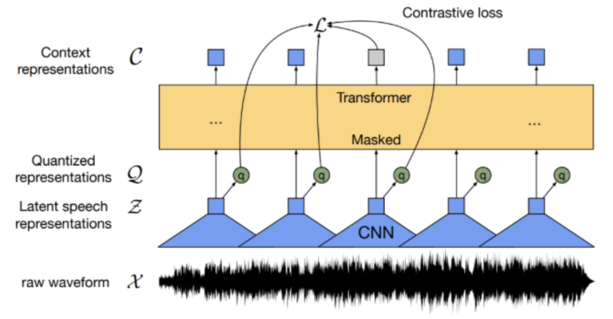

# Scaling Speech Technology to 1,000+ Languages

[Link to the paper](https://arxiv.org/abs/2305.13516)

**Vineel Pratap, Andros Tjandra, Bowen Shi, Paden Tomasello, Arun Babu, Sayani Kundu, Ali Elkahky, Zhaoheng Ni, Apoorv Vyas, Maryam Fazel-Zarandi, Alexei Baevski, Yossi Adi, Xiaohui Zhang, Wei-Ning Hsu, Alexis Conneau, Michael Auli**

*arXiv Preprint*

Year: **2023**

Researchers use a dataset of 1107 languages with labeled utterances, and another with 3809 languages with unlabeled speech. They then pre-train wav2vec 2.0 on unlabeled data and finetune them to perform ASR and TTS in 1107 languages, and language identification in 4017 languages. The artifacts of this project (codename Massive Multilingual Speech (MMS)), including the code and the models, are open source: https://github.com/facebookresearch/fairseq/tree/main/examples/mms. The dataset used comes from people volunteering to read the New Testament books: https://www.faithcomesbyhearing.com/

The paper describes how the original data from Faith Comes by Hearing has been processed: force-alignment to chop the long audio clips into short utterances, data QA filtaring based on ASR transcription and CV splits.

## Wav2vec 2.0 (W2V) pretraining on unlabeled data 
Speech representation using unlabeled data (self-supervision), to further fine-tune the model to solve downstream tasks. The architecture is similar to the  Wav2vecQ (https://arxiv.org/pdf/1910.05453.pdf). The encoder consists of a stack of convolutions X->Z followed by a transformer Z->C. Z features are quantized using a Gumbel Softmax. The model is trained to solve a masking task using contrastive learning. The C space is a projection from Z where the contrastive loss is applied.

## ASR
Fine-tuning the pre-trained W2V model. The W2V architecture is modified with a linear layer on top of it that maps the latents to an output vocabulary of letters. The model is trained using Connectionist Temporal Classification (CTC) loss. 

They prove that the MMS reduces the error of Whisper ASR by a relative 58%. However Whisper improves MMS substantially in large languages: English, Spanish, French, German, Arabic, Russian, etc. The improvement is far from uniform and comes only on lower resource languages. 

## Language identification
After finetuning W2V on a language identification task, the system achieves 92-98% accuracy with in-domain data, and 80-88% accuracy with out of domain data.

## TTS
Architecture based on VITS, where a spectrogram-based set of acoustic features are generated using a normalizing flow, which are decoded later using HiFi-GAN vocoder. **The models are monolingual**. 

## To read
- Adapter modules: https://arxiv.org/abs/1902.00751