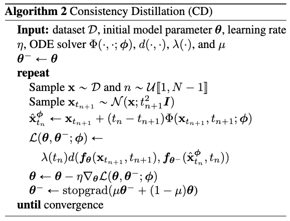
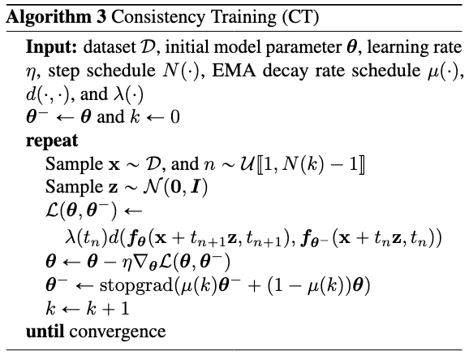
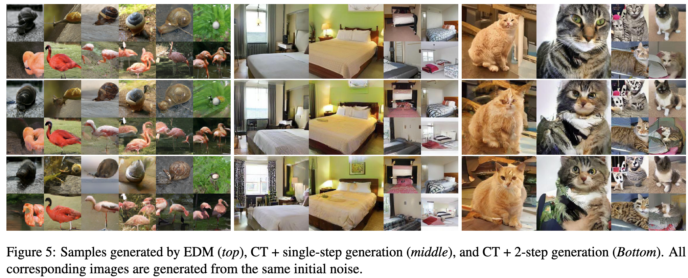

# Consistency Models

[Link to the paper](https://arxiv.org/abs/2303.01469)

**Yang Song, Prafulla Dhariwal, Mark Chen, Ilya Sutskever**

*arXiv Preprint*

Year: **2023**

Diffusion models, compared with single-step generative models such as GANs, VAEs or normalizing flows, require iterative sampling which limits real time applications but enable other zero shot capabilities (inpaining, colorization, etc). By choosing more or less steps in the reverse diffusion process, one can trade off quality vs compute. The objective of consistency models is to allow single-steps without sacrificing the mentioned capabilities.

The main idea of consistency models (referred as $f$ hereafter) is to enforce self-consistency: "points on the same trajectory map to the same initial point": $f: (x_t, t) \rightarrow x_e \ \forall \ t \in [\epsilon, T]$. I.e.  $f(x_t, t) = f(x_{t'}, {t'}) \ \forall\  t, t' \in [\epsilon, T]$. An important condition derived from the first one is the boundary condition: $f(x_\epsilon) - x_\epsilon = 0$. I.e. at $t=\epsilon$ (last time step), the consistency model should be an identity function. The boundary condition can be parameterized easily as shown in the following equation, where $F_\theta$ is a neural network which input and output tensors are of the same shape and $c_\mathrm{skip}(t)$ and $c_\mathrm{out}(t)$ are differentiable functions such that $c_\mathrm{skip}(t=\epsilon) = 1$ and  $c_\mathrm{out}(t=\epsilon) = 0$:

$$f_\theta(x, T) = c_\mathrm{skip}(t) \cdot x + c_\mathrm{out}(t) \cdot F_\theta(x, t)$$

The authors propose two methods to train consistency models: one based on distillation of a pretrained diffusion model, and other based on training the consistency model on insolation. 

## Consistency distillation 
For this, let model $s_\phi(x, t)$ be a pretrained diffusion score function. Consider discretizing the time horizon: $[\epsilon, T]$ into N-1 intervals. The consistency distillation loss is defined as follows: 

$$\mathcal{L}_{CD}^N := (\theta, \theta^-; \phi) := \mathbb{E}[\lambda(t_n)d(f_\theta(x_{t_{n+1}}, t_{n+1}), f_{\theta^-}(x_{t_{n}}^\phi, t_{n}))]$$

where:
- $\mathbb{E}$ is taken over $n\sim\mathcal{U}(1, N-1)$, $x\sim p_\mathrm{data}$, and $x_{t_{n+1}}\sim\mathcal{N}(x, t_{n+1}^2\mathcal{I})$
- $\lambda(t_n)$ is a positive weighting function, which the authors end up setting it to 1.0 as it seems to work well in all cases
- $x_{t_{n}}^\phi$ is the estimation of $x_{t_{n}}$ given by the diffusion model
- $d(\cdot, \cdot)$ is a distance metric such as $\mathcal{L}_2$ or $\mathcal{L}_1$. The authors also use [[LPIPS]](https://arxiv.org/pdf/1801.03924.pdf).
- $\theta$ denotes the parametes of the consistency model.
- $\theta^-$ is an exponential moving average of $\theta$, similar to a target network in RL, that has shown empyrically to stabilize the training process: $\theta^- = \mathrm{sg} (\mu\theta^- + (1-\mu)\theta)$ (where sg comes from stop gradient). In this comparison, $\theta$ can be seen as the parameters online network. 

The training algorithm is described below.

The authors recommend initializing this model with the weights of the pretrained diffusion model. 

## Consistency training
The paradigm is very similar to the distillation training, but in this case no pretrained model is required. Instead, the gradient of the ODE is approximated using Montecarlo, using the forward diffusion targets as follows.

$$\mathcal{L}_{CT}^N = (\theta, \theta^-; \phi) := \mathbb{E}[\lambda(t_n)d(f_\theta(x + t_{n+1}\cdot z, t_{n+1}), f_{\theta^-}(x + t_{n}\cdot z, t_{n}))]$$

Tricks of the trade:
- Progressively increase $N$ during training.
- Progressively decrease $\mu$ during training.

The training algorithm is described below.

## Effect of distance metric, ODE solver and $N$ and $\mu$ schedules in FID

CT is independent of ODE solver, as it is trained using distillation targets.

## Samples

