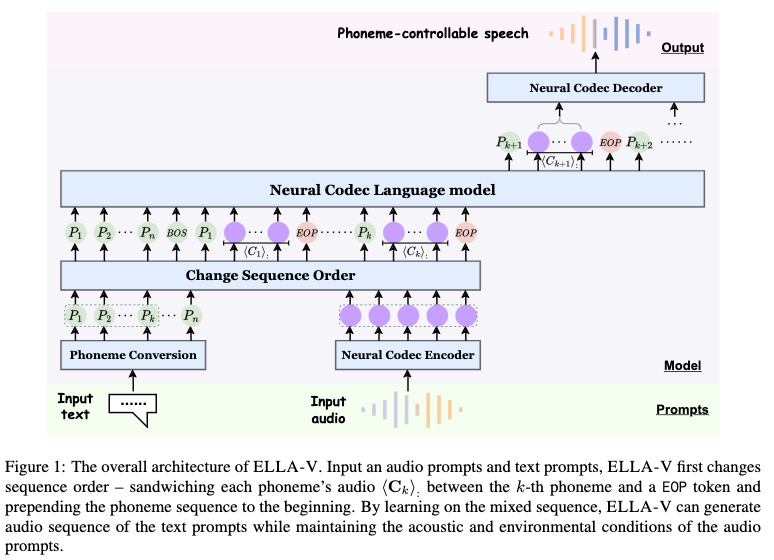
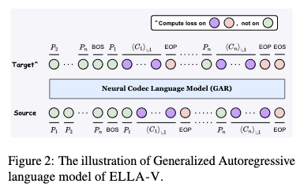

# ELLA-V: Stable Neural Codec Language Modeling with Alignment-guided Sequence Reordering

[Link to the paper](https://arxiv.org/abs/2401.07333)

**Yakun Song, Zhuo Chen, Xiaofei Wang, Ziyang Ma, Xie Chen**

*arXiv Preprint*

Samples: https://ereboas.github.io/ELLAV/

Year: **2024**

This paper builds upon the stability limitations of VALL-E, and proposes ELLA-V, a new TTS model that claims higher stability than VALL-E. ELLA-V uses General AutoRegressive (GAR) modelling for the first RVQ code and NAR (non-auto-regressive) for the subsequent levels. 

Some details:
- GAR seems to be a input-output streaming strategy, and the authors recommend giving a look-ahead window (aka local-advance) to better model the coarticulation.

ELLA-V is based on a decoder-only transformer that learns to generate speech given a sequence of phonemes and an audio prompt. It relies on discretized acoustic tokens from Encoded (@75Hz, 8 codebooks of 1024 codes) and then decodes audio @24kHz. The phonetic sequences are pre-aligned with the audio using Montreal Forced Aligner.

Given that the durations of the phonemes are known, and hence the correspondence between acoustic tokens and phonemes, the authors interleave the phonetic and the acoustic representations as shown in the following image. They also provide a bit of look-ahead context so the model has information about what is coming. The authors call this _local advance_. They also add the full phonetic sequence at the beginning so that the model sees all the context. They call this _global advance_.  ELLA-V uses a maximum likelihood loss on the acoustic tokens but not on the full hybrid sequence.  This approach is used to predict the first RVQ level. The next RVQ level is predicted in parallel, assuming independence between the contiguous tokens in time.

The results claim much better zero-shot capabilities than VALL-E and a >50% reduction in WER. The authors ablate global advance and phoneme sandwitching and conclude that the first one is very important while the second is as well but slightly less.