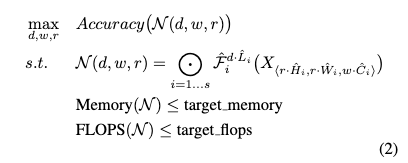
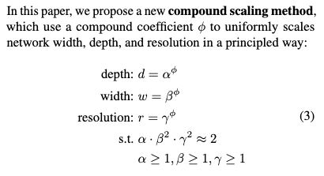
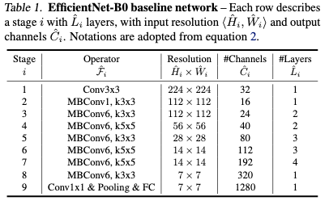
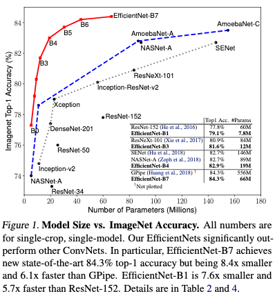
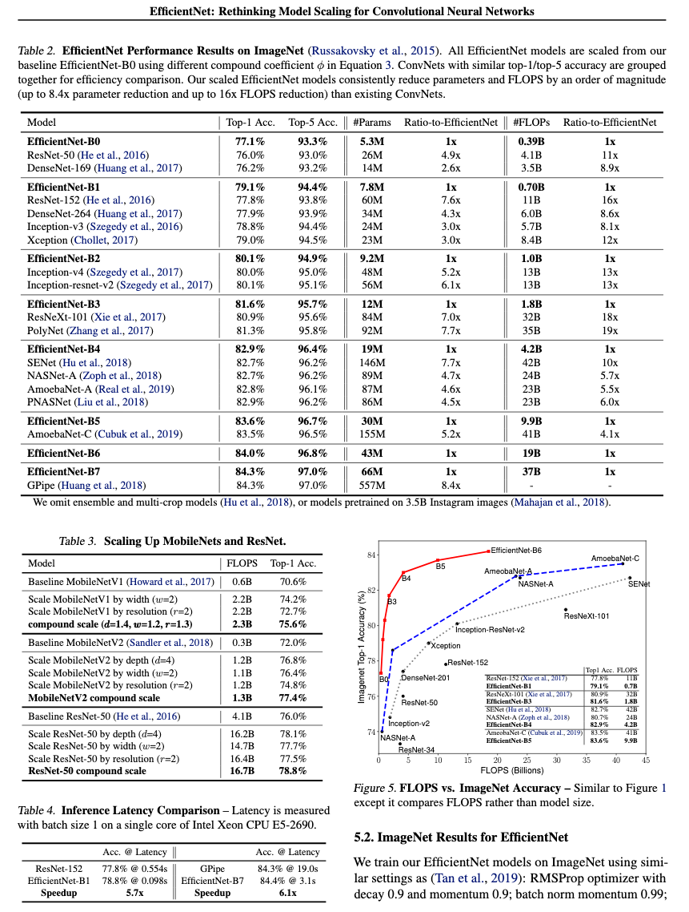

# EfficientNet: Rethinking Model Scaling for Convolutional Neural Networks

[Link to the paper](https://arxiv.org/abs/1905.11946)

**Mingxing Tan, Quoc V. Le**

*International Conference on Machine Learning, 2019*

Year: **2019**

This paper presents a new computer vision architecture that features a compound coefficient for model scaling.

MobileNet, one year before, showed that it was possible to achieve ResNet-level results using an order of magnitude less parameters. They introduced various parameters to control the width/depth of the network as well as the input image resolution. EfficientNet goes one step further by studying how to reduce it to one single coefficient that controls all three levers. The authors explain that the motivation for this study relies on the folowing research question: "is there a principled method to scale up ConvNets that can achieve better accuracy and efficiency?"

Intuitively this study makes sense because for instance when the input image is scaled up by a factor R, the network will probably need to be deeper to be able to increase the effective receptive field of the stack of convolutions. The authors mathematically define the general problem as an optimization problem, as follows:

Additionally, they describe the optimization parameters as follows, where $\emptyset$ represents the compound parameter that the authors want to take control of. For that, they need to find $\alpha$, $\beta$ and $\gamma$ using a small grid search.

Additionally, to prove the effectiveness of the previously described framework, a new architecture is defined using Neural Architecture Search: EfficientNet. See the details of the base architecture below.

## Results
As it can be seen in the following figures, EfficientNet achieves much better performance than MobileNetV1/V2 ResNet, etc. with a small but scalable number of parameters.

