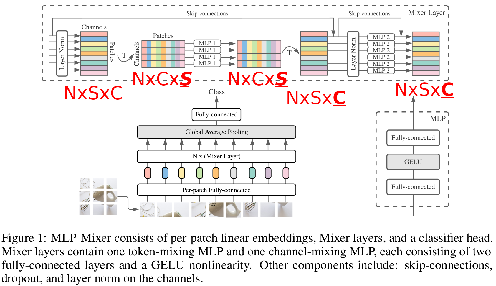
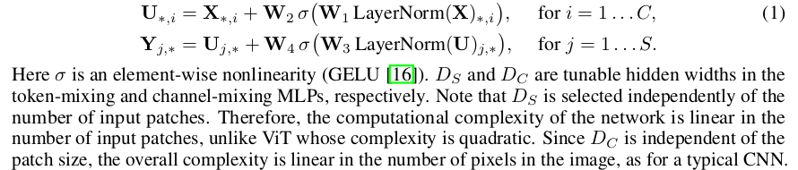
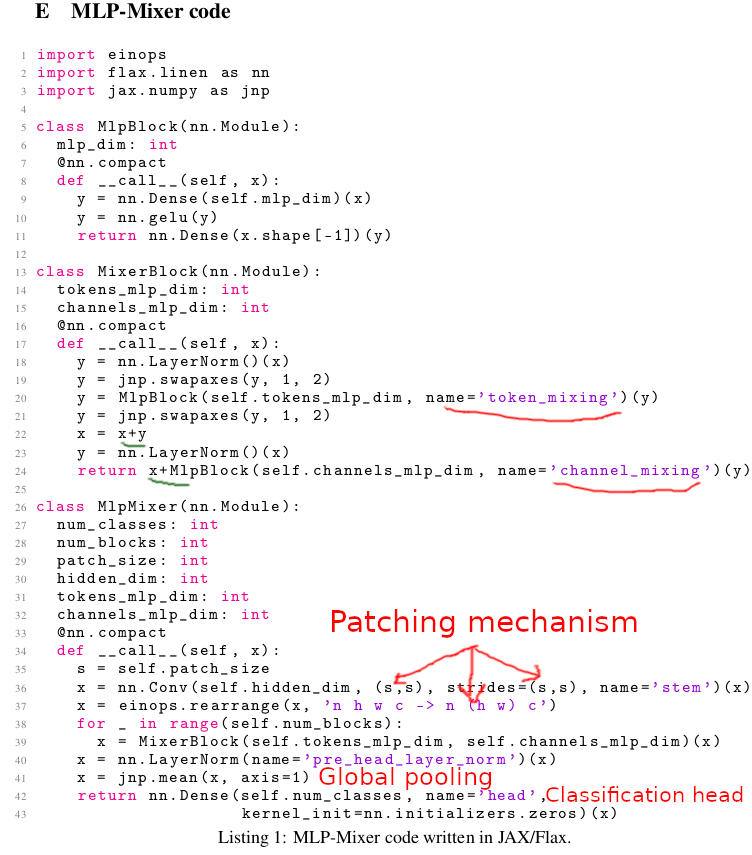
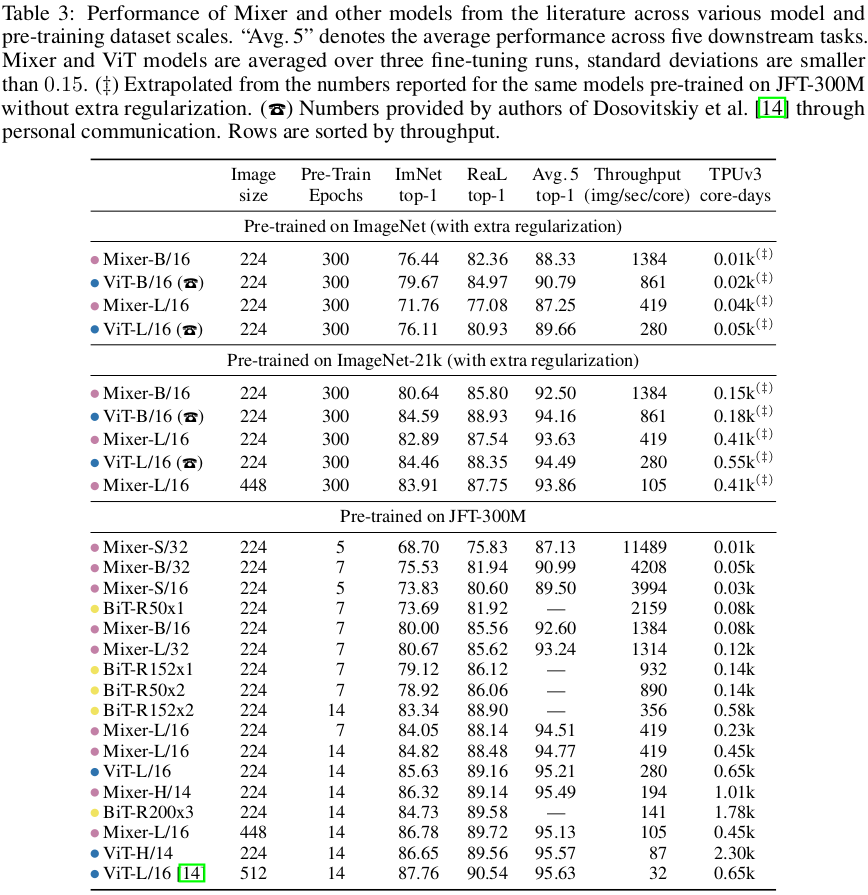

# MLP-Mixer: An all-MLP Architecture for Vision

[Link to the paper](https://arxiv.org/abs/2105.01601)

**Ilya Tolstikhin, Neil Houlsby, Alexander Kolesnikov, Lucas Beyer, Xiaohua Zhai, Thomas Unterthiner, Jessica Yung, Andreas Steiner, Daniel Keysers, Jakob Uszkoreit, Mario Lucic, Alexey Dosovitskiy**

*Google Preprint*

Year: **2021**

The authors present in this work a new vision architecture capable of achieving competitive results with SOTA transformers at a much lower cost.

The solution consists of an all-MLP with no attention architecture. The input of the model is an image chopped in patches (aka tokens). Each patch is passed through an embedding layer to get a linear projection, that will be used as input for the first mixer block. Each mixer block is built up with two different layers: (1) channel mixing MLP and (2) the token-mixing MLP. Each one does, similar to depthwise-separable convolution, share parameters across tokens, and across channels, respectively. This is essentially equivalent to applying two MLP blocks, one to X -> H_1 and the next to H_1^T -> H_2. The following figure shows more details about the architecture.

The fundamental difference between mixers and DWS convolutions is that in mixers a shared set of parameters is applied to all the channels (step 1) while in DWS conv. networks a different kernel is learned for every channel.

As shown in the figure, also skip connections are implemented. The following formulas show the computation performed by (1) and (2) more in detail

Additionally, the authors provide a handful snippet of code with the core implementation of the MLP-MIXER architecture in Python.

Results are summarized in the following table, showing that the MLP Mixer is superior to the rest in trade off between accuracy and computational resources.

