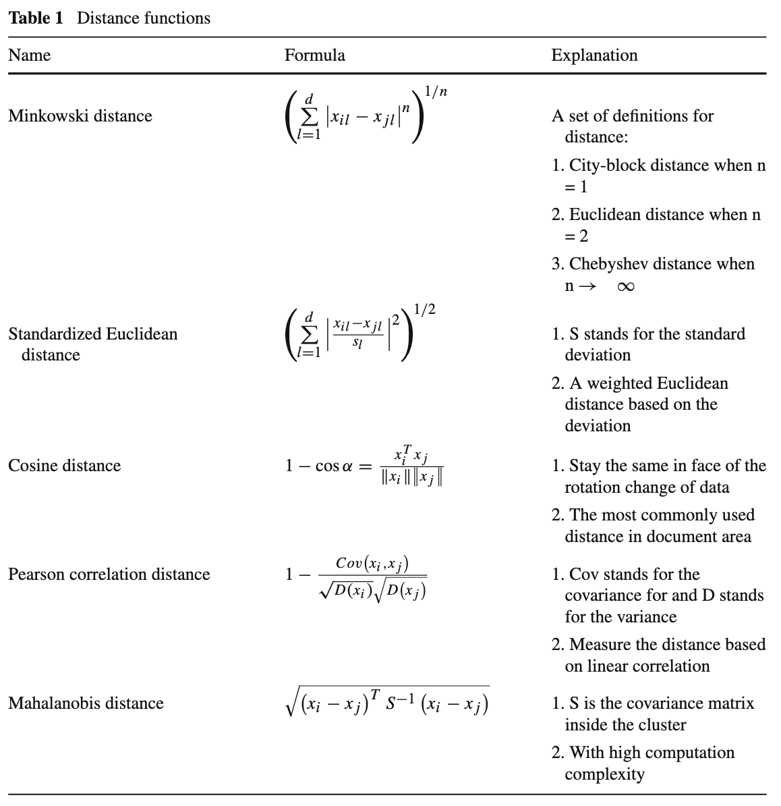

# A comprehensive survey of clustering algorithms

[Link to the paper](https://link.springer.com/article/10.1007/s40745-015-0040-1)

**Dongkuan Xu, Yingjie Tian**

*Annals of Data Science, Springer, 2015*

Year: **2015**

This paper contains one of the biggest surveys of currently available clustering algorithms. It is a good reference to have a broad picture and choose the appropiate algorithm for an application.

The most important information is summarized in a set of tables. They have been compiled and sticked below. Proper high level descriptions of each of the algorithms are included in the paper. 

## Distance and similarity functions

## Evaluation functions (internal and external)

## Algorithms by family

