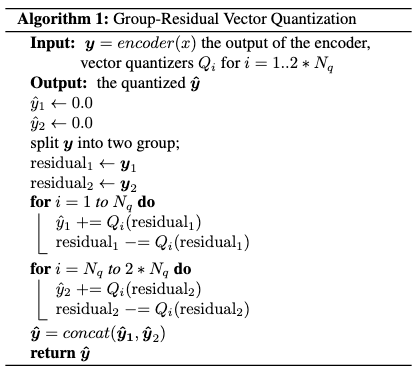
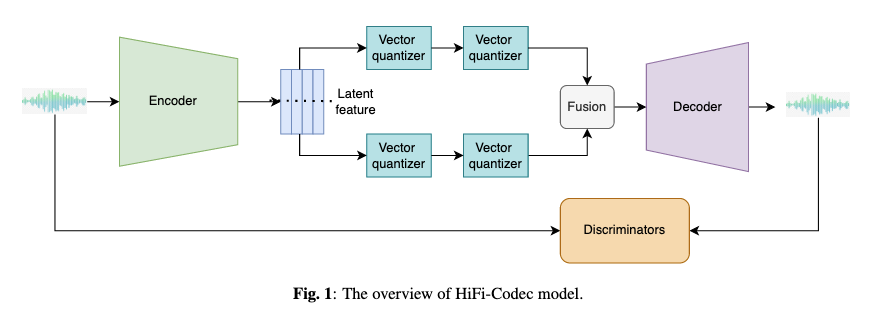

# HiFi-Codec: Group-residual Vector quantization for High Fidelity Audio Codec

[Link to the paper](https://arxiv.org/abs/2305.02765)

**Dongchao Yang, Songxiang Liu, Rongjie Huang, Jinchuan Tian, Chao Weng, Yuexian Zou**

*arXiv Preprint*

Year: **2023**

The authors of this study introduce another VQ-based codec, specially designed for speech generation. For that, they focus on high quality reconstructions with low number of codebooks.

To achieve that, they introduce a new technique that they call Group Residual Vector Quantization. In this case, instead of stacking quantizations and codebooks in cascade (residual-VQs), they propose to do the same in parallel. The method consists of splitting the continuous latent vector that conforms the output of the encoder ($z_e$) into $N_q$ vectors and quantize each of them separately. They propose also adding one residual to each of the groups (see algorithm below). At the end, they concatenate the last quantization of each group into a joint vector that is feed into the decoder. The authors use a reconstruction loss (based on $\mathcal{l}_1$ distance) and perceptual loss based on GAN.

The motivation of this approach is that Encodec/RVQ/Soundstream models encode many information into the first codebook (content, pitch, prosody, etc), and then use the rest of codebooks to sparsely encode minor details. By splitting the representation from the beginning, they claim that the information is better distributed across codebooks.

Although not directly mentioned in the paper, the most interesting property of this approach is that the $N_q$ codebooks may be predicted in parallel (same way as they are trained), so that downstream generative models can improve inference computation speed. 

The following chart shows the architecture of HiFi codec.

