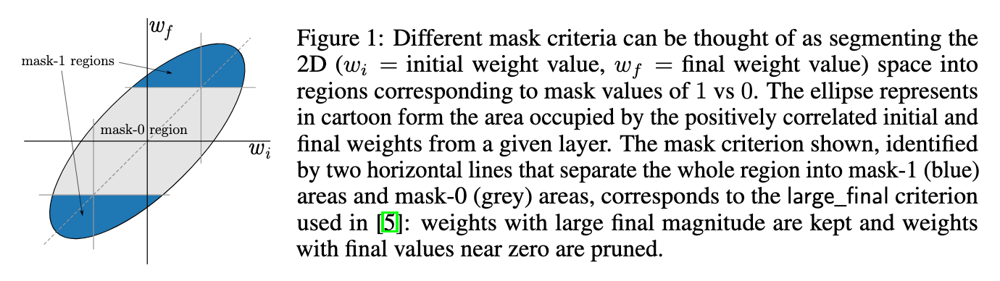
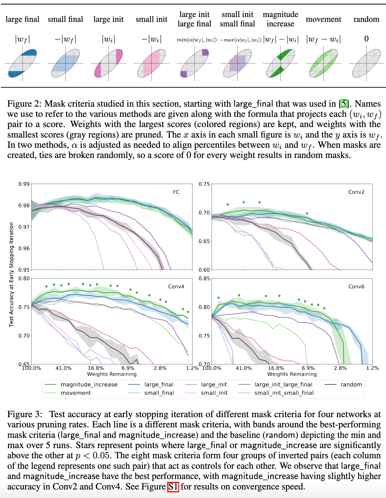
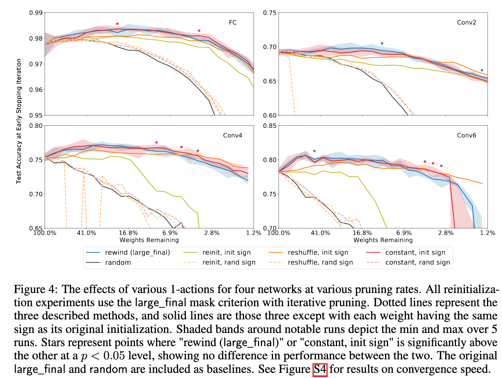
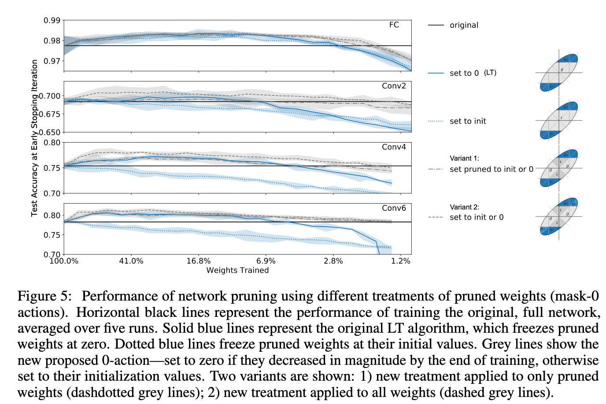
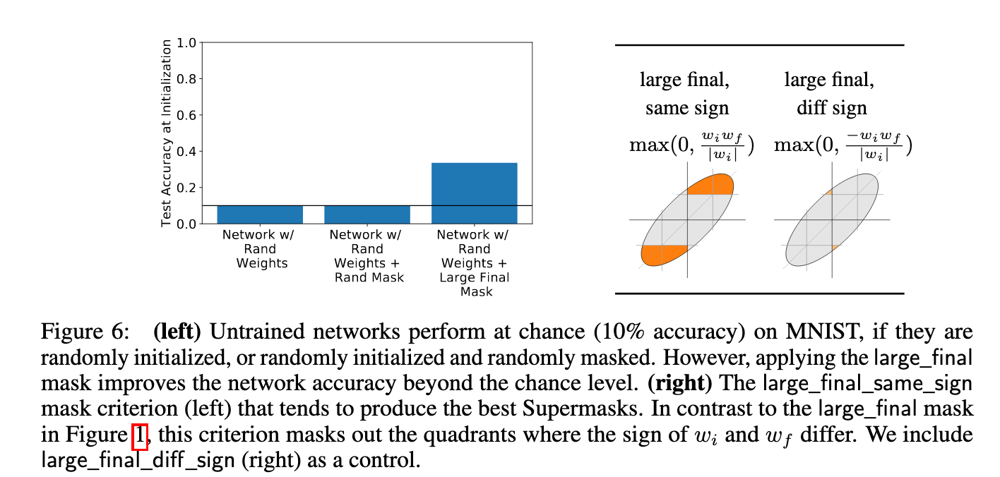
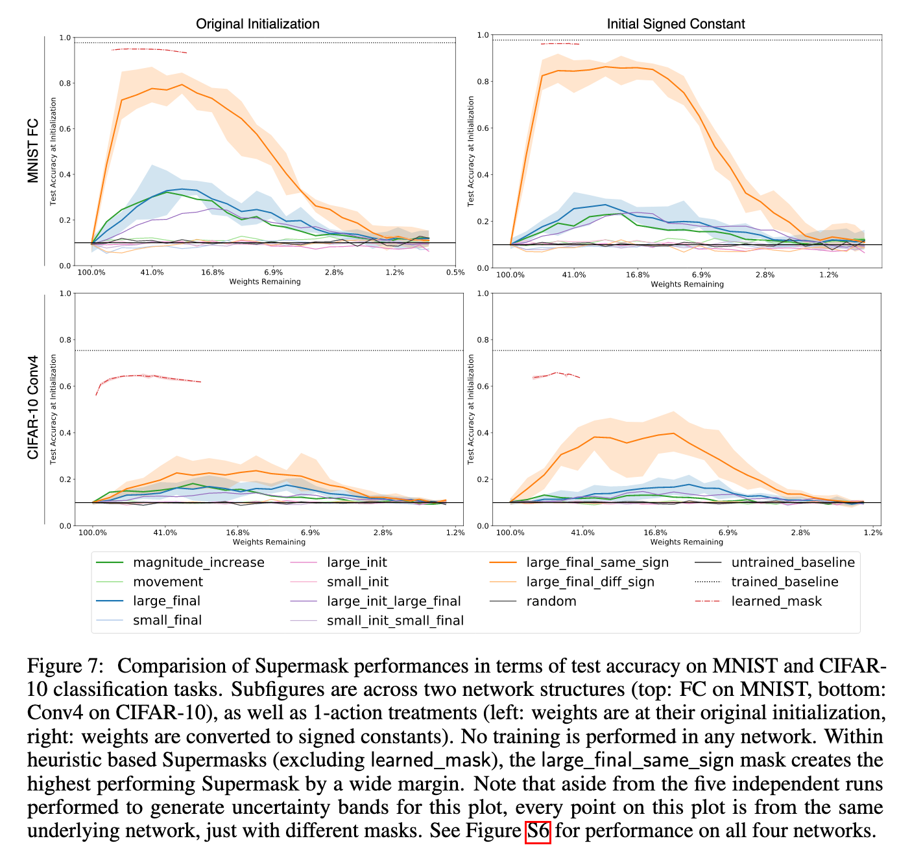
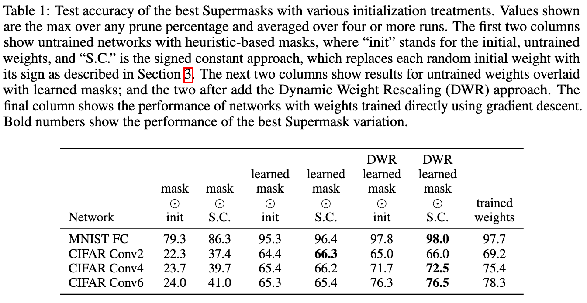

# Deconstructing Lottery Tickets: Zeros, Signs, and the Supermask

[Link to the paper](https://arxiv.org/abs/1905.01067)

**Hattie Zhou, Janice Lan, Rosanne Liu, Jason Yosinski**

*NeurIPS 2019*

Year: **2019**

The current paper extends the lottery ticket hypothesis in 3 dimensions:
- It analyses different pruning strategies to see if there is one performing better than the original.
- It analyses the freeze process of the pruned weights, suggesting alternative methods.
- It proposes a the concept of supermask: subnetworks that perform well without training.

All the experiments shown in this paper follow the same setup than the original paper (same architectures, number of experiments and data sets).

The authors start by introducing a conceptual diagram that helps visualizing the masking strategy, which is always based on the initial value of the weights $w_i$ and the final value achieved after training $w_f$.

## Masks
Given this diagram, the authors suggest a set of different pruning criteria. All of them together with the results are summarized in the figures below

Takeaways:
- The original criterion ("large final") is very competitive.
- The criterion "magnitude increase" seems to show a bit better results than the original one.

## Mask-one actions
The authors tried applying different actions to the weights that survived the pruning process. They restricted the experiments to the "large-final" pruning mask.
- Reinitializtion to the original distribution ("reinit")
- Reshuffling the weights of the original distribution, layer by layer ("reshuffle")
- Setting the weights to constant values, layer by layer.
They showed that the results were non promising, and hence they added a new restriction: hold the sign of the weights to be the same as in the initial values; results below.

Takeaways:
- The sign restriction seems to be key for the model success. Just holding the weights sign shows a huge improvement.

## Mask-zero actions
Why the pruned weights should be clamped to zero? This is the subject of study in this section. The authors did 3 main experiments:
- "set to init": freeze the weights on their initial value
- "variant 1": set the pruned weights that showed a value decrease along training to zero, and the rest to the initial values.
- "variant 2": same as variant 1 but also applied to mask-one weights (unpruned).

Takeaways:
- Variant 2 and variant 1 show a great improvement over the original strategy (in both, allowing more prune rate and increasing the peak accuracy). It seems that clamping to zero all the values in the network that showed a magnitude decrease is very powerful (Variant 2).

## Supermasks
Along the way, the authors discovered that just by applying the pruning, the networks work much better than random; this suggests that the mask itself provides an inductive bias. This is shown below.

That motivates the authors to measure the accuracy without training across all the different masking strategies.

The authors discovered also that when the weights are set to a constant value (maintaining the sign), the accuracy increases.

Finally, the authors showed that the supermasks can be trained. They used a Bernoulli process at weight level, with a sigmoid, that probabilistically decides if the weight should be masked or not. The original weights of the network are hold to random values, just the mask is trained. The method can be seen as a differentiable way of training network masks. Results below.

Takeaways:
- The networks perform very well when using the large final mask strategy constrained to the weights that do not change the sign across training.
- If wee set the weights to a constant, accuracy increases substantially (the model generalizes better).
- The supermasks training strategy shows a very competitive approach with the normal training process, which unveil a new potential paradigm. Shall we continue focusing on training weights? Or shall we focus more on the structure of the network instead?
