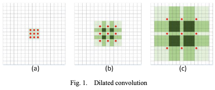
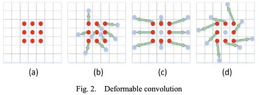
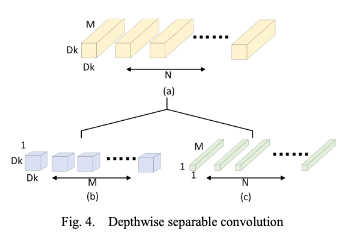

# Review of research on lightweight convolutional neural networks

[Link to the paper](https://ieeexplore.ieee.org/abstract/document/9141847)

**Yan Zhou, Shaochang Chen, Yiming Wang, Wenming Huan**

*ITOEC 2020*

Year: **2020**

This paper summarizes some of the most impactful ideas on the field of lightweight convolutional neural networks.

First of all, the paper introduces 4 types of efficient convolutions.

- Dilated convolutions: consisting of injecting holes into the convolution kernel to effectively increasing the receptive field without increasing the number of parameters
  

- Deformable convolutions: consisting of letting the network choose the shape of the kernel, moving away from the regular rectangular size
  

- Group convolutions: consisting of distributing the computation of the convolutional layers per group, as a way to distribute the calculation and achieving a sparser computation (all input channels no longer depending on all output channels)
  

- Depthwise separable convolutions: consisting of unfolding the classical convolutional layer operation into two composed operations: a pointwise convolution capable of modifying the number of channels, and a depthwise convolution applied to analyse spatial information. 
  

Then, the authors take 6 examples of neural networks that leaded the trend of current efficient CNNs:
- Squeezenet: 1x1 convolutions used to reduce the computation
- MobileNetV1: depthwise separable convolutions
- MobileNetV2: depthwise separable convolutions + linear bottleneck
- ShuffleNet: group convolutions with channel mixing operation
- MixNet: depthwise separable convolutions + mixed kernel sizes
- EfficientNet: efficient choice of depth, width and resolution

