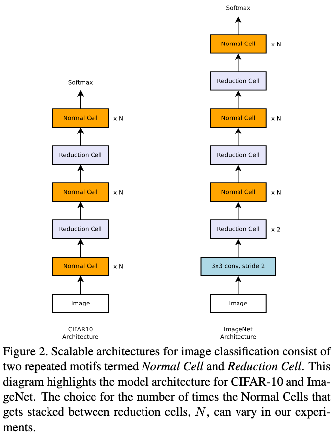
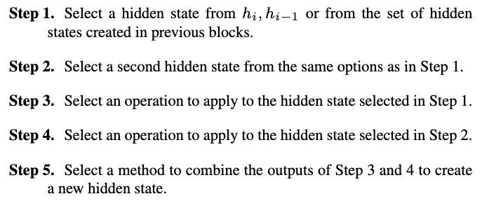
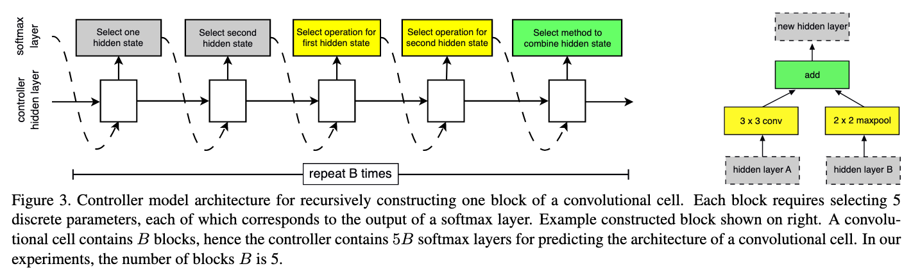
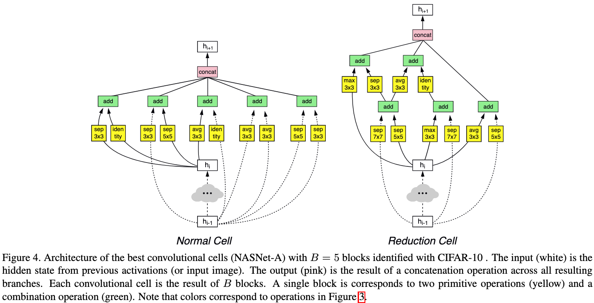
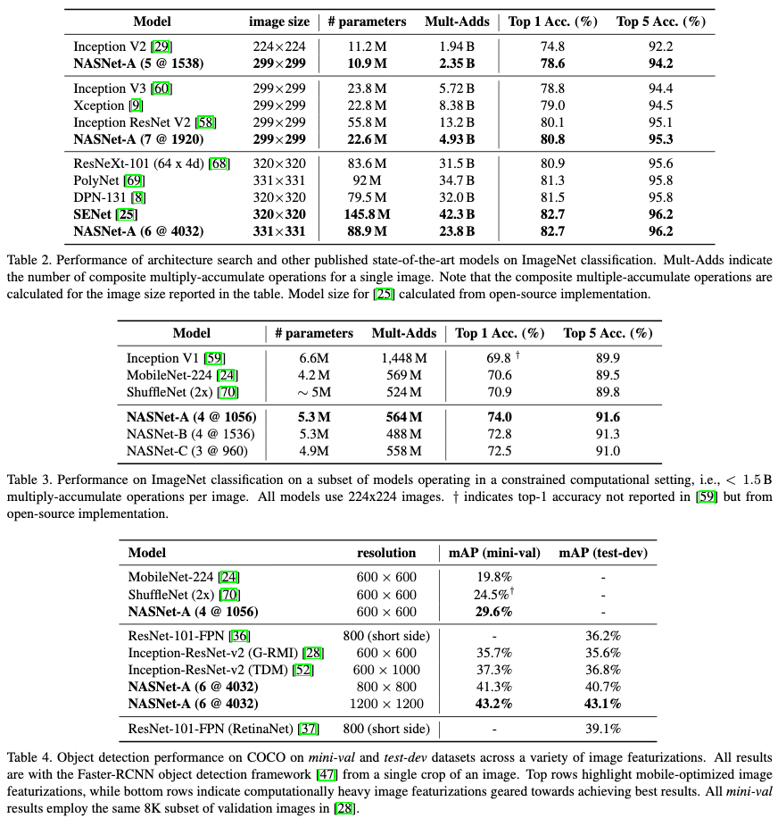

# Learning Transferable Architectures for Scalable Image Recognition

[Link to the paper](https://arxiv.org/abs/1707.07012)

**Barret Zoph, Vijay Vasudevan, Jonathon Shlens, Quoc V. Le**

*CVPR, 2018*

Year: **2017**

This paper introduces a new architecture as well as a methodology to perform Neural Architecture Search at scale.

## Neural Architecture Search
The method presented in this paper uses reinforcement learning in order to look for convolutional architectures. The methodology consists of the following: given a general architecture skeleton with the placement of the different blocks (named cells by the authors by analogy with RNN cells) at high level (see figure below), learn the blocks themselves so that they maximize the accuracy in CIFAR-10 dataset. The authors empirically prove that the architecture that works the best in the CIFAR-10 task, also does it in the Imagenet competition.

Notice that the skeletons are different for the CIFAR-10 dataset and Imagenet due to different image sizes. In each skeleton, normal cells are differentiated by reduction cells. This is because the authors decided to allow the algorithm to learn potentially different cells for the points where the network reduces the spatial dimension with strides and the points where stride of 1 is applied.

The architecture search has been performed using Proximal Policy Optimization with a recurrent neural network. The sequential search space is defined as follows.

At each block, the previous 5 steps are repeated B times, so that each block has 5 different sub-blocks. Several different operations are defined by the authors. Among them, identity operation, convolutions, dilated convolutions and several types of pooling. The agent procedure is described in the diagram below.

## NASNet
The final convolutional blocks, result of the best solution found by the reinforcement learning agent, looks as follows.

The results achieved, compared with the state of the art baselines, is summarized in below.

