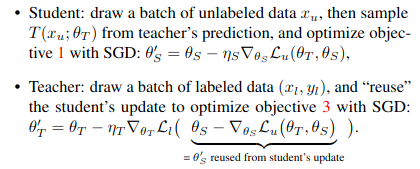
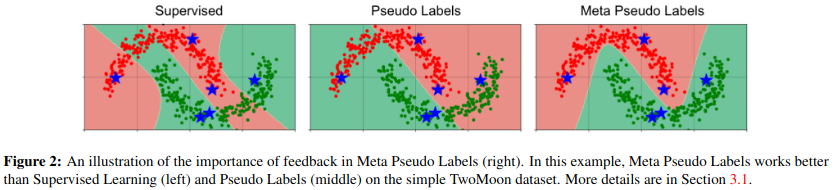
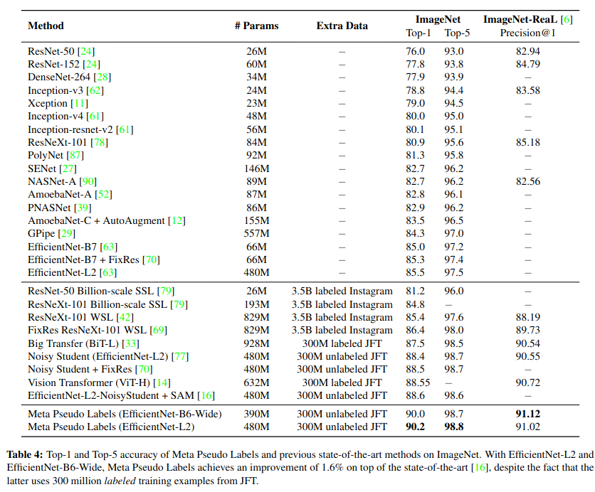

# Meta Pseudo Labels

[Link to the paper](https://arxiv.org/abs/2003.10580)

**Hieu Pham, Zihang Dai, Qizhe Xie, Minh-Thang Luong, Quoc V. Le**

*IEEE Conference on Computer Vision and Pattern Recognition (2021)*

Year: **2021**

This paper builds upon the Pseudo Labels paper. However, it understands Pseudo-Labels a bit differently than Lee did originally. Here, the pseudo labels are given by a pretrained teacher, that never changes. These pseudo labels are used to distill the knowledge into a Student. It develops a novel semi-supervised approach that beats the state of the art accuracy on ImageNet.

The whole approach consists, at a high level, on using two models, a student and a teacher, which are jointly trained. The  student is trained entirely on the pseudo-labels provided by the teacher, while the teacher is trained using REINFORCE, with the objetive of making the student perform better on the labeled data set. 

In contrast to the Pseudo-Labels approach, the Meta Pseudo Labels technique does not have a pre-trained and fixed teacher. Instead, it feeds the teacher with reward in order to improve at teaching the student. In this sense, Pseudo-Labels have the weakness that they entirely depend on the teacher performance, and will inherit all the biases that it has: confirmation bias.

The training goes as follows

In addition, given that the student has been entirely trained using pseudo labels, upon convergence, a fine-tuning with real labels is proposed by the authors as a way to improve the student.

The paper shows many experiments (from small to large scale) empyrically proving Meta Pseudo Labels superior than the state of the art. Examples below.

## Two moons data set separation region

## ImageNet
