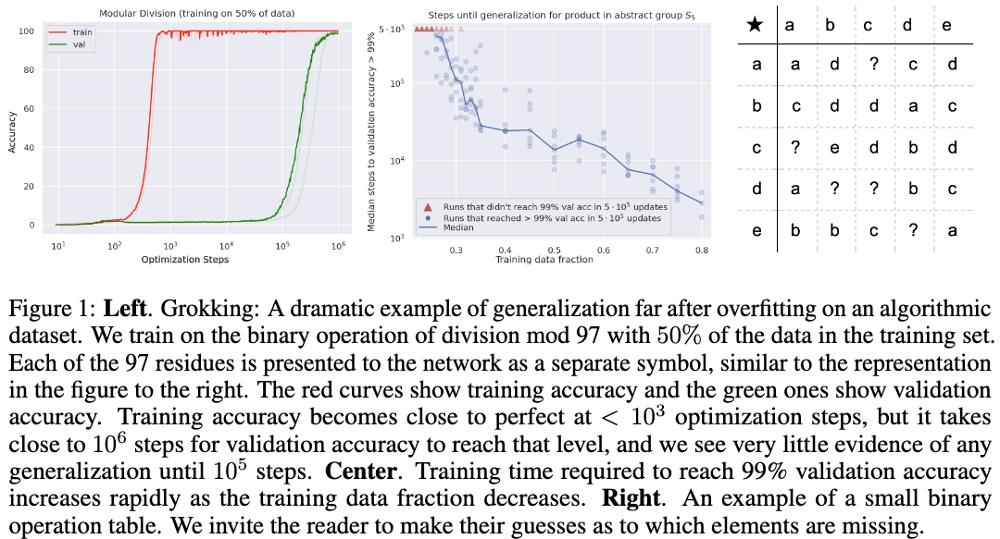

# Grokking: Generalization Beyond Overfitting on Small Algorithmic Datasets

[Link to the paper](https://arxiv.org/abs/2201.02177)

**Alethea Power, Yuri Burda, Harri Edwards, Igor Babuschkin, Vedant Misra**

*arXiv Preprint*

Year: **2022**

Generalization of overparameterized neural networks defies the intuitions of classical learning theory. This paper shows that neural networks trained on small synthetic datasets generalize far beyond overfitting. The following picture shows this effect, graphically.

In these experiments, the authors created a bunch of synthetic datasets with binary operation tasks. They play with the proportion of data the model sees, and conclude that the more data the model sees, the smaller amount of steps they need to observe the grokking effect (generalization after overfitting). They also found weight regularization to help reaching grokking with less steps.