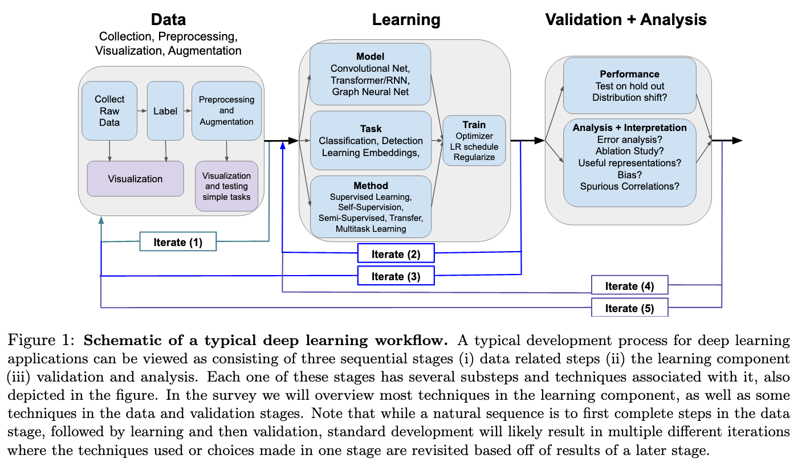
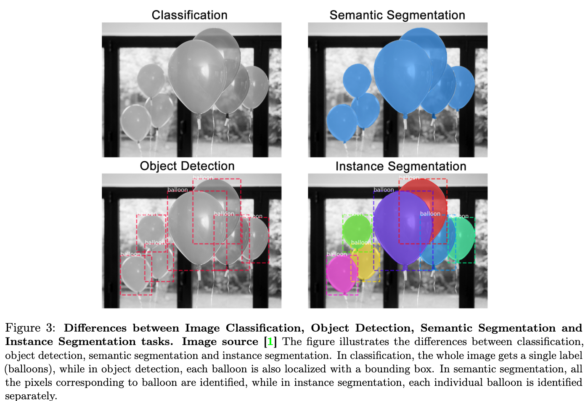

# A Survey of Deep Learning for Scientific Discovery

[Link to the paper](https://arxiv.org/abs/2003.11755)

**Maithra Raghu, Eric Schmidt**

*Cornell Univeristy and Schmidt Futures report*

Year: **2020**

This paper is simply a very well written survey of Deep Learning techniques covering from the basics to the state of the art of the field. It comprises models, tasks, methods and best practices.

Notice that in this case I am not going to be able to synthesize the full content of this paper, as it is full of useful links and resources. However, I'll add a list of the most interesting links from my own point of view and applicable to my research line.

The document starts talking about the *Deep Learning Workflow* with all its possible iteration processes. Below, a graph from the paper summarizing this section is included.

The survey focuses mainly on the learning block, and gives some guidance also related to the validation + analysis one.

A bunch of useful resources is provided, please refer to Section 3 to review it. Some of them have been summarized at the end of these notes.

The authors distinguish between (1) models, (2) tasks and (3) methods. By models (1) the authors refer to the architectural details of the neural network. By tasks (2) the authors describe how do the inputs and outputs look like. Finally, by methods, the authors describe the type of learning process used.

The document includes an extensive summary/taxonomy of Deep Learning models and tasks. Some of the highlights below.

- Supervised learning
  - **MLPs**
  - **CNNs**. Tasks:
    - Image classification: map images to a class
    - Object detection: identify and locate objects in an image
    - Semantic segmentation: tag every pixel with a class
    - Instance segmentation: tag every pixel and locate each of the entities in the image
    - Super resolution
    - Image registration: aligning two images
    - Pose estimation

  - **Graph NN**: the authors describe at high level how these architectures work. In a nutshell, the input graph consists of a set of nodes and edges, which can have feature vectors associated. The NN is able to use neighboring information and that's the benefit of these models. The output of these NN can be at input node level or at full graph level, depending on the application.
  - **Sequential models**
    - Language modeling: next-token prediction
    - Sequence-to-sequence
    - Question Answering
    - Recurrent Neural Networks
    - Attention
    - Transformers: original transformer and Bert

## Supervised learning methods
- Transfer learning: consists on two steps (1) pretrain an architecture with a general big dataset and (2) fine-tune the weights (generally of the last layers) on a different task.
- Domain adaption: there are two domains (1) the source domain and (2) the target domain. The task consists of leveraging the data of the (1) to get benefit on (2). Normally this needs for a domain adaption procedure to succeed; e.g. assure the hidden representations for both domains at some point are close.
- Multitask learning: consists of predicting multiple outputs from a single input; generally with a multi-head neural network. These models share the weights of several layers. This often has beneficial effects even if there is only one prediction of interest, as it provides the neural network with useful additional feedback that can guide it in learning the most important data features. When some of the tasks are added just to improve the other's performance they are known commonly as auxiliary tasks.
- Weak supervision: consists of pretraining the model with noisy labels generated through an automated process.
- Multimodal learning: consists of using input data from different modalities (e.g. text and images)

## Self-supervised training methods
The main idea consists of generating a *pretext task* defined directly from the raw data instances. E.g. rotate an image and training the network to predict the degree of rotation of it.
- Self-supervised learning for images: the most common pretext tasks consist of rotations, patch completion, jigsaw solving, exemplar (invariance to image transformation) and relative patch location
- Self-supervised learning for sequences: there are two main pretext tasks: (1) using neighboring tokens to predict a target token (word2vec and word embeddings) or (2) language modelling

## Semi-supervised training methods
- Semi-supervision through self-supervised learning: consists of having a two heads network, one of which is used to train a pretext task with the unlabeled data, and the other for the intended supervised task
- Self-training: same idea as network distillation, i.e. train a simple model with the labeled data, generate labels for the unlabeled data, and then train a model with all the data. Often times only the newly labeled data for which the model is pretty confident is used.
- Enforcing consistency: it is based on the principle of consistently labeling original and perturbed images with the same label.
- Co-training: consists of training multiple neural networks with different views of the data (e.g. different parts of an input sentence) and enforce them to be consistent in their prediction.

## Data augmentation
- On images: consists of applying multiple transformations to the data in order to increase the size and variability of a dataset. One of the last developments suggests combining different images, through linear weighting (MIXUP) or through patching (RICAP), with different proportions, and assinging the label of the highest proportion to the resulting image
- On text: it consists of applying transformations to the sentences too, but this time three typical transformations are typically used: deleting tokens, swapping tokens or replacing tokens by synonyms. The paper also mentions back-translation, a method that is based on translating a set of sentences to a language and then translating it back to the original one; that usually increases the variability of the data.

## Data denoising
Consists of training an algorithm to reduce the noise of the data. This may be easy to achieve given that introducing noise to existing data is usually straightforward. Hence it is possible to come up with a supervised task from an unlabeled dataset.

## Interpretability
(As this is not my field of expertise, I am going to summarise it very shallowly)
The paper talks about different techniques:
- Per-example feature attribution: references: sailency maps, etc
- Feature ablations and perturbation: shapely, lime, deeplift, etc
- Model inspection
- Dimensionality reduction of hidden representations
- Representational comparisons

## Advanced methods
- Generative models: it seeks to model and enable sampling from high dimensional data distributions. It is usually performed by learning some task from the data images; e.g. encoding/decoding (VAE) or fake images detection (GANs).
  - GANs: the author highlights the difference between conditional and unconditional GANs
  - VAEs
  - Autoregressive Models
  - Flow Models: new class of generative models that perform generation using a sequence of invertible transformations (reference below)
- Reinforcement Learning
  - With an environment (online)
  - Without an environment (offline)

## Implementation tips
- Explore the data
- Try simple methods before
- Start with well tested models/tasks/methods
- First debugging steps: (i) overfitting, (ii) distribution shift, (iii) underfitting, (iv) deep dive into individual error cases, (v) stability across reruns, (vi) look at the gradient
- Hyperparameters importance: look first at learning rate and its schedule. Reference on AdamW from FastAI below.
- Validate thoroughly

## Useful resources
- Up to date interactive DL book through Jupyter Notebooks: http://d2l.ai/index.html
- U. Toronto ML course: http://www.cs.toronto.edu/~rgrosse/courses/csc411_f18/
- U. Toronto NN and DL course: http://www.cs.toronto.edu/~rgrosse/courses/csc421_2019/
- AI Curriculum, lectures from TOP unis: https://github.com/Machine-Learning-Tokyo/AI_Curriculum
- ArXiV Sanity TOP: https://www.arxiv-sanity.com/top
- Sentence-summary of papers: https://www.paperdigest.org/
- Language applications with DL (large directory): https://github.com/huggingface
- Tutorials and implementations of SOTA architectures; focused on application: https://modelzoo.co
- Lilian Weng blog - interesting complex DL/RL related discussions: https://lilianweng.github.io/lil-log/
- The illustrated BERT: http://jalammar.github.io/illustrated-bert/
- Domain adaption primer - https://towardsdatascience.com/deep-domain-adaptation-in-computer-vision-8da398d3167f
- Sebastian Ruder introduction to Multi Task DL: https://ruder.io/multi-task/index.html#fn4
- When does Multi-Task DL work and when it doesn't: http://hazyresearch.stanford.edu/multi-task-learning
- Multitask learning: teach your AI more to make it better: https://towardsdatascience.com/multitask-learning-teach-your-ai-more-to-make-it-better-dde116c2cd40
- Awesome self-supervised learning: https://github.com/jason718/awesome-self-supervised-learning
- Revisiting self-supervised learning - paper from google - https://arxiv.org/pdf/1901.09005.pdf
- Semi-supervised co-training schemas primer - https://ruder.io/semi-supervised/
- Video on Flow Generative Models: https://www.youtube.com/watch?v=i7LjDvsLWCg&feature=youtu.be
- AdamW; enhancing convergence speed: https://www.fast.ai/2018/07/02/adam-weight-decay/
- Implementation references and design considerations: https://www.fast.ai/2018/07/02/adam-weight-decay/
- Debugging NNs: http://josh-tobin.com/assets/pdf/troubleshooting-deep-neural-networks-01-19.pdf
- Debugging NNs (Karpathy): http://karpathy.github.io/2019/04/25/recipe/

## Interesting papers collected (read-later)
- Wavenet
- Mask R-CNN - Kaiming He
- Non-local NNs - Kaiming He
- Faster R-CNN - Object detection, precursor of YOLO
- EfficientNets - Image classification
- https://arxiv.org/pdf/1901.09005.pdf
- The simple and efficient semi-supervised learning method for deep neural networks
- Self-training with noisy student improves imagenet classification.
- Mean teachers are better role models: Weight-averaged consistency targets improve semi-supervised deep learning results
- Temporal ensembling for semi-supervised learning
- Mixmatch: A holistic approach to semisupervised learning.