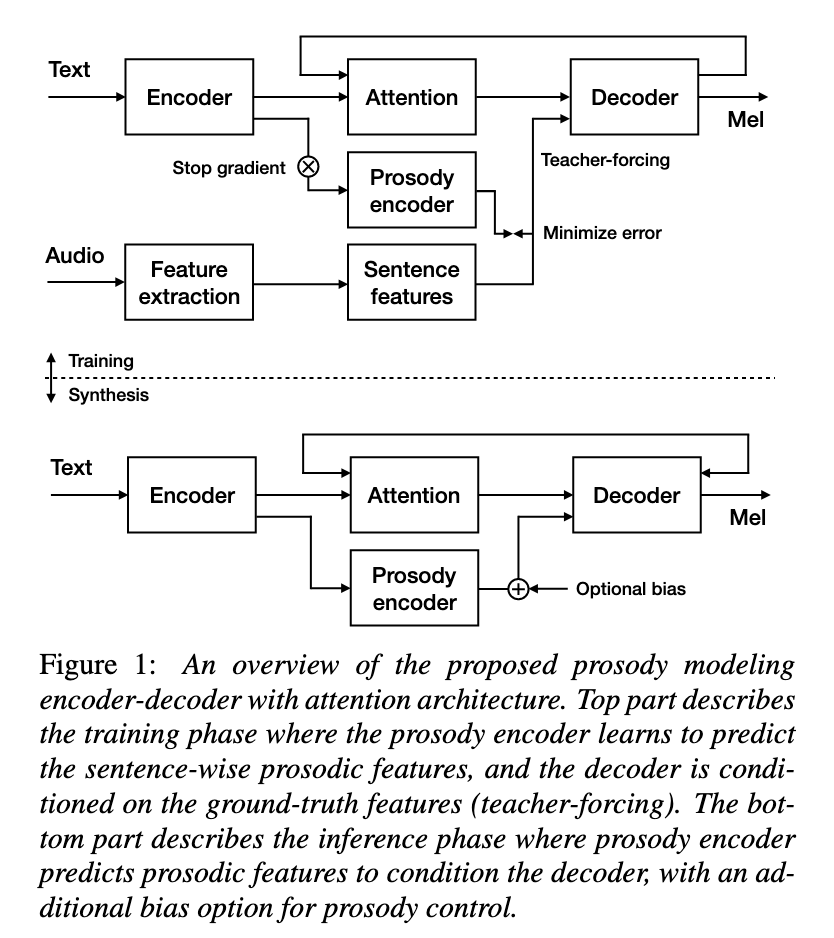
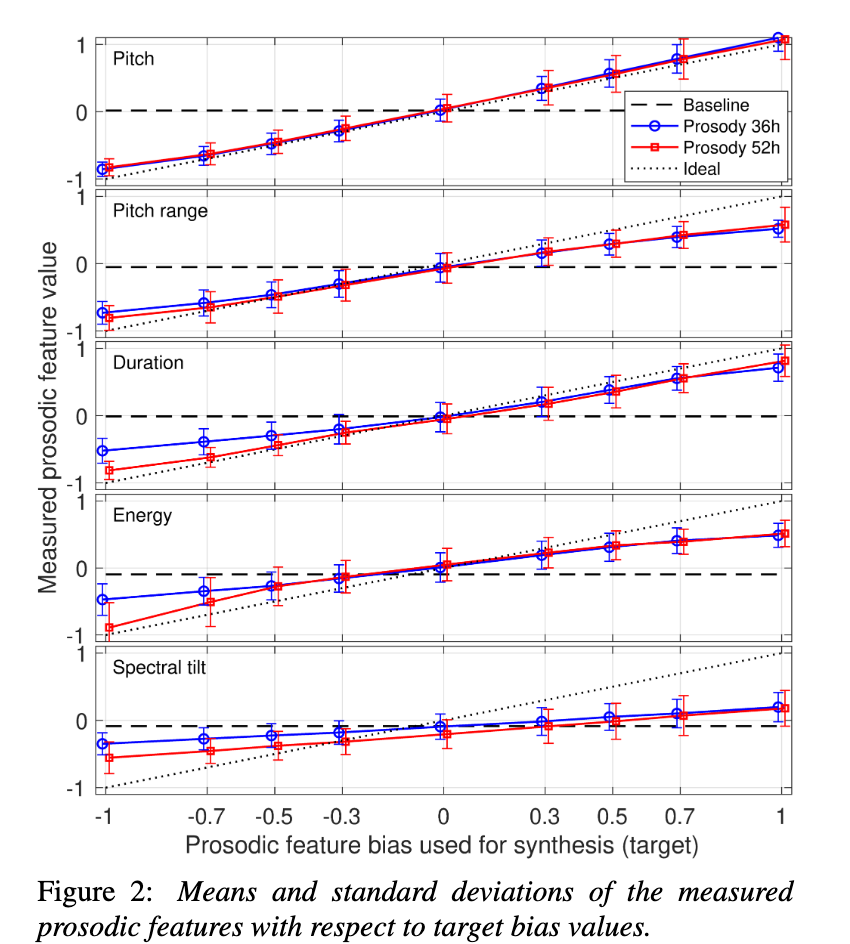
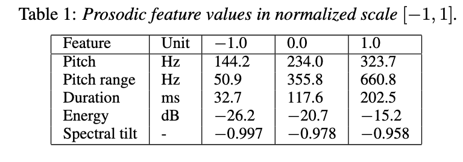

# Controllable neural text to speech synthesis using intuitive prosodic features

[Link to the paper](https://arxiv.org/abs/2009.06775)

**Tuomo Raitio, Ramya Rasipuram, Dan Castellani**

*Apple report*

Year: **2020**

Audio samples: [Link](https://apple.github.io/neural-tts-with-prosody-control/)

This paper shows an elegant way to gain control over several independent prosodic characteristics through conditioning a VAE encoder on pitch, speaking rate, spectral tilt and energy.

Generally speaking, neural TTS systems already generate voices to an undistinguishable level from human voice. The main problem that is still unsolved is how to generate voices with rich prosody variation. The main state of the art approaches learn to speak with the average prosody of the data set.

Although there is still discussion on the set of variables that define prosody, the authors focused on pitch, length, loudness, timbre and voice quality. These variables can be approximated with f0, phone duration, speech energy and spectral tilt.

The architcture presented along with the paper consists of a tacotron architecture conditioned to the four previously mentioned features and to the input phonemes. The authors, additionally, stop the gradient so that the prosody conditioning does not impact the phonemes encoder at all.

To quantify the results, apart from a perceptual test the authors check if the pitch, pitch range, duration, energy and spectral tilt of the synthesis matches the target. Results below.

