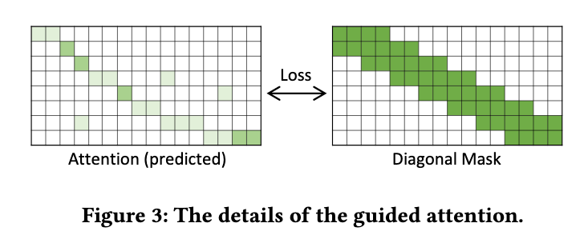

# DeepSinger: Singing Voice Synthesis with Data Mined From the Web

[Link to the paper]([link](https://arxiv.org/abs/2007.04590))

**Yi Ren, Xu Tan, Tao Qin, Jian Luan, Zhou Zhao, Tie-Yan Liu**

*KDD2020*

Year: **2020**

Samples: https://speechresearch.github.io/deepsinger/

This paper develops a multi-lingual multi-singer singing voice synthesis (SVS) using songs and lyrics in English, Chinese and Cantonese downloaded from music websites. The dataset is described below.

The process consists of two different processes: a lyrics to singing alignment, and an audio synthesis using FastSpeech based models + Griffin Limm spectrograms inversion.

## Lyrics to singing alignment
Consists of getting the duration of each phoneme in the sang song. As the songs are long (1-5 minutes), the authors claim that this process is specially complex. They design a two-step pipeline for that.

1. Train an alignment model over full songs, and use it to chop the audio in sentences.
2. Continue training the previous model at sentence level with the sentences chopped.

The alignment model is based on an Automatic Speech Recognition model with a couple of tricks:
- Greedy training: gradually increasing the length of the song
- Guided attention: forcing the attention to be monotonic and diagonal. For that purpose, the authors enforce a diagonal mask as shown in the following picture.
  

The duration extraction is an arduous task, the authors propose a method based on dynamic programming to select the phoneme change times.

Extra details about the lyrics alignment and the dynamic programming algorithm are included in the appendix of the paper.

## Singing model
It seems that a FastSpeech Transformer is used to generate the linear-spectrograms that are feed into the Griffin Limm algorithm.

The singing model consists of the following encoder modules:

- A lyrics encoder: a set of transformer blocks (self-attention) transform the input phonemes into a hidden representation. The representation is expanded in time to match the target spectrogram sequences based on the phoneme duration.
- A pitch encoder: a pitchID, containing the pitch over time, is inputted to an embedding and through a set of transformer blocks, it is transformed into a hidden representation.
- A reference encoder: it receives a reference spectrogram as input. It is passed through a prenet, a set of transformer blocks, and then into an average pooling to compress all the time information into a vector. It contains information about the pitch of the speaker. This vector is broadcasted along the time to match the lyrics and pitch lengths.

The output of these three encoders are added together to form a single encoder output sequence.

There seems not to be attention from the encoder and the decoder. The decoder first gets the output of the encoder as input, passes it through a set of transformer blocks, and generates the sequence of linear spectrograms that will be later processed by the Griffin Limm algorithm.

The full model is optimized by minimizing the MSE between output linear spectrograms and the target ones.

## Results
The alignment model performs as follows

The generated voices are first evaluated quantitatively by checking the fundamental frequencies of the generations vs the ground truth frequencies. An upper bound is calculated by inverse-transforming the ground-truth spectrograms using the Griffin-Limm algorithm.

Qualitative evaluations are also performed.

And finally, an ablation study is also performed to see if the pieces of the model are truly contributing to the final result.

