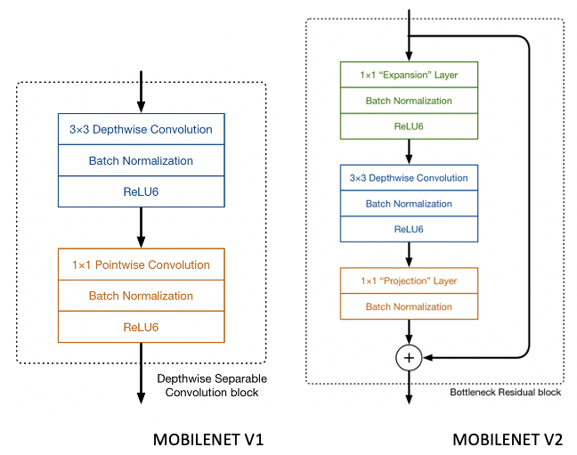
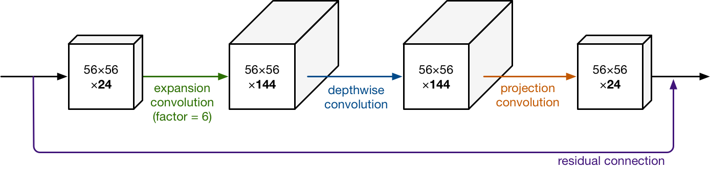
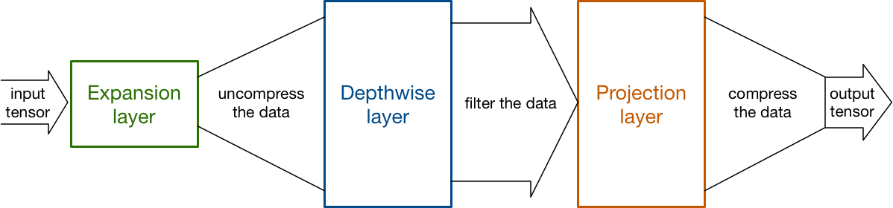
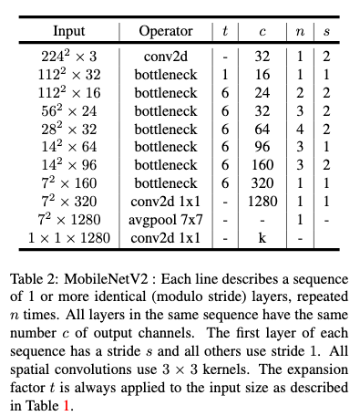
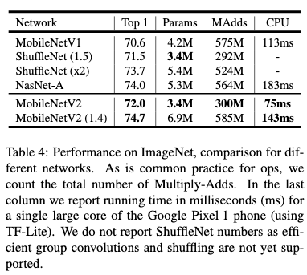

# MobileNetV2: Inverted Residuals and Linear Bottlenecks

[Link to the paper](https://arxiv.org/pdf/1801.04381.pdf)

**Mark Sandler, Andrew Howard, Menglong Zhu, Andrey Zhmoginov, Liang-Chieh Chen**

*The IEEE Conference on Computer Vision and Pattern Recognition (CVPR)*

Year: **2018**

In the same spirit of the MobileNetV1, the authors of MobileNetV2 tackle the problem of designing an architecture focused on mobile implementation.

This architecture is built over the MobileNetV1 one, with a couple of smart enhancements that bring it from 5.1M to 4.3M parameters, from 1.3B to 0.8B operations and showing higher accuracy in the tested tasks (e.g. imagenet top1 accuracy from 70.6% to 72%).

## Enhancement 1
The architecture block is similar to the original mobilenet block, but includes some changes. It has a new convolutional layer at the beginning. The convolutional block in the end now has the function of compressing the tensor, and the one in the begining expands it back. The last convolutional block does not have an activation layer. The authors justify that by stating that theoretically, activations can destroy information by projecting several data points to a single point. See the figures below.

## Enhancement 2
The enhancement block now in the new version has a residual connection that sums the input of each block to its output. It has the same function as in the residual networks.

Example.

Bottleneck view with expansions/compressions per block.

What these changes allow is ultimately reducing the input/output tensors of every block, leading to a much skinnier architecture, as it can be seen in the following table

## Results
The results are summarized in the paper in terms of accuracy in different tasks and number of parameters. For the sake of brevity, only the ImageNet results are shown in this summary.

## References
The images of the architecture blocks are taken from this wonderful blog post, which also has a great summary of MobileNetV2: https://machinethink.net/blog/mobilenet-v2/