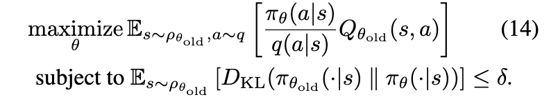

# Trust Region Policy Optimization

[Link to the paper](https://arxiv.org/abs/1502.05477)

**John Schulman, Sergey Levine, Philipp Moritz, Michael I. Jordan, Pieter Abbeel**

*Proceedings of the 31st International Conference on Machine Learning, 2015*

Year: **2015**

The paper theoretically proves that it is possible to get guaranteed monotonic improvements on policy gradient methods and proposes a new algorithm based on the optimization of a surrogate objective with a KL divergence constraint called Trust Region Policy Optimization (TRPO) that has this benefit.

The authors describe two variants of the algorithm: (1) the single-path method, applicable to online model-free settings and (2) the vine method, applicable to simulated environments where we can reset to a specific state to perform multiple rollouts from the same initial state.

The full paper is structured as follows:
1. A theoretical proof justifying that a surrogate objective with a penalty on the KL divergence must be optimized to get monotonic improvements.
2. For several reasons, the theoretical framework is unfeasible in practise, so several optimizations are applied. Now we optimise a surrogate objective with a constraint on the KL divergence
3. The constraint is unfeasible as it has to be applied to all the states of the system, so a simplification is performed by taking the expected KL divergence

The work starts by introducing a loss function in terms of the advantage of $\tilde\pi$ (a new policy) over $\pi$ (the current policy) as shown in the equation below, where $\eta({\pi})$ represents the expected discounted reward of the policy $\pi$.

The authors point to the proof that this loss function represents a lower-bound of the return. This comes from another paper and is applicable to mixtures of policies ($\pi_{new} = (1-\alpha)\pi_{old}(a|s) + \alpha \pi'(a|s)$)

This means  that improving th right hand side of the previous equation guarantees an improvement in the return.

To make it applicable to stochastic policies instead of mixtures of policies the authors suggest replacing $\alpha$ by a divergence between the old and the new policy. The authors prove the following lower bound.

And then, from there, the surrogate objective is derived and a first theoretical algorithm is proposed.

The TRPO algorithm is just an approximation of Algorithm 1 where the KL-Divergence becomes a constraint instead of a penalty. The authors take this decision given that, otherwise, with the $C$ value recommended by the theoretical finding the updates would be very small. Another change that the authors propose is to use a heuristic approximation to constraint the average KL-divergence, otherwise it has to be constrained over all the states and the problem becomes unfeasible. The specific proposal is shown below.

In plain english, the TRPO objective optimizes an estimate of the expected total reward $\eta$ subject to a constraint on the change in the policy at each update.

In practice, the authors recommend to use MC simulations to train the TRPO agent. In that setting, the objective becomes the following:

Where $q$ is the sampling distribution (i.e. the policy followed to collect the data).

Two versions:
- Single path: here, $q(a|s) = \pi_{\theta_{old}}(a|s)$ and $Q_{\theta_{old}}(s,a)$ is computed as the sum of discounted rewards for each state-action pair.
- Vine: it consists of (1) generating a set of trajectories, (2) sample a set of states from these trajectories (rollout set), (3) sample a set of actions for each of the states of the rollout set and (4) estimate $Q_\theta(s_n, a_{n,k})$ by performing a rollout. Then the loss can be computed as follows:

The authors highlight that the vine method has much lower variance than the single-path one, allowing much better estimations of the advantage function.

With all this, the TRPO full algorithm would consist of the repeated execution of the following steps:
1. Collect state-action pairs and MC estimates of the Q-values following either the single-path or vine schemas
2. Average over multiple samples to build the estimated objective (minibatching)
3. Solve the constrained optimization problem to update the policy.

TRPO has been tested on MuJoCo (phisics-based states) and Atari games (image based observations), showing competitive results when compared with other algorithms.

