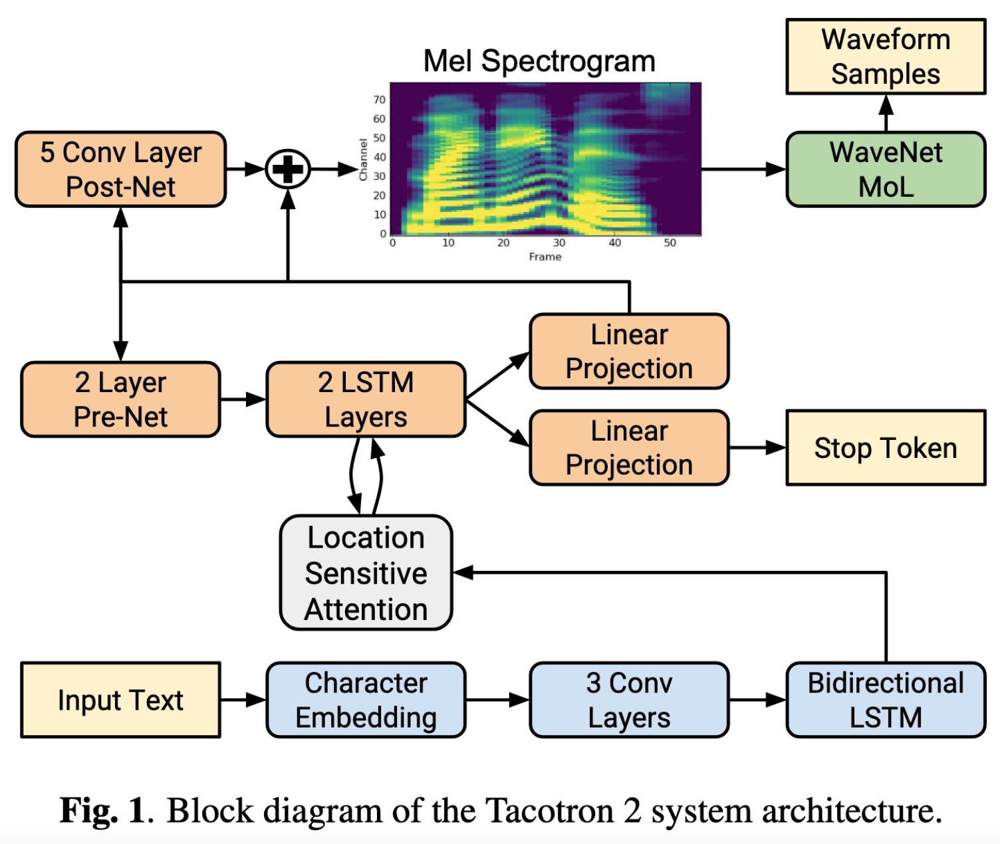
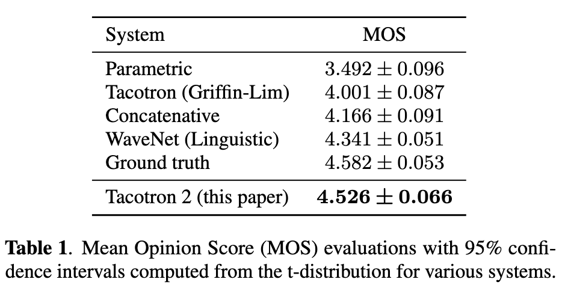
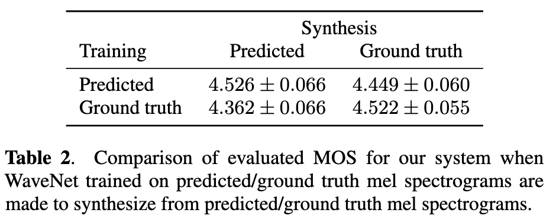
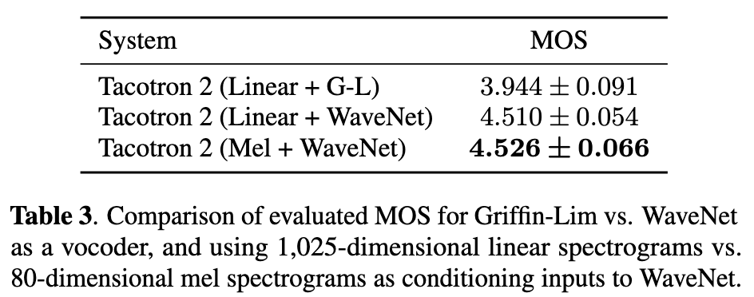
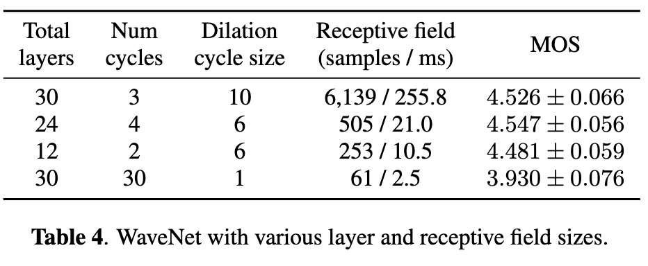

# Natural TTS Synthesis by Conditioning WaveNet on Mel Spectrogram Predictions

[Link to the paper](https://arxiv.org/abs/1712.05884)

**Jonathan Shen, Ruoming Pang, Ron J. Weiss, Mike Schuster, Navdeep Jaitly, Zongheng Yang, Zhifeng Chen, Yu Zhang, Yuxuan Wang, RJ Skerry-Ryan, Rif A. Saurous, Yannis Agiomyrgiannakis, Yonghui Wu**

*ICASSP 2018*

Year: **2018**

The current work present Tacotron 2, an improved and refined version of [Tacotron](assets/../wang2017.md). The authors claim having achieved an MOS of 4.53 vs the 4.58 achieved by professional speakers.

This work develops the research line stated in Tacotron of improving the Griffin-Lim vocoder. A modified WaveNet has been used to synthesizing audio from the Mel spectrograms. It also simplifies substantially the spectrogram prediction network.

A diagram summarizing the spectrogram prediction network and the Vocoder is included below.

## Spectrogram prediction network
It has an encoder-attention-decoder structure.

In the encoder, the first module of this network is a character embedding, that converts each of the characters into a 512-dim vector. Then, this is passed through a stack of 3 convolutional neural networks with 512 filters each of a fixed size of 5 x 1. Each layer is followed by batch normalization and a ReLU activation. This is passed through a bi-directional LSTM containing 512 units (256 in each direction), generating the encoded representation.

The output of the encoder is used as key (K) and value (V) for the attention, which will summarize the output of the encoder as a fixed-length context vector at each decoder step. The attention algorithm used is the location-sensitive attention (extension of the additive attention mechanism with cumulative attention weights as extra features).

The decoder is simply an autoregressive module which consists of a pre-net with two FC layers, two uni-directional. LSTM layers. The output of the LSTMs together with the attention weights are linearly projected twice to produce the LSTM output and the stop probability. The output of the first projection is what gets used for auto-regression. It is also passed through a stack of 5 convolutional layers (post-net) to generate the mel spectrogram.

The loss used is the MSE.

## WaveNet vocoder
As vocoder, a slightly modified WaveNet is used. The modifications consist of (1) substituting the SoftMax layer of the end by a 10-component mixture of logistic distributions (similar to reparametrization trick in VAEs).

The loss used is the negative log-likelyhood.

## Tricks of the trade
- Teacher forcing is used in both networks

## Results

Outstanding MOS

Ablation analysis
- Using ground-truth audios to generate the mel spectrograms for training the vocoder.
  
  Conclusion: performance decreases
- Using linear spectrograms instead of Mel
  
  Conclusion: performance holds, then it is better to use Mel due to the lower dimensionality
- Tuning WaveNet
  
  Conclusion: the model could be reduced to 12 layers instead of 30.