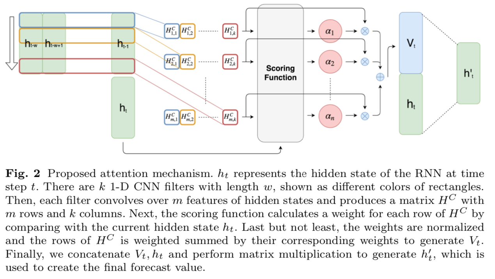
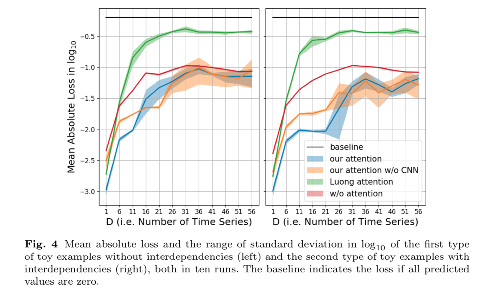
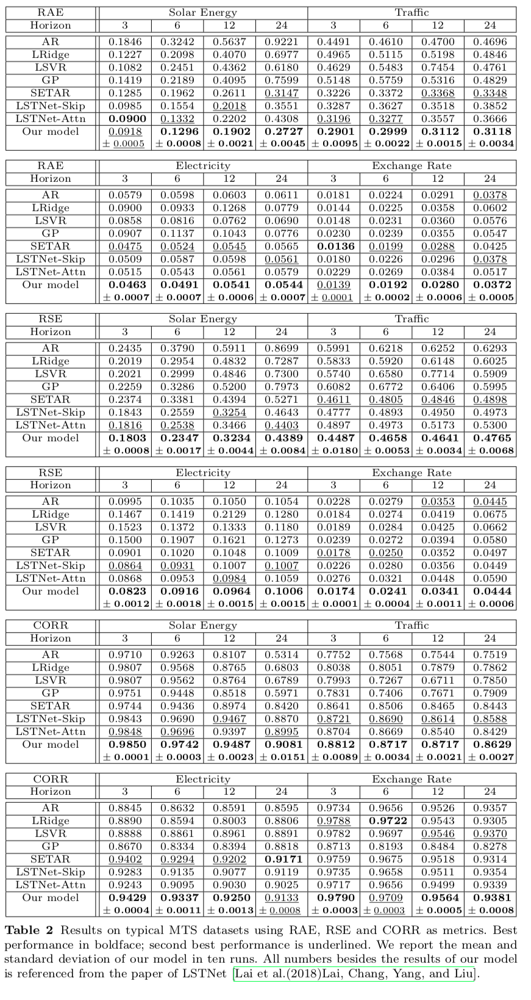

# Temporal Pattern Attention for Multivariate Time Series Forecasting

[Link to the paper](https://arxiv.org/abs/1809.04206)

**Shun-Yao Shih, Fan-Keng Sun, Hung-yi Lee**

*European Conference on Machine Learning and Principles and Practice of Knowledge Discovery in Databases (ECML PKDD) 2019*

Year: **2019**

The current work proposes tackling the problem of Multivariate Time Series (MTS) Forecasting using the attention mechanism across the features axis instead of across the time axis.

The authors claim that the traditional attention mechanism (across time) fails when used with MTS because it is not able to attend to the features that are important at each timestep. They claim that the fact that it averages across multiple time steps makes it unable to detect temporal patterns. Although they recognize that this type of models is useful when a single time step represents a single unit of information. E.g. a token in NLP.

The paper suggests to (1) analyse the time-axis using CNNs and then (2) attend to the different features (or channels) using the attention mechanism. Their architecture is depicted in the figure below.

In this case, the attention mechanism soft-selects the important features to attend to, averages them together. An importance difference between this algorithm and the standard attention is that the attention weights do not necessarily sum to 1. I.e. the authors suggest using a sigmoid activation instead of a softmax activation for calculating those weights. In their own words, this enables the algorithm to select more than one important feature.

A small ablation analysis is performed on a couple of toy tasks, showing that the most important part of the proposed architecture is the attention over features. It is shown in the picture below.

Finally, the proposed algorithm is tested in a set of real data sets, concluding that the proposed model outperforms the alternative approaches in the majority of the cases

