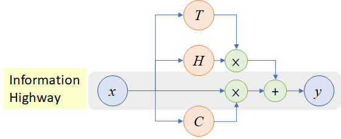
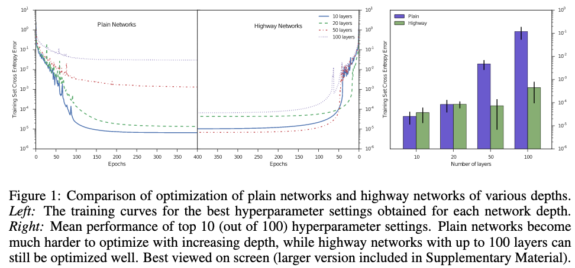

# Training Very Deep Networks

[Link to the paper](https://arxiv.org/abs/1507.06228)

**Rupesh Kumar Srivastava, Klaus Greff, Jürgen Schmidhuber**

*NIPS 2015*

Year: **2015**

A new CNN architecture is presented, allowing training deeper neural networks more easily.

The authors recommend the following simple structure as a building block for an architecture.

$$ y = H(x, W_H) \cdot T(x, W_T) + x \cdot C(x, W_C) $$

In the previous equation, $H$ is just a non-linear function applied over an affine transformation of $x$ with $W$ (e.g. a dense layer $Wx+b$). $T$ is known as the transform gate. $C$ is defined as the carry gate. For simplicity, the authors define $C = 1-T$, where $T(x, W_T) = \sigma(W_T^T\cdot x + b_T)$. The authors also recommend to initialize the bias terms with negative numbers to bias the network towards carrying the information instead of transforming it.

The results show that these networks, when compared to plain CNNs, tend to allow deeper architectures to be trained.

