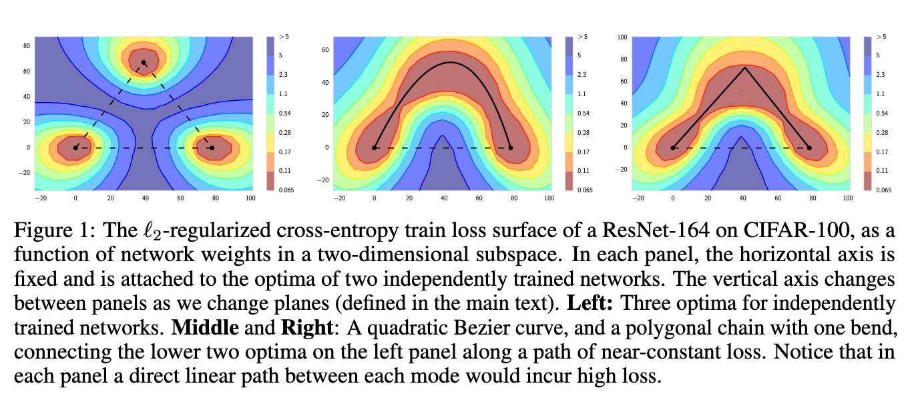
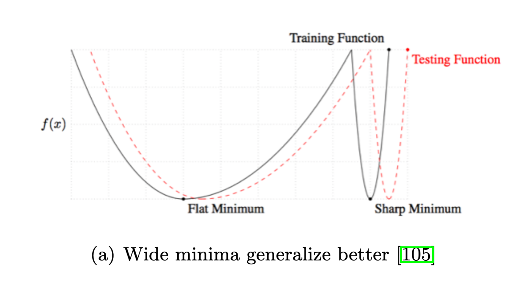

# Optimization for deep learning: theory and algorithms

[Link to the paper](https://arxiv.org/abs/1912.08957)

**Ruoyu Sun**

*University of Illinois report*

The current work surveys from the basics to the state of the art of optimization in Deep Learning.

The authors point to three main aspects that make training a neural network successful:
- A proper neural network architecture
- A proper training algorithm
- A proper set of training tricks

The article focuses on simple supervised feedforward neural networks.

The first section starts talking about the training issues. The test error can be decomposed into three errors: representation error, optimization error and generalization error.

While optimizing, two types of issues can arise: local issues (gradient explosion/vanishing, slow convergence) and gobal issues (bad local minima, plateaus, etc).

The authors define the structure of a feed-forward neural network along with the backpropagation algorithm (we'll skip it for brevity). They show how matrix factorization is a particular case of a neural network with a hidden layer and with a vector of ones in the input.

## Neural networks tricks
In this section the authors describe a set of useful tricks to train a neural network,
1. Gradient vanishing/explosion is the most common problem in neural nets. The most simple way of remediate it is with a careful initialization. The authors justify it with: the exploding/vanishing gradient regions occupy a large portion of the whole space. Several methods are presented for initializing the networks:
- Naive initialization: consisting on initializing randomly. Not very convenient
- Lecun initialization: consisting of initializing with mean 0 and variance $1/fan_{in}$. Useful for sigmoid activations.
- Xavier/Glorot initialization: consisting of initializing with mean 0 and variance $2/(fan_{in} + fan_{out})$ to account for both forward and backward passes. Useful for sigmoid activations.
- Kaiming/He activation: intuititively, Glorot and Lecun initializations provide outputs (h) that are cut in half when the activation used is ReLU. Hence He et al proposed initializing with zero mean and $2/fan_{in}$ or $2/fan_{out}$ variance. This proposal does not account for forward and backward passes. Some studies have analysed this particularity and propose using geometrical averaging initialization (zero mean, variance $c/\sqrt{fan_{in} * fan_{out}})$
- LSUV: consists of initializing the weights using an orthogonal approach and then normalize the outputs of each layer for each minibatch.
- Other studies are mentioned here, more details in the paper

2. Neural network normalization can be seen as an extension of neural network initialization. In this case, the most common method is Batch Normalization (BatchNorm). It is seen to increase the convergence speed. It seems to have an effect on reducing the Lipschitz constants of the objective and the gradients. Its practical benefit consists of allowing larger learning rates. After this method, variations arrived:
- Normalizing intermediate outputs: batchnorm, layer normalization, instance normalization, group normalization
- Normalizing the weight matrices: spectral normalization and switchable normalization are the most relevant methods. Normally these methods learn separately the direction and the norm of the weight matrices.

3. Changing the architecture to more sophisticated designs often leads to better performance. One of the major discoveries here has been the addition of skip connections between layers; this is the main idea of the ResNet Architecture. The skip connections have the following desirable properties: (a) improve generalization (b) allow signals propagate better (c) produce better optimization landscape. One important discovery on top of ResNet is the FixUp initialization; which showed that it is possible to achieve good results without Batch Normalization.

## Algorithms for training neural networks
Two objectives are pursued by these techniques: learn fast, improve KPI metrics.

- SGD is commonly used as opposed to GD due to it's scalability and faster convergence properties.
- Learning rate schedule is often useful to avoid getting stucked due to bouncing around an optimum point. There are studies pointing out that it is possible to train neural nets with fixed learning rate (and in practice it is very common), however in that case the gradient will not converge to zero; there will always be an error term dependent on the step size.
- Learning rate warmup is often used to improve convergence.
- Cyclical learning rate showed very remarkable speed gains. It consists usually in making the step size bound between a lower and upper bounds, describing a triangular function.

There are also several variations in the literature of the stochastic gradient descent method that can make training faster and more efficient. The main ideas are summarized below:
- Momentum: adding a momentum term (or a Nesterov one) is usually beneficial as it speeds up training
- Adaptive learning rates: methods like AdaGrad, AdaDelta and RMSProp analyse how the gradient navigates the space accross iterations and adjust something equivalent to a learning rate per component of the gradient vector.
- Combination of momentum and adaptive learning rates is implemented in the Adam algorithm, one of the most used ones.

Other way of speeding training consists of distributing the computation. The training of ImageNet has been reduced to 1h and to 1.2 minutes by using very efficient techniques for computation distribution (scaling efficiency > 0.9).

## Global optimization of neural nets
In this section the authors describe the practical innovations and the theoretical aspects of the convergence of neural networks, pointing out that the optimization problem that occurs at a NN is non-convex.

The study of the optimization landscapes has been one of the tools that has been exploited in the global optimization field. There have been several studies showing methods to analyse the landscape. Among the main conclusions: (a) local minima represent a problem less frequently than plateaus. The landscape of a neural network is much nicer than thought.

Two recent and very interesting findings are revolutionizing the field:
- Mode connectivity: the local minima at which the neural networks converge in different iterations are often connected through almost planar surfaces.

- Lottery ticket hypothesis: when training a neural network, a very small subnet lays in the main network which, when the other neurons are prunned, it holds a high accuracy. This subnet is known as winning ticket because it has win the lottery of initialization. The most remarkable aspect of them is that when trained from the same initialization on insolation (masking to zero the rest of weights) the performance achieved is higher than the one of the full network.

The landscape has an effect in the generalization in the network. Wide local minima generalize much better than sharp ones. The intuition lays on the fact that small perturbations produced by covariance shift can have much greater effects in the loss function in the case of sharp minima as opposed to the wide minima. The following picture shows graphically this effect

There is an empirical observation that states that overparametrized networks (networks with more parameters than needed) usually get smoother optimization landscapes.

Relu has been shown to converge to bad local minima as compared with smoother activations.

