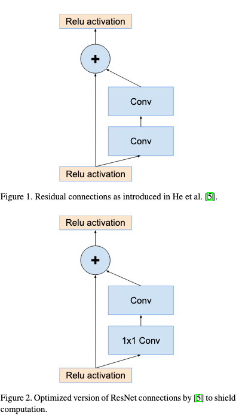
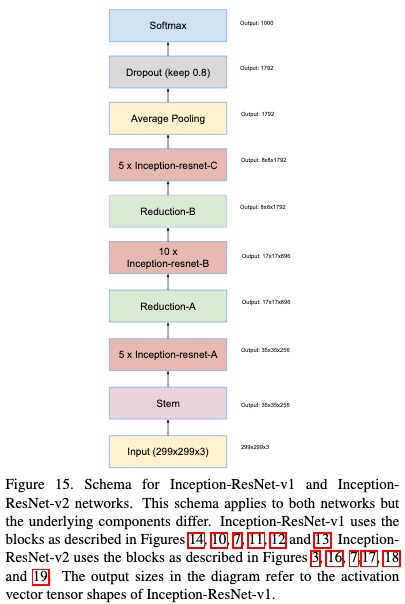
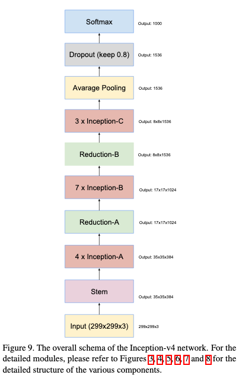
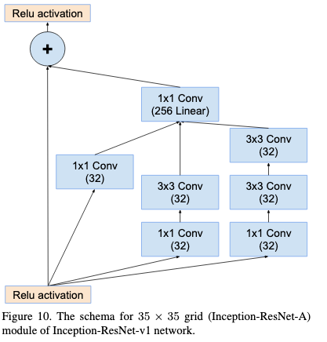
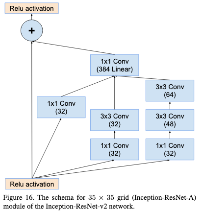
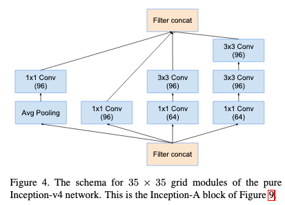
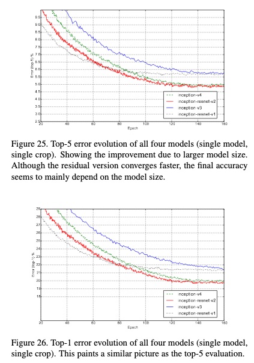

# Inception-v4, Inception-ResNet and the Impact of Residual Connections on Learning

[Link to the paper](https://arxiv.org/abs/1602.07261)

**Christian Szegedy, Sergey Ioffe, Vincent Vanhoucke, Alex Alemi**

*CVPR, 2016*

Year: **2016**

This paper studies how adding residual connections to inception impacts its performance, and introduces a new variant of inception where 3 alternative networks are presented: (a) Inception-ResNet-v1, (b) Inception-ResNet-v2, (c) Inception-v4.

The (a) and (b) networks are inception-like networks with residual connections. (a) has similar computational cost to Inception-v3 while (b) is costlier (wider) but its performance is slightly better. (c) is an optimized version of Inception-v3 without residual connections.

All the networks presented in this paper differ from the previous version (Inception-v3) in the introduction of compression-expansion mechanisms. Each convolution is preceded by a 1x1 convolution that expands the number of channels and the output of the following convolution reduces that number. This is also the mechanism exploited by mobilenets and allows more efficient use of parameters. Look at the following picture for extra details

## Architectures
The following figures show the overall schemas of the residual architectures (a) and (b) vs the pure architecture (c)

This paper covers many details of the architecture in form of diagrams. This can be carefully studied on the paper. In this summary only an example will be given for the 35x35 block.

## Results
The following training curves show how by introducing residual connections the networks are able to converge faster

