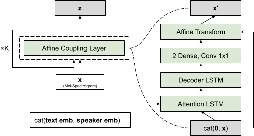

# Flowtron: an Autoregressive Flow-based Generative Network for Text-to-Speech Synthesis

[Link to the paper](https://arxiv.org/abs/2005.05957)

**Rafael Valle, Kevin Shih, Ryan Prenger, Bryan Catanzaro**

*International Conference of Learning Representations, 2021*

Year: **2020**

Code: https://github.com/NVIDIA/flowtron

Samples: https://nv-adlr.github.io/Flowtron

This paper presents an **autoregressive** and **attention-based** Text to Speech model based on normalizing flows. 

The proposed architecture uses a normalizing flow which **affine coupling blocks are conditioned to the content (text) and context (speaker)**. The type of architecture used is similar to the one of an inverse autoregressive flow, although this paper lacks details about the specific implementation. The authors assure they don't use any prenet or postnet in their implementation. 

Tricks of the trade:
- The authors use a variance dampening factor at inference time, otherwise they report loss in quality. At synthesis time, ~~they use a variance of 0.5~~ [they use a standard deviation of $\sigma=0.5$](https://github.com/NVIDIA/flowtron/blob/master/inference.py#L107).
- A weight decay of $0.01\lambda$ where $\lambda$ is the learning rate. They anneal the learning rate when platoing.
- It seems that the authors use only two steps of flow, and don't implement any skips.
- To achieve convergence, the model is trained with a simple flow (1-step) with good quality data, and then the weights are transferred to a more complex model (2-steps of flow) to learn from lower quality data.
- From the code:
  - FlowTron seems to use [CTC loss](https://github.com/NVIDIA/flowtron/blob/master/flowtron.py#L77-L104) to stabilize attention