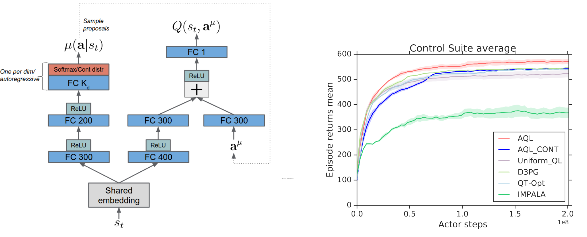

# Q-Learning in enormous action spaces via amortized approximate maximization

[Link to the paper](https://arxiv.org/abs/2001.08116)

**Tom Van de Wiele, David Warde-Farley, Andriy Mnih & Volodymyr Mnih**

*DeepMind report*

Year: **2020**

The paper focuses on trying to substitute the maximization over all the actions happening in Q-Learning by a tractable alternative for very large action spaces. They suggest a new approach called Amortized Q-Learning (AQL) that is even able to handle continuous action spaces.

- Their first suggestion consists of plugging the action space as input, as long as the state space, so that the neural network output layer consists of a single scalar instead of a large layer.
- AQL consists of treating the search for the best action as another learning problem, replacing the exact maximization over the entire action space with the maximization over a subset of actions sampled from a learned distribution (referred here as the *proposal distribution*).
- The authors claim they achieved better performance than D3PG and QT-Opt (continuous RL SOTA methods) in several continuous actions tasks.
- An action space is generally combinatorially structured, i.e. defined as a Cartesian product of sub-action spaces. $A=A_1 \times ... A_D$ where $A_i$ is a finite set ($A_i = [a,b]\subset \mathbb{R}$). Hence $a_t$ is a $D$ dimensional vector and each of its components is referred to as a sub-action.
-
## Amortized Q-Learning
- Method inspired by the variational inference *reparametrization trick* where, instead of trying to model the output of a distribution, the parameters of that distribution are adjusted so that we can sample from them.
- In this case, the authors recommend building an additional neural network to predict, from state $s_t \in S$, sufficient of a **proposal distribution** $\mu$ over possible actions. The architecture of the proposal distribution model needs to be autoregressive (think about autoregressive language generators) in order to incorporate the dependencies among the chosen sub-actions.
- The proposal network is trained with approximate maximums over the DQN q estimates, found using stochastic optimization. More in detail, the method consists of evaluating the union of a uniformly sampled set of actions from A and a set of samples drawn from the proposal network. The proposal network then is updated with the argmax action over the union subset. Better detailed in the algorithm description below.

- For the case of discrete sub-actions, $\mu_d$, i.e. the distribution of the possible values of a given sub-action, can be modeled using a softmax distribution.
- The paper also proposes an architecture with shared parameters for the state input. The architecture proposed is depicted in the figure below.

## Experiments and results
- Benchmarks: UniformQL (Q-Learning with max over random sample of actions), D3PG (distributed DDPG), QT-Opt (Q-Learning with CEM optimizer for actions) and IMPALA (A3C variant).
- UniformQL and AQL use N=100 proposal actions and M=400 uniformly sampled actions. M > N due to the lower computation cost (no autoregressive steps needed).
- The figure below shows that results are noticeable in the large action spaces, due to the failure of simpler methods like uniform sample search (UniformQL) because of the large search space.
