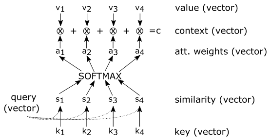
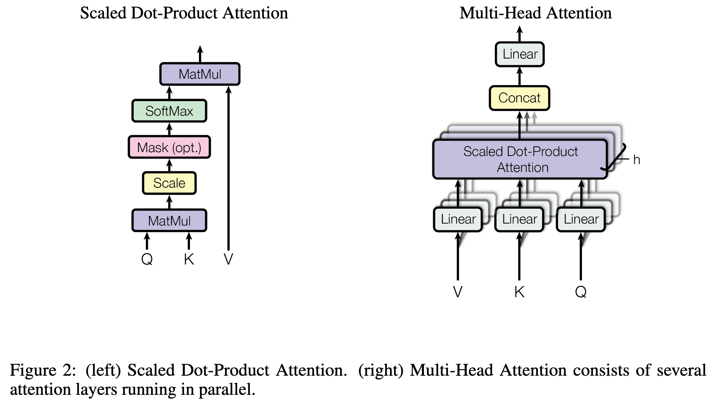
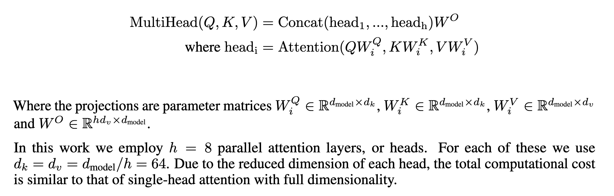
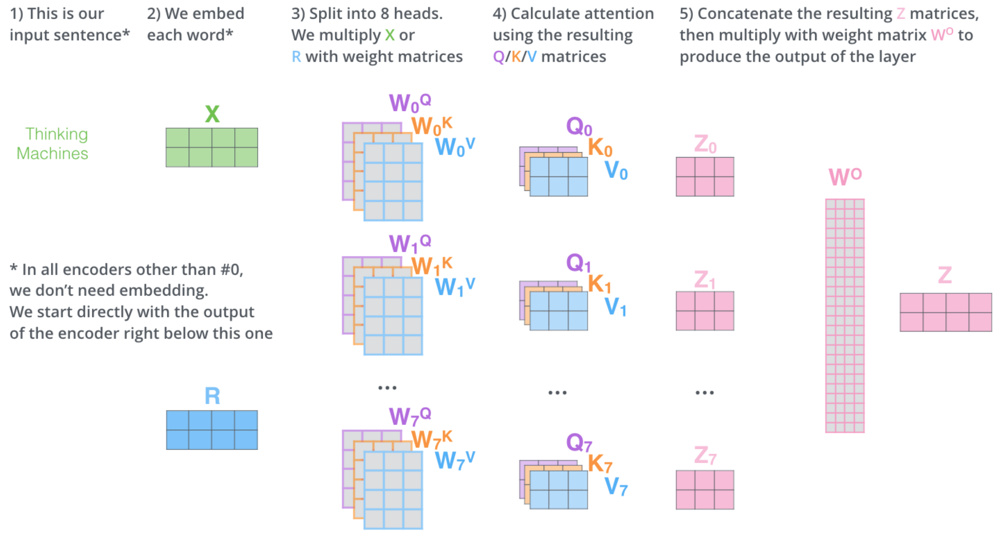
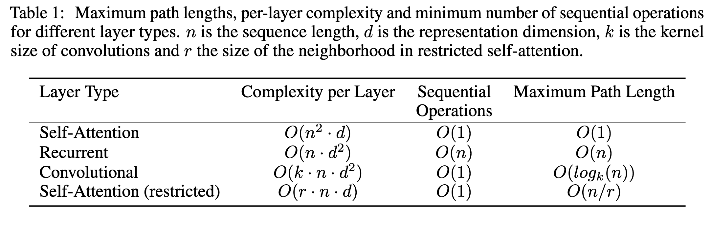
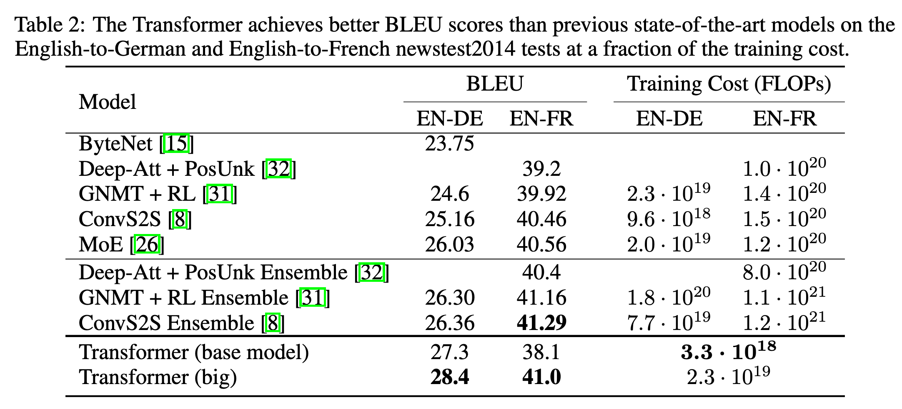

# Attention Is All You Need

[Link to the paper](https://arxiv.org/abs/1706.03762)

*NIPS 2017*

**Ashish Vaswani, Noam Shazeer, Niki Parmar, Jakob Uszkoreit, Llion Jones, Aidan N. Gomez, Lukasz Kaiser, Illia Polosukhin**

[Official implementation](https://github.com/tensorflow/tensor2tensor)

Objective: enhance parallelization in sequence to sequence tasks by getting rid of the RNN and CNN modules: transformer.

Intuition: since with the attention mechanism we collect the signals at each time step directly (dynamically weight using attention), we no longer need to sequentially propagate an combine the signals down to the final time step. Hence RNNs are no longer needed, allowing much more powerful parallelization.

- Previous efforts have been done where CNNs where used to make the sequence to sequence problem more easy to parallelize. But one of the most criticised aspects of these approaches is that the number of operations required to learn temporal dependencies depends on the distance between the related positions. In ConvS2S that dependence is linear, and in ByteNet it is log-linear. However, the architecture proposed in this work has a constant dependence here.

- In an encoder-decoder setting, the encoder maps the input sequence $\mathbf{x} = (x_1, x_2, ..., x_n)$ to a sequence of continuous representations $\mathbf{z} = (z_1, z_2, ..., z_n)$. Given $\mathbf{z}$, the decoder outputs $\mathbf{y} = (y_1, y_2, ..., y_m)$. At each of the $m$ output steps, the model is autoregressive.
- The transformer works in the same overall way the encoder-decoder setting does.

- The left half of the picture shows the transformer encoder, and the right one shows the decoder network. The former processes the input sequence all at once, and the second one combines the output with the encoded input to predict the probabilities of the next time step symbol.
- The transformer processes all input and output sequences without recurrence, i.e. in one computation. At the encoder, this computation is clear because the input sequence is given. However, at the decoder it is possible due to the fact that we use **teacher forcing** to train the network.
- Teacher forcing assumes at training time that the output of the previous time steps is the target one. So at each decoding step, instead of providing the decoder with the previously generated symbol, we provide it with the real one, as if the decoded hit perfectly the target symbol. That allows running the decoder for all the output time steps at once.

## Encoder
The encoder architecture consists of a word embedding and a positional embedding summed together which are passed to a stack of N=6 encoder blocks. The input sentences are passed to the embeddings.

The encoder block is formed of two layers, each of them with a residual connection and a layer normalization. The first layern (orange square in the picture) is a special type of attention layer which is known as *multi head attention* and performs self-attention over the input sequence. The second one (blue square) consists of a couple of fully connected layers, the first one with ReLU activation.

The output of the last block is collected and passed to the decoder.

## Decoder
The decoder architecture consists, as in the encoder, of a word embedding and a positional embedding which are passed to a stack of N=6 decoder blocks. The output sentences are passed to the embeddings.

The decoder block has a similar structure as the encoder block, but it has an extra piece. First, it has a multi-head self-attention layer, later it has a multi-head encoder-decoder attention layer, and finally it has a fully connected layer. The first and last pieces work the same way as the counterparts in the encoder network, with the small but important different that the multi-head self-attention layer has a mask to do the operations causal (i.e. it only focuses on past generated values, not in future ones). The middle block, the encoder-decoder multi-attention layer is in charge of querying the encoder output with the decoder query.

The output of the last block is mapped to the output shape with a linear layer where a softmax operation is applied.

## Multi-head attention
First, let's quickly remember what attention is.

$C(Q,K,V) = \text{softmax}(f(Q, K)) \cdot V$

Where $f(Q, K)$ is a function that computes the similarity between Q and K. Here, there are multiple choices; the most common ones are:
- Dot product: $Q \cdot K^T$
- Scaled dot product: $(Q \cdot K^T) /\sqrt {d_k}$
- General dot product: $Q \cdot W \cdot K^T$
- Additive similarity: $W_Q^T \cdot Q + W_K^T\cdot K$

The paper uses the scaled dot product. The authors highlight the importance of scaling the dot-product in order to have a constant small variance independently of the size of the multiplied vectors.

Now, multi-head attention's main idea is to compute multiple attentions per query with different weights. More specifically, it consists of applying linear projections to $Q$, $K$ and $V$ and the scaled dot product operation multiple times (number of heads denoted by $h$ – in the paper $h=8$). After all these computations, the outputs are concatenated and it's size is adjusted using a linear projection. The picture below summarizes the process very concisely.

Intuitively, you can look at the different heads in the computation as different feature maps in the convolutional neural networks.

### Encoder multi-head (self) attention
Allows each position in the encoder to attend over all the positions in the previous layer.
- Query: each time step of the input
- Key = Value: all input vectors

### Decoder multi-head masked (self) attention
Allows every position in the decoder to attend over all the positions in the previous layer.
- Query: each **past** time step of the output, the future ones are masked in the softmax layer, by summing $-\infty$ to the illegal terms.
- Key = Value: all output vectors

### Encoder-Decoder multi-head attention
Allows every position in the decoder to attend over all positions in the input sequence.
- Query: Output of the decoder multi-head attention layer
- Key = Value: encoder hidden state vectors

## Tricks of the trade
- The Adam optimizer lr has a warm-up phase and a cool-down one. The training starts from a very small learning rate, it is increased over time, and later it is decreased again.
- Residual dropout with $P_{\text{drop}} = 0.1$ is used. This is dropout at the output of each layer, before the layer normalization and the residual connection addition.
- Dropout after the sum of the embeddings and at the positional embedding is also added.
- Sine and cosine functions at different frequencies are used as alternative of positional embeddings.

## Results
The authors apply the current setting over different translation tasks, English to French and English to German, concluding:
- The current setting improves the state of the art performance
- The current setting is much faster than previous efforts, given that it allows more parallelization

## References
- [CS480/680 Lecture 19: Attention and Transformer Networks](https://www.youtube.com/watch?v=OyFJWRnt_AY)
- [Annotated paper with Pytorch implementation](http://nlp.seas.harvard.edu/2018/04/03/attention.html)
- [The illustrated transformer](http://jalammar.github.io/illustrated-transformer/)
- [Lukasz Kaiser masterclass](https://www.youtube.com/watch?v=rBCqOTEfxvg)
- [Efficient implementation in Pytorch](https://arogozhnikov.github.io/einops/pytorch-examples.html). Be careful with the pytorch scaled dot product implementation, it considers the dimensions are (BS, TS, FEATS) instead of (TS, BS, FEATS) which is the pytorch standard format. They do it because the StandardDotProduct method is meant to be private, handled by the MultiHeadAttention method; although they don't specify it anywhere