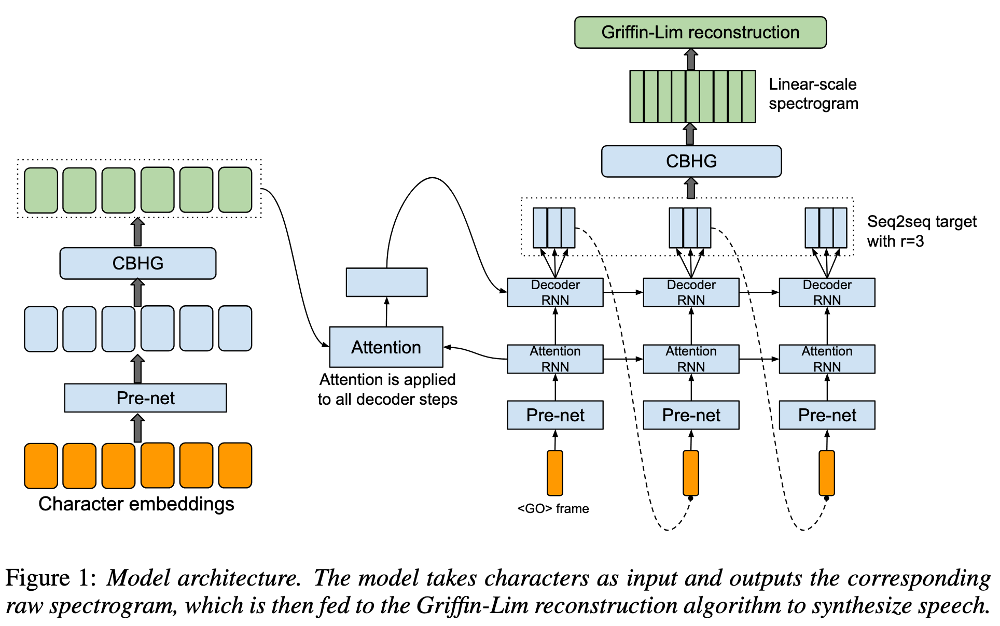
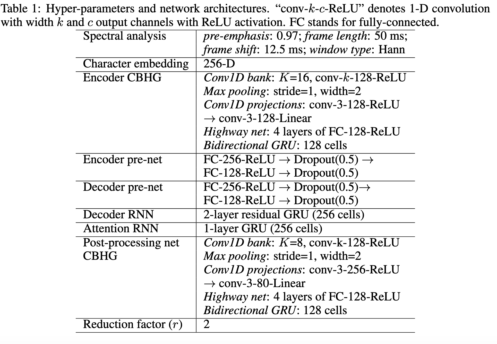
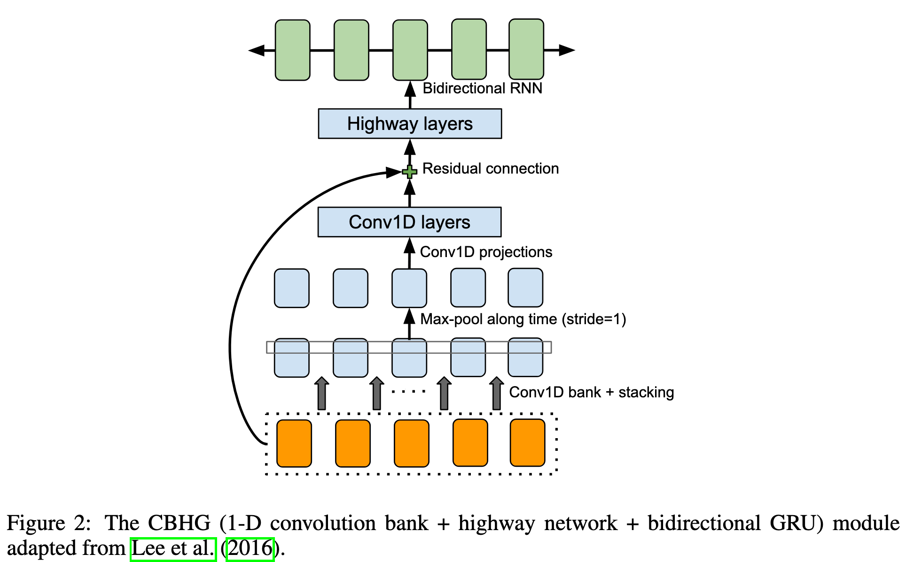
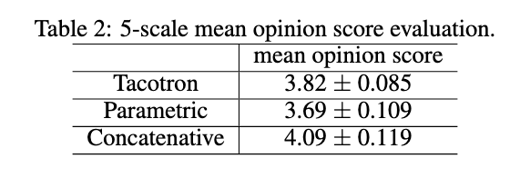
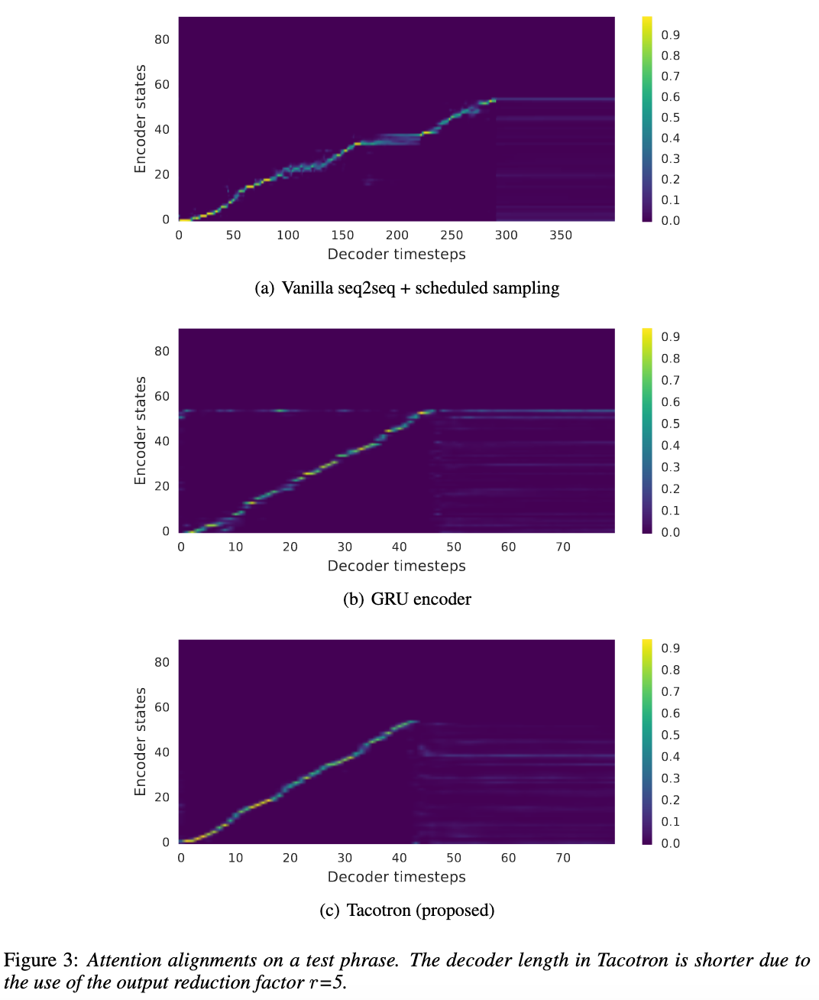
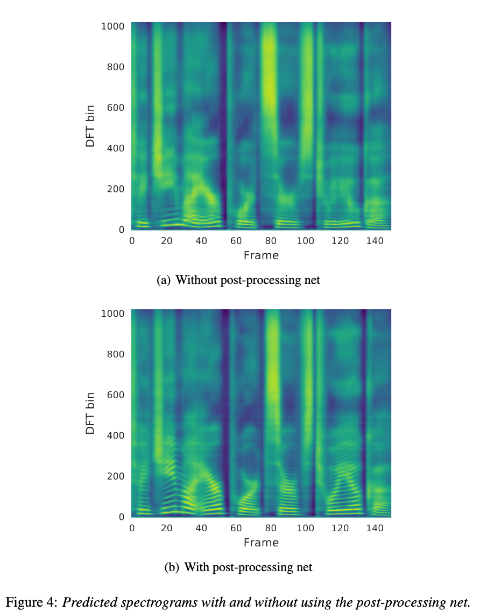

# Tacotron: Towards End-to-End Speech Synthesis

[Link to the paper](https://arxiv.org/abs/1703.10135)

**Yuxuan Wang, RJ Skerry-Ryan, Daisy Stanton, Yonghui Wu, Ron J. Weiss, Navdeep Jaitly, Zongheng Yang, Ying Xiao, Zhifeng Chen, Samy Bengio, Quoc Le, Yannis Agiomyrgiannakis, Rob Clark, Rif A. Saurous**

*INTERSPEECH 2017*

Year: **2017**

Audio samples: [Link](https://google.github.io/tacotron/publications/tacotron/index.html)

This work presents a very robust end-to-end text-to-speech (TTS) synthesis that can be trained from scratch from <text, audio> pairs: the "Tacotron". This model is mainly based on sequence to sequence with attention. On a high level, it takes characters as input and produces an spectrogram that can be transformed into the time domain (audio signal).

TTS is a difficult task, at a high level it consists of decompressing a text into an audio signal. This is difficult because there is no injection (multiple audios can correspond to the same text, one to many). TTS was originally built up with a bunch of modules engineered independently. Neural TTS before this paper consisted of a series of models trained independently. This has the disadvantage that errors from each component may compound. Contrary to this, the authors propose an end-to-end system that can generate mel spectrograms from text. These mel spectrograms can easily be inverted to audio using a synthesizer. This allows for multiple advantages, like speaker or language full conditioning (in the previous paradigms the modules had to be conditioned independently).

The structure of the Tacotron is depicted below.

The different modules are briefly explained below
- The CBHG module is a handful block for extracting abstract representations from sequences. A diagram representing its internals is added above, in figure 2. As it can be seen in the figure, the first layer is a bank of 1D convolutions with different sizes, aiming to represent k-grams. After that, a max pooling layer with stride 1 is used in order to increase local invariance. Then a fixed size 1d convolution is included whose outputs are added with the original input via residual connections. The output of the residual block is inputted into a highway layer and then passed through a bidirectional GRU, to extract fw/bw sequential context.
- The encoder takes as input a set of one hot character vectors, passes them to a pre-net module, which as it can be seen in the table 1 is just a set of 2 fc layers applied to each character independently, and finally generates its output through a CBHG block.
- The decoder is autoregressive. It takes as input the previous generation and feeds a prenet, that feeds an RNN with them (aka the attention RNN). This RNN is responsible for producing the query (Q) for the attention module. The encoder output represents the key (K) and the value (V). The output of the attention, together with the output of the attention RNN (Q) are concatenated and inputted into another RNN. This RNN generates the next r spectrograms (the authors found that this improved stability over predicting only the next spectrogram.). These spectrograms are passed to the post-net module, consisting of a CBHG block, which generates the final spectrograms. The output of the S2S which is forwarded as input in the autoregressive mechanism is the output of the RNN, and not the output of the encoder. The first symbol of the decoder is an empty generation (all zeros), representing a <GO> symbol.
- A Griffin-Lim synthesizer is used to inverse-transform the spectrograms to the audio signal. The authors say that this part must be improved.

The algorithm was trained with 24.6 hours audio from a North American English dataset, producing a MOS of 3.82 out of 5.

Conclusions from an ablation analysis.
- Tacotron produces much more robust attention alignment than a simple GRU encoder or a vanilla S2S. GRU is noiser. Listen to the audio signals.

- The post-processing layer produces much more pleasant audio signals, in the following spectrograms we can see that the harmonics in the 100-400 band are much more defined when the post-processing block is included.

The authors insist that the modules proposed can be refined, emphasizing that the synthesizer they used is a very old algorithm, and new algorithms like Wavenet could be beneficial.