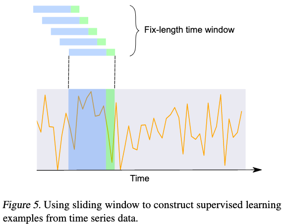
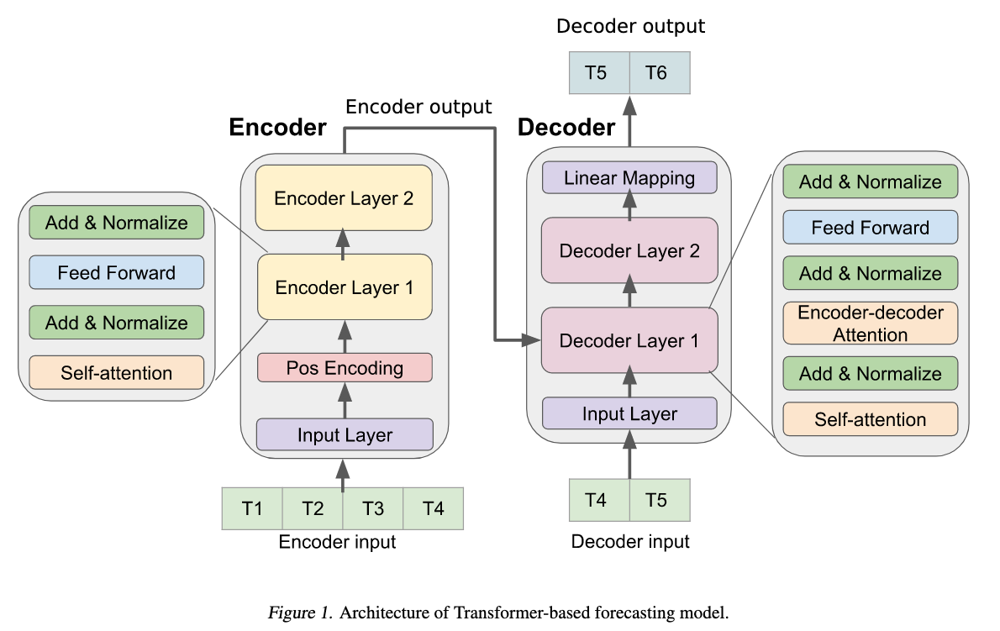
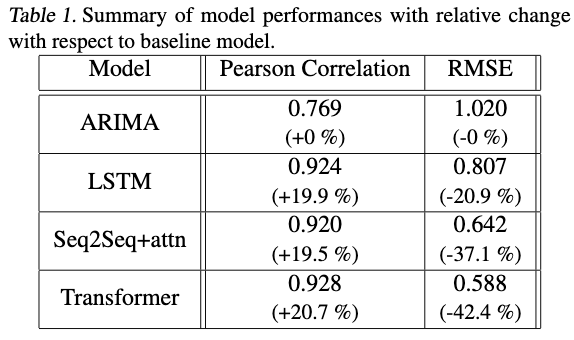

# Deep Transformer Models for Time Series Forecasting: The Influenza Prevalence Case

**Neo Wu, Bradley Green, Xue Ben, Shawn O'Banion**

*Proceedings of the International Conference of Machine Learning (ICML) 2020 (to be submitted)*

Year: **2020**

This work talks about the application of deep learning transformers (as formulated by Vaswani et al. in 2017) to time-series forecasting.

The authors chose influenza-like illness as case study for proving that this algorithm is also available for forecasting. They state specifically that their target variable (ILI ratio) consists of the percentage of patients seen with ILI vs. the total number of patients seen, per state and per week.

The dataset has been built using a time-sliding window approach, with a fixed history window size, as shown in the figure below. The authors note that they apply max-min scaling over all the data, but give no further details. If this is true, the results may have some information leakage given that future values are used to normalize the time series.

The methodology in this case consists of applying the same transformer as Vaswani et al., with minor changes in the hyperparameters choice (# of layers and dropout). The figure below shows the architecture used (analog to the original transformer definition).

The results show that the proposed approach outperforms ARIMA, LSTM and Seq2Seq with Attention, as shown in the table below. The authors do not specify if they run several evaluations with different parameters.
