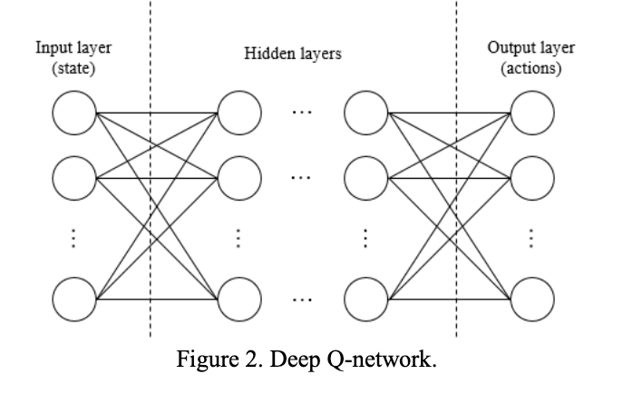
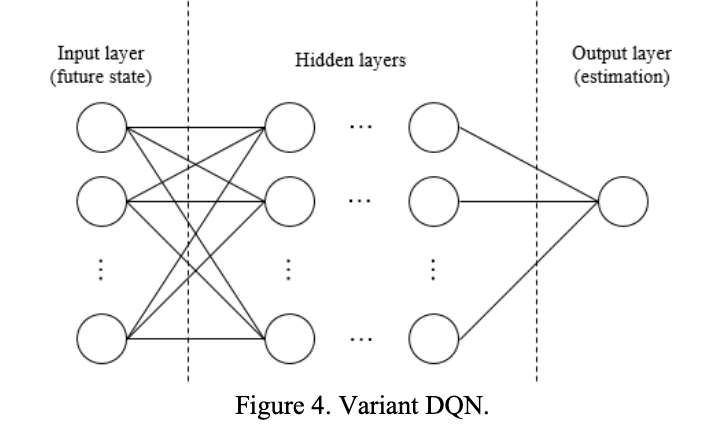

# Handling Large-Scale Action Space in Deep Q Network

**Zhiheng Zhao, Yi Liang, Xiaoming Ji**

*2018 International Conference on Artificial Intelligence and Big Data*

Year: **2018**

- The authors highlight the issues that arise when tackling a high dimensional action-space problem with DQN: the neural network layer has to have as many outputs as actions in the environment. This has some undesirable effects (memory needed, sparse training labels, etc.)
- Classical DQN receives the state as an input and predicts the expected Q-value for all the actions

- The first proposal is to move the actions to the input of the network.
- The proposal consists of a model where states and actions represent an input, and the expected Q-value is given as a scalar output by the network.
- The authors claim that the proposed setting can be problematic given that (S-A1) and (S-A2) can lead to very similar expected Q-Values; in other words, it may be difficult for the network to learn that different actions applied over the same state can have quite different results.
- The second proposal tries to tackle the flaws of the first proposal by restricting the application to deterministic environments where (S-A always lead to S'). They propose using S' as input instead of S-A, which solves the problem of the impact of the actions in the output given the same state.
- The authors don't tackle the problem of how to select the maximum achievable Q-Value, needed by the Q-Learning algorithm. This is in fact a significant miss given that finding the action that maximizes the output of the network can be computationally expensive, if not unfeasible.

